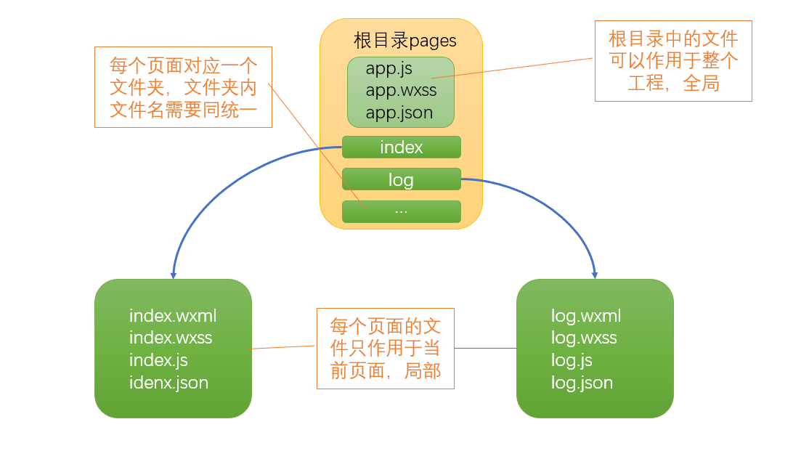
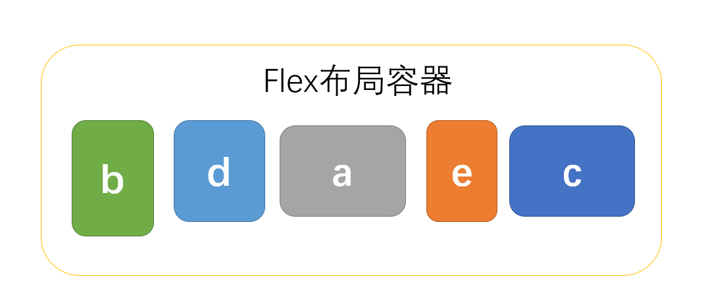
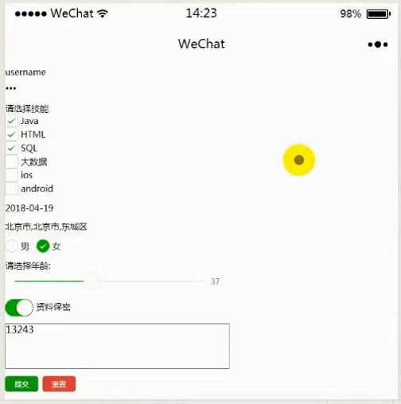

# 一、入门

## 1.工程介绍

https://developers.weixin.qq.com/miniprogram/dev/index.html



## 2.文件描述

### 1）wxml

用于编写页面文本信息，相当于html文件

index.wxml的HelloWorld

~~~html
<view class="container">   <!-- view相当于HTML的div -->
  {{motto}}   <!-- 这里使用了动态绑定，需要在js中指定具体值 -->
</view>
~~~

### 2）wxss

用于编写页面的样式信息，相当于css文件

### 3）js

用于编写页面的动态信息，就是普通的Js文件

index.js

~~~js
Page({
  data: {
    motto: 'Hello World'   //动态绑定，在wxml中使用{{motto}}可以被转化为这里的具体值
  }
})
~~~

### 4）json

用于编写页面的配置信息

小程序配置 app.json

`app.json` 是当前小程序的全局配置，包括了小程序的所有页面路径、界面表现、网络超时时间、底部 tab 等。QuickStart 项目里边的 

~~~json
{
  "pages":[
    "pages/index/index",     #第一个为小程序默认加载的页面，即首页
    "pages/logs/logs"    
  ],
  "window":{
    "backgroundTextStyle":"light",
    "navigationBarBackgroundColor": "#fff",
    "navigationBarTitleText": "WeChat",
    "navigationBarTextStyle":"black"
  },
  "tabBar": {
    "list": [
      {
        "pagePath": "pages/index/index",
        "text": "首页"
      },
      {
        "pagePath": "pages/logs/logs",
        "text": "日志"
      }
    ]
  }
}

~~~

1. `pages`字段 —— 用于描述当前小程序所有页面路径，这是为了让微信客户端知道当前你的小程序页面定义在哪个目录。`"pages/index/index"`表示pages目录下，index目录下，所有index名的文件（后缀不同）
2. `window`字段 —— 定义小程序所有页面的顶部背景颜色，文字颜色定义等。
3. `tabBar`字段——微信小程序底部的tab页

详细参考[全局配置](https://developers.weixin.qq.com/miniprogram/dev/framework/config.html#全局配置)

# 二、flex布局

在父容器中控制各个子容器的布局，可以通过设置子容器属性调整顺序和大小等




## 1.语法

在父容器的样式中写

`display:flex;`    此属性设置后，其他属性才能生效，**属性可写在wxss文件中**

## 2.父容器属性

| 属性            | 描述     | 取值                                                         |
| --------------- | -------- | ------------------------------------------------------------ |
| flex-direction  | 排序方向 | row（行默认），row-reverse（行反序）<br/>column（列），column-reverse（列反序） |
| flex-wrap       | 换行规则 | nowrap（默认不换行，如果宽度过大，按比例分配）<br/>wrap（换行），wrap-reverse（倒序换行） |
| justify-content | 对其方式 | flex-start（左对齐），flex-end（右对齐），center（居中）<br/>space-between（平均间隔，不贴边），space-around（平均间隔，贴边） |

## 3.子容器属性

| 属性  | 描述             | 取值                                     |
| ----- | ---------------- | ---------------------------------------- |
| order | 成员之间显示顺序 | 数字，值越大小优先级越高，不写优先级最高 |
| flex  | 成员所占屏幕比例 | 设置后，宽度失效                         |

# 三、组件

**属性不能写在wxss样式文件中**

## 1.视图容器

类似于HTML的div

### 1）view

视图容器

| 属性名                 | 类型    | 默认值 | 说明                                                         | 最低版本                                                     |
| ---------------------- | ------- | ------ | ------------------------------------------------------------ | ------------------------------------------------------------ |
| hover-class            | String  | none   | 指定按下去的样式类。当 `hover-class="none"` 时，没有点击态效果 |                                                              |
| hover-stop-propagation | Boolean | false  | 指定是否阻止本节点的祖先节点出现点击态（是否阻止冒泡）       | [1.5.0](https://developers.weixin.qq.com/miniprogram/dev/framework/compatibility.html) |
| hover-start-time       | Number  | 50     | 按住后多久出现点击态，单位毫秒                               |                                                              |
| hover-stay-time        | Number  | 400    | 手指松开后点击态保留时间，单位毫秒                           |                                                              |

hover-start-time（点击后多久出现点击态，不需要按住不放）

### 2）scroll-view

可滚动视图区域。

案例：

```html
<scroll-view class="scroll" scroll-y='true'>
  <view class='a size'>a</view>
  <view class='b size'>b</view>
  <view class='c size'>c</view>
  <view class='d size'>d</view>
  <view class='e size'>e</view>
</scroll-view>
```

属性：

| 属性名                | 类型            | 默认值 | 说明                                                         |
| --------------------- | --------------- | ------ | ------------------------------------------------------------ |
| scroll-x              | Boolean         | false  | 允许横向滚动                                                 |
| scroll-y              | Boolean         | false  | 允许纵向滚动                                                 |
| upper-threshold       | Number / String | 50     | 距顶部/左边多远时（单位px，2.4.0起支持rpx），触发 scrolltoupper 事件 |
| lower-threshold       | Number / String | 50     | 距底部/右边多远时（单位px，2.4.0起支持rpx），触发 scrolltolower 事件 |
| scroll-top            | Number / String |        | 设置竖向滚动条位置（单位px，2.4.0起支持rpx）                 |
| scroll-left           | Number / String |        | 设置横向滚动条位置（单位px，2.4.0起支持rpx）                 |
| scroll-into-view      | String          |        | 值应为某子元素id（id不能以数字开头）。设置哪个方向可滚动，则在哪个方向滚动到该元素 |
| scroll-with-animation | Boolean         | false  | 在设置滚动条位置时使用动画过渡                               |
| enable-back-to-top    | Boolean         | false  | iOS点击顶部状态栏、安卓双击标题栏时，滚动条返回顶部，只支持竖向 |
| bindscrolltoupper     | EventHandle     |        | 滚动到顶部/左边，会触发 scrolltoupper 事件                   |
| bindscrolltolower     | EventHandle     |        | 滚动到底部/右边，会触发 scrolltolower 事件                   |
| bindscroll            | EventHandle     |        | 滚动时触发，event.detail = {scrollLeft, scrollTop, scrollHeight, scrollWidth, deltaX, deltaY} |

### 3）swiper

滑块视图容器。（轮播图）

| 属性名                  | 类型        | 默认值            | 说明                                                         | 最低版本                                                     |
| ----------------------- | ----------- | ----------------- | ------------------------------------------------------------ | ------------------------------------------------------------ |
| indicator-dots          | Boolean     | false             | 是否显示面板指示点                                           |                                                              |
| indicator-color         | Color       | rgba(0, 0, 0, .3) | 指示点颜色                                                   | [1.1.0](https://developers.weixin.qq.com/miniprogram/dev/framework/compatibility.html) |
| indicator-active-color  | Color       | #000000           | 当前选中的指示点颜色                                         | [1.1.0](https://developers.weixin.qq.com/miniprogram/dev/framework/compatibility.html) |
| autoplay                | Boolean     | false             | 是否自动切换                                                 |                                                              |
| current                 | Number      | 0                 | 当前所在滑块的 index                                         |                                                              |
| current-item-id         | String      | ""                | 当前所在滑块的 item-id ，不能与 current 被同时指定           | [1.9.0](https://developers.weixin.qq.com/miniprogram/dev/framework/compatibility.html) |
| interval                | Number      | 5000              | 自动切换时间间隔                                             |                                                              |
| duration                | Number      | 500               | 滑动动画时长                                                 |                                                              |
| circular                | Boolean     | false             | 是否采用衔接滑动                                             |                                                              |
| vertical                | Boolean     | false             | 滑动方向是否为纵向                                           |                                                              |
| previous-margin         | String      | "0px"             | 前边距，可用于露出前一项的一小部分，接受 px 和 rpx 值        | [1.9.0](https://developers.weixin.qq.com/miniprogram/dev/framework/compatibility.html) |
| next-margin             | String      | "0px"             | 后边距，可用于露出后一项的一小部分，接受 px 和 rpx 值        | [1.9.0](https://developers.weixin.qq.com/miniprogram/dev/framework/compatibility.html) |
| display-multiple-items  | Number      | 1                 | 同时显示的滑块数量                                           | [1.9.0](https://developers.weixin.qq.com/miniprogram/dev/framework/compatibility.html) |
| skip-hidden-item-layout | Boolean     | false             | 是否跳过未显示的滑块布局，设为 true 可优化复杂情况下的滑动性能，但会丢失隐藏状态滑块的布局信息 | [1.9.0](https://developers.weixin.qq.com/miniprogram/dev/framework/compatibility.html) |
| bindchange              | EventHandle |                   | current 改变时会触发 change 事件，event.detail = {current: current, source: source} |                                                              |
| bindtransition          | EventHandle |                   | swiper-item 的位置发生改变时会触发 transition 事件，event.detail = {dx: dx, dy: dy} | [2.4.3](https://developers.weixin.qq.com/miniprogram/dev/framework/compatibility.html) |
| bindanimationfinish     | EventHandle |                   | 动画结束时会触发 animationfinish 事件，event.detail 同上     | [1.9.0](https://developers.weixin.qq.com/miniprogram/dev/framework/compatibility.html) |

#### swiper-item

仅可放置在[``](https://developers.weixin.qq.com/miniprogram/dev/component/swiper.html)组件中，宽高自动设置为100%。

| 属性名  | 类型   | 默认值 | 说明                    | 最低版本                                                     |
| ------- | ------ | ------ | ----------------------- | ------------------------------------------------------------ |
| item-id | String | ""     | 该 swiper-item 的标识符 | [1.9.0](https://developers.weixin.qq.com/miniprogram/dev/framework/compatibility.html) |

### 4）movable-view

可移动的视图容器，在页面中可以拖拽滑动

| 属性名        | 类型            | 默认值 | 说明                                                         | 最低版本                                                     |
| ------------- | --------------- | ------ | ------------------------------------------------------------ | ------------------------------------------------------------ |
| direction     | String          | none   | movable-view的移动方向，属性值有all、vertical、horizontal、none |                                                              |
| inertia       | Boolean         | false  | movable-view是否带有惯性                                     |                                                              |
| out-of-bounds | Boolean         | false  | 超过可移动区域后，movable-view是否还可以移动                 |                                                              |
| x             | Number / String |        | 定义x轴方向的偏移，如果x的值不在可移动范围内，会自动移动到可移动范围；改变x的值会触发动画 |                                                              |
| y             | Number / String |        | 定义y轴方向的偏移，如果y的值不在可移动范围内，会自动移动到可移动范围；改变y的值会触发动画 |                                                              |
| damping       | Number          | 20     | 阻尼系数，用于控制x或y改变时的动画和过界回弹的动画，值越大移动越快 |                                                              |
| friction      | Number          | 2      | 摩擦系数，用于控制惯性滑动的动画，值越大摩擦力越大，滑动越快停止；必须大于0，否则会被设置成默认值 |                                                              |
| disabled      | Boolean         | false  | 是否禁用                                                     | [1.9.90](https://developers.weixin.qq.com/miniprogram/dev/framework/compatibility.html) |
| scale         | Boolean         | false  | 是否支持双指缩放，默认缩放手势生效区域是在movable-view内     | [1.9.90](https://developers.weixin.qq.com/miniprogram/dev/framework/compatibility.html) |
| scale-min     | Number          | 0.5    | 定义缩放倍数最小值                                           | [1.9.90](https://developers.weixin.qq.com/miniprogram/dev/framework/compatibility.html) |
| scale-max     | Number          | 10     | 定义缩放倍数最大值                                           | [1.9.90](https://developers.weixin.qq.com/miniprogram/dev/framework/compatibility.html) |
| scale-value   | Number          | 1      | 定义缩放倍数，取值范围为 0.5 - 10                            | [1.9.90](https://developers.weixin.qq.com/miniprogram/dev/framework/compatibility.html) |
| animation     | Boolean         | true   | 是否使用动画                                                 | [2.1.0](https://developers.weixin.qq.com/miniprogram/dev/framework/compatibility.html) |
| bindchange    | EventHandle     |        | 拖动过程中触发的事件，event.detail = {x: x, y: y, source: source}，其中source表示产生移动的原因，值可为touch（拖动）、touch-out-of-bounds（超出移动范围）、out-of-bounds（超出移动范围后的回弹）、friction（惯性）和空字符串（setData） | [1.9.90](https://developers.weixin.qq.com/miniprogram/dev/framework/compatibility.html) |
| bindscale     | EventHandle     |        | 缩放过程中触发的事件，event.detail = {x: x, y: y, scale: scale}，其中x和y字段在[2.1.0](https://developers.weixin.qq.com/miniprogram/dev/framework/compatibility.html)之后开始支持返回 | [1.9.90](https://developers.weixin.qq.com/miniprogram/dev/framework/compatibility.html) |

除了基本事件外，movable-view提供了两个特殊事件

| 类型       | 触发条件                                                     | 最低版本                                                     |
| ---------- | ------------------------------------------------------------ | ------------------------------------------------------------ |
| htouchmove | 初次手指触摸后移动为横向的移动，如果catch此事件，则意味着touchmove事件也被catch | [1.9.90](https://developers.weixin.qq.com/miniprogram/dev/framework/compatibility.html) |
| vtouchmove | 初次手指触摸后移动为纵向的移动，如果catch此事件，则意味着touchmove事件也被catch | [1.9.90](https://developers.weixin.qq.com/miniprogram/dev/framework/compatibility.html) |

> movable-view 必须设置width和height属性，不设置默认为10px
>
> movable-view 默认为绝对定位，top和left属性为0px

**注意**：movable-view必须在`<movable-area/>`组件中，并且必须是直接子节点，否则不能移动。

#### movable-area

> 基础库 1.2.0 开始支持，低版本需做[兼容处理](https://developers.weixin.qq.com/miniprogram/dev/framework/compatibility.html)。

`movable-view` 的可移动区域

| 属性名     | 类型    | 默认值 | 说明                                                         | 最低版本                                                     |
| ---------- | ------- | ------ | ------------------------------------------------------------ | ------------------------------------------------------------ |
| scale-area | Boolean | false  | 当里面的movable-view设置为支持双指缩放时，设置此值可将缩放手势生效区域修改为整个movable-area | [1.9.90](https://developers.weixin.qq.com/miniprogram/dev/framework/compatibility.html) |

**注意：movable-area 必须设置width和height属性，不设置默认为10px**

## 2.基础组件

1）icon

图标。

| 属性名 | 类型            | 默认值 | 说明                                                         |
| ------ | --------------- | ------ | ------------------------------------------------------------ |
| type   | String          |        | icon的类型，有效值：success, success_no_circle, info, warn, waiting, cancel, download, search, clear |
| size   | Number / String | 23px   | icon的大小，单位px（2.4.0起支持rpx）                         |
| color  | Color           |        | icon的颜色，同css的color                                     |





