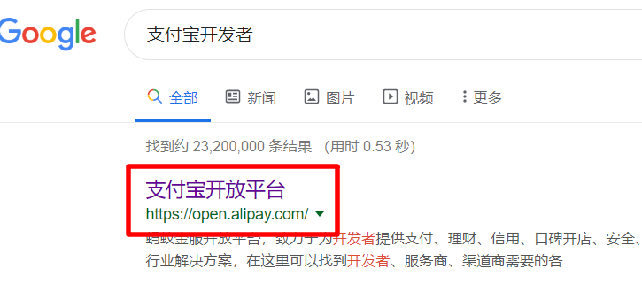

# 一、进入支付宝开发平台

本文主要讲解了对接支付宝沙箱环境，生成支付二维码的流程

## 1、搜索支付宝开发

​	

## 2、登录


## 3、进入到沙箱环境


### 沙箱环境主要信息

可以点进去看看，了解大致都有什么东西，一会要用


### 设置好公钥

主要设置应用公钥


如果不会，可以点击支付宝说明，有详细步骤


## 4、下载demo

### 点击开发者中心概览


### 右侧SDK下载


支付宝提供了很多测试Demo，拿来改改就可以直接用

### 找到当面付


### 下载


# 二、获取支付二维码

## 1、打开测试Demo


## 2、修改配置文件

工程中有一个zfbinfo.properties配置文件，是对接中的一些重要配置信息

这里只捡出来必要的字段

```properties
#网管修改为dev
open_api_domain=https://openapi.alipaydev.com/gateway.do
#沙箱账号中，商户的UID，这个为收钱商户的ID
pid = 2088102178032752
#沙箱应用中，appid
appid = 2016100100635726

# RSA私钥、公钥和支付宝公钥
private_key = 	支付宝公私钥软件生成的公钥
public_key =  支付宝公私钥软件生成的私钥的pkcs8版

#其他字段根据个人需求修改
```

## 3、Main类

main方法中使用了`main.test_trade_precreate();`方法来生成二维码

我们可以修改`main.test_trade_precreate();`方法中的内容，来自定义信息

1）435行的路径可以设置为本机路径，为图片生成路径

```Java
String filePath = String.format("C:/Users/bai/Desktop/qr-%s.png",        response.getOutTradeNo());
//这行代码的注释打开，用来生成图片到我们的路径下
ZxingUtils.getQRCodeImge(response.getQrCode(), 256, filePath);
```

2）423行为回调接口的URL，在用户扫码后和支付成功后，支付宝分别会有一次回调，两个回调调用这一个接口，可以根据状态字段做判断，在JSON报文中有字段解释

```java
.setNotifyUrl("外网可访问的支付宝回调URL")
```

3）其他信息可以根据注释和个人需求定制

修改信息后直接运行即可在指定路径下生成二维码图片

## 4、四个JSON报文

### 获取二维码发出的JSON：

~~~json
//获取二维码发出的json
{
	//必填，订单号，64个字符以内，字母数字下划线
	"out_trade_no": "tradeprecreate15647279763334241735",
	"seller_id": "",  //收款支付宝ID，如为空，按支付宝开发应用配置中的pid使用
	"total_amount": "100",  //必填，总金额（打折前）
	"undiscountable_amount": "0",  //不打折金额（实际付款金额），选填，默认为总金额-打折金额
	"subject": "xxx品牌xxx门店当面付扫码消费",  //必填，订单标题
	"body": "购买商品3件共20.00元",  //订单描述
	//商品信息
	"goods_detail": [{
		"goods_id": "goods_id001",
		"goods_name": "xxx小面包",
		"quantity": 1,
		"price": "10"
	}, {
		"goods_id": "goods_id002",  //商品ID
		"goods_name": "xxx牙刷",  //商品名
		"quantity": 2,  //数量
		"price": "5"  //单价
	}],
	"operator_id": "test_operator_id",  //商户操作员编号，可以用来做销售统计，选填
	"store_id": "test_store_id",  //必填，商户门店编号
	//自定义参数，回调时会带回，目前只支持sys_service_provider_id
	"extend_params": {
		"sys_service_provider_id": "2088100200300400500"
	},
	//过期时间
	"timeout_express": "120m"
}
~~~

### 获取二维码响应的JSON：

~~~json
//支付宝响应响应
{
	"alipay_trade_precreate_response": {
		"code": "10000",
		"msg": "Success",
		"out_trade_no": "tradeprecreate15647279763334241735",
        //图片
		"qr_code": "https:\/\/qr.alipay.com\/bax03381xcn7dw89lcih007e"
	},
	"sign": "hFNh5JIlUR9rY42ModDoCj/7CA/05cHUq5fI/XaWGRpVAxR3i8tGjTa7XQpvNZEpGd04D/vI5KF/9QfDV7nH5MGNAR/JQA2fkHrevvbfiBV1O+aKzBIZel4BRTNDTrTH1k+DxWE7nn2Ei54DDwnuk47l8bKhMM4jA6fFCcu/oimcybvMdQV/HyHqssiIph/0OiorFMrOebIKPieAGF7+XksIa1OrSSRCCsjYxh2c7vIHFLCDU1rlSpL8e8USl0bkMy5XX+qCn967aQVet+ejy4eMSYZ2PFNGY3HlgAESX2PEhfDd8opmED3xWSzSzLJUW2RRisjwkR0Pjz8AXe0fGA=="
}

~~~

### 用户扫码回调JSON：

~~~json
//扫码后
{
	"gmt_create": ["2019-08-02 14:39:53"],  //订单创建时间
	"charset": ["utf-8"],
	"seller_email": ["rxfxed9950@sandbox.com"],  //售货员邮箱，沙箱账户中信息
	"notify_time": ["2019-08-02 14:39:54"],  //通知时间
	"subject": ["xxx品牌xxx门店当面付扫码消费"],  //标题
	//签名
	"sign": ["OiXtXYPpQx2siDhBJiKYyEpYYd1NULnt1pKAP+MGJHaya8bIFzHcx3GdQLMmj3MPL+jKimMd2+lMVNCfvxjXvYLLfyHe3TrxECI1vGuS3ROREz0xwl6vQemZnBVgphGGulAVYsmzVyBq3L0mfGwPgFgAVnU63iK874l1C57hlsGZTetkyEKcBWPgOchNKciHDTLgzuaEQnhn37JYJbAm1SZB5hGc4HxHsKWEvdmfu+dzU7uE0WdBTs76V1xG8lyMeKjcUjah4NAsxbp0HRvli5lWiCEXt30eIJZJAEcgraL/lrpmb0p7AabLixbsT+P/ibF4pEWByXX7lzkYa/+aGA=="],
	"body": ["购买商品3件共20.00元"],   //订单详情
	"buyer_id": ["2088102178090170"],   //买主ID
	"version": ["1.0"],  //版本
	"notify_id": ["2019080200222143954090171000498739"],  //通知ID
	"notify_type": ["trade_status_sync"],  //通知类型
	"out_trade_no": ["tradeprecreate15647279763334241735"],  //订单号
	"total_amount": ["100.00"],  //总价格
	"trade_status": ["WAIT_BUYER_PAY"],  //交易状态
	"trade_no": ["2019080222001490171000065035"],  //交易编号
	"auth_app_id": ["2016100100635726"],  //app ID
	"buyer_logon_id": ["kdl***@sandbox.com"],  //买主登录ID
	"app_id": ["2016100100635726"],  //app—ID
	"sign_type": ["RSA2"],  //签名类型
	"seller_id": ["2088102178032752"]  //商户UID，支付宝开发中信息
}
~~~

### 用户付款回调JSON：

~~~json
//支付成功后
{
	"gmt_create": ["2019-08-02 14:39:53"],
	"charset": ["utf-8"],
	"seller_email": ["rxfxed9950@sandbox.com"],
	"subject": ["xxx品牌xxx门店当面付扫码消费"],
	"sign": ["UBHEmHSVGHz3e/sPYx0wEe7n2jRKVBFiraQdfwp49ElD3XqWemOtk6xFpj1wlVzElOCov9V/RWJr+Xhw98A9yxybtWboFBOCg3oyUXdftLDhUD3gFkUVoGyB70LvPeIG5qzo84/zcrr/F/JqTuiFXzuG7CYpzg1g/H6K2Be7X+cT+9xsvT4llkZB2mso0pkWTXFoR0kG8OrjuYdaBo0yKIFWIn6JYGxsyrX1jn/hj/v6VthKIf17u/bSVxZUcZO/asgjqd2v1wweELJsyvSz7pwW0R+bqKRvZ+wLGsV9r3LQC6TQecQIP4adFlfdVAWPJ981einnk+F2+0u38K3WCg=="],
	"body": ["购买商品3件共20.00元"],
	"buyer_id": ["2088102178090170"],
	"notify_id": ["2019080200222144027090171000500200"],
	"total_amount": ["100.00"],
	"app_id": ["2016100100635726"],
	"sign_type": ["RSA2"],
	"buyer_logon_id": ["kdl***@sandbox.com"],
	"seller_id": ["2088102178032752"],
	"version": ["1.0"],
	"out_trade_no": ["tradeprecreate15647279763334241735"],
	"trade_no": ["2019080222001490171000065035"],
	"auth_app_id": ["2016100100635726"],

	//---------------以上是扫码后同有的数据

	"notify_time": ["2019-08-02 14:40:27"],  //通知时间
	"gmt_payment": ["2019-08-02 14:40:26"],  //支付时间
	"trade_status": ["TRADE_SUCCESS"],  //支付状态，成功
	"buyer_pay_amount": ["100.00"],  //买方花费金额
	"invoice_amount": ["100.00"],  //发票金额
	"fund_bill_list": ["[{\"amount\":\"100.00\",\"fundChannel\":\"ALIPAYACCOUNT\"}]"],
	"receipt_amount": ["100.00"],
	"point_amount": ["0.00"]  //优惠价格
}
~~~

## 5、回调接口

回调的接口必须是外网可访问，可以使用花生壳做内网穿透

搭建一个外网可访问的服务，我这里使用的SpringBoot快速搭建，也可以直接使用Web项目放到Tomcat中运行

```java
@RestControllerpublic 
class WebController {    
    @PostMapping("/")    
    public String receive(ZfbRequestBean zfbRequestBean) {
        System.out.println(JsonUtil.object2Json(zfbRequestBean));        
        return "hello";    
    }
}
```

用ZfbRequestBean来接收请求过来的数据，所有的属性都和上面的JSON报文对应

```java
@Data
public class ZfbRequestBean {
    private String gmt_create;
    private String charset;
    private String seller_email;
    private String subject;
    private String sign;
    private String body;
    private String buyer_id;
    private BigDecimal invoice_amount;
    private String notify_id;
    private String fund_bill_list;
    private String notify_type;
    private String trade_status;
    private BigDecimal receipt_amount;
    private BigDecimal buyer_pay_amount;
    private String app_id;
    private String sign_type;
    private String seller_id;
    private String gmt_payment;
    private String notify_time;
    private String version;
    private String out_trade_no;
    private BigDecimal total_amount;
    private String trade_no;
    private String auth_app_id;
    private String buyer_logon_id;
    private BigDecimal point_amount;
}

```

当用户扫码和支付后，此接口会被支付宝调用

fund_bill_list字段比较特殊，是个字符串JSON，这里没有做转换，可以自行转换

# 三、补充

## 1、web版Demo

该测试工程下有webapp目录，可以自行配置Tomcat，运行index.html，有做好的页面版对接

需要改动几处

把zfbinfo.properties配置文件拷贝道WEB-INF文件夹中

trade_precreate.jsp文件第31行修改为Configs.init("../zfbinfo.properties");

如果需要测试其他接口，路径都需要修改

这里是个人的解决方案，如有更好，可以在评论区讨论

## 2、其他接口

Main方法和WebAPP中有其他接口的对接，可以自行尝试，都类似