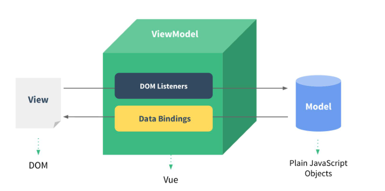

# 一、Helloworld

直接上代码

```html
<body>
<div id="app">   <!-- View -->
    <input type="text" v-model="username">
    <p>hello，{{username}}</p>

</div>
<!-- 引入vue -->
<script type="application/javascript" src="../js/vue.js"></script>
<script type="application/javascript">
    //ViewModel，相当于一个管理器，1.需要去监听view，2.需要绑定数据model
    const vm = new Vue({   //配置对象
        el: '#app',   //element   元素（这里用选择器选择一个元素）
        data: {  //数据   model
            username: 'username'
        }
    })
</script>

</body>
```



MVVM是vue的核心思想

model：模型，存放数据对象（data对象）

view：指视图，模板页面（并不是真正的静态页面），用来显示数据

view model：视图模型（vue的实例vm）

# 二、vue语法

## 1.模板语法

### 1）模板的理解

动态的HTML页面，包含了一些js语法代码

双大括号表达式

指令（以v-开头的自定义标签属性）

### 2）双大括号表达式

直接绑定

```html
<div id="app">
    <p>{{ msg }}</p>
</div>

<script type="application/javascript" src="../js/vue.js"></script>
<script type="application/javascript">
    var vm = new Vue({
        el: "#app",
        data:{
            msg:"这是一条消息"
        }
    });
</script>
```

### 3）强制数据绑定

在属性前加v-bind:，或者只加:，可以对某个属性的值进行数据绑定

```html
<div id="app">
    <!-- 两种写法效果一样，第二种写法为简写方式 -->
    
    
</div>

<script type="application/javascript" src="../js/vue.js"></script>
<script type="application/javascript">
    var vm = new Vue({
        el: "#app",
        data:{
            imgUrl:"https://www.google.com/logos/doodles/2019/omar-khayyams-971st-birthday-6192814449754112.2-s.png"
        }
    });
</script>
```

### 4）绑定事件

使用v-on:click属性，或者@click（简写模式）

不需要传值可以省略括号

如果需要传值可以加上括号

可以传入model（data）中的值

需要在data里添加methods对象，在里面写事件的方法，多个方法,分隔

```html
<div id="app">
    <!-- 单击事件 -->
    <button v-on:click="test">test</button>
    <!-- 简写模式 -->
    <button @click="test">test</button>
    <!-- 传值 -->
    <button @click="test1('123')">test1</button>
    <!-- 传入model（data）里的值 -->
    <button @click="test1(msg)">test1</button>
</div>

<script type="application/javascript" src="../js/vue.js"></script>
<script type="application/javascript">
    var vm = new Vue({
        el: "#app",
        data:{
            msg:"这是一条消息",
        methods:{
            //定义事件方法
            test() {
                alert("hello");
            },
            test1(string) {
                alert(string);
            }
        }
    });
</script>
```

## 2.计算属性

场景：现有两个input框，firstname，lastname

现在需要在第三个input框（fullname）中显示两个框加在一起的字符串，如何做属性计算？

需要在vm对象中写computed对象，在里面写函数，返回值为属性的值，然后用v-model指定这个函数

```html
<div id="demo">
    <input type="text" v-model="firstName">
    <input type="text" v-model="lastName">
<!-- fullname表示一个计算属性的函数，返回值会这个input的值，在computed中定义 -->
    <input type="text" v-model="fullName">
</div>

<script type="application/javascript" src="../js/vue.js"></script>
<script type="application/javascript">

    var demo = new Vue({
        el: "#demo",
        data: {
            firstName: "",
            lastName: ""
        },
        //计算
        computed: {
            fullName() {
                //用this调用data中的值
                return this.firstName + " " + this.lastName;
            }
        }
    });

</script>
```

## 3.监视

使用监听做出计算属性相同的效果

```html
<div id="demo">
    <input type="text" v-model="firstName">
    <input type="text" v-model="lastName">
    <input type="text" v-model="fullName2">
</div>

<script type="application/javascript" src="../js/vue.js"></script>
<script type="application/javascript">

    var demo = new Vue({
        el: "#demo",
        data: {
            firstName: "",
            lastName: "",
            fullName2: ""
        },
        //监听
        watch: {
            //监视的属性：属性改变后的回调函数
            //参数为改变后的值和改变前的值，如果只需要改变后的值（newValue），则只需要写一个参数即可
            firstName: function (newValue, oldValue) {
                this.fullName2 = newValue + " " + this.lastName;
            }
        }
    });
    
    //可以使用$watch方法监听一个属性
    //在这里value表示改变后的值
    demo.$watch("lastName", function (value) {
        this.fullName2 = this.firstName + " " + value;
    });

</script>
```

## 4.set-get方法

在computed中定义，用于计算属性值的方法

get方法：回调函数，当需要读取当前属性值时回调，根据相关的数据计算并返回当前属性的值。

getter计算方法执行后，会将值放入缓存中，后续在使用直接从缓存中拿，避免重复计算

set方法：回调函数，监视当前属性值的变化，当属性值发生改变时回调，（可以用来更新相关的属性数据）

```HTML
<div id="demo">
    <input type="text" v-model="firstName">
    <input type="text" v-model="lastName">
    <input type="text" v-model="fullName3">
</div>

<script type="application/javascript" src="../js/vue.js"></script>
<script type="application/javascript">

    var demo = new Vue({
        el: "#demo",
        data: {
            firstName: "",
            lastName: ""
        },
        computed: {
 			//注意，这里是一个对象，不是一个函数
            fullName3: {
                //监听值是否需要重新读取
                get() {
                    return this.firstName + " " + this.lastName;
                },
                //监听属性值被改变，这里可以有两个参数，一个是改变前的值，另一个是改变后的值，如果写一个，则是改变后的值
                set(value) {
                    console.log(value);
                }
            }
        }
    });

</script>
```

## 5.强制绑定style和class

==注意，对象中不能有`-`等特殊字符，可用驼峰避免==

强制绑定class

有三种方式（不会覆盖class属性的值）

字符串方式：直接在字符串中写出需要添加的class

对象方式：用对象的方式指定某个class是否启用（常用）

数组方式：把所有需要添加的class写在数组中（基本不用，不够灵活）

```html
<div id="demo">
    <!--  字符串方式  -->
    <p :class="p_str_class">字符串方式</p>
    <!--  对象方式  -->
    <p :class="{bgred:isred,smallsize:issmall,bgblue:isblue,bigsize:isbig}">对象方式</p>
    <!--  数组方式  -->
    <p :class="['bgred','bigsize']">数组方式</p>

    <button @click="btn">转换</button>

</div>

<script type="application/javascript" src="../js/vue.js"></script>
<script type="application/javascript">
    var demo = new Vue({
        el: "#demo",
        data: {
            p_str_class: "bgred smallsize",
            isred: true,
            issmall: true,
            isblue: false,
            isbig: false
        },
        methods: {
            btn() {
                this.p_str_class = this.p_str_class == "bgred smallsize" ? "bgblue bigsize" : "bgred smallsize";
                this.isred = this.isred == true ? false : true;
                this.issmall = this.issmall == true ? false : true;
                this.isblue = this.isblue == true ? false : true;
                this.isbig = this.isbig == true ? false : true;
            }
        }
    });
</script>
```

强制绑定style

```html
<div id="demo">
    <p :style="{ background : bgcolor ,fontSize : size + 'px' }">style绑定</p>
</div>

<script type="application/javascript" src="../js/vue.js"></script>
<script type="application/javascript">
    var demo = new Vue({
        el: "#demo",
        data: {
            bgcolor: "yellow",
            size: 40
        }
        }
    });
</script>
```

## 6.条件渲染

两种方式

==第一种是使用 v-if  和v-else，来决定元素是否存在，如果false，则元素会被移除==

==第二种是使用v-show来，决定元素是否显示，如果为false，元素依然存在，只是被隐藏了==

```html
<div id="demo">
    <!--  if ok为true，则显示成功  -->
    <p v-if="ok">成功</p>
    <!--  否则显示失败  -->
    <p v-else>失败</p>
    <!--  if ok为true，则显示  -->
    <p v-show="ok">真的成功了</p>
    <!--  if ok 为false，则显示   -->
    <p v-show="!ok">真的失败了</p>
    <button @click="convert">转换</button>
</div>

<script type="application/javascript" src="../js/vue.js"></script>
<script type="application/javascript">
    var demo = new Vue({
        el: "#demo",
        data: {
            ok: true
        },
        methods: {
            convert() {
                this.ok = !this.ok;
            }
        }
    });
</script>
```

## 7.列表渲染for


```html
<div id="demo">

    <ul>
        <li v-for="(value,index) in persons" :key="index">
            {{index}} | {{value.name}} | {{value.age}}
            <button @click="deleteP(index)">删除</button>
            <button @click="updateP(index)">修改</button>
        </li>
    </ul>

</div>

<script type="application/javascript" src="../js/vue.js"></script>
<script type="application/javascript">
    var demo = new Vue({
        el: "#demo",
        data: {
            persons: [{
                "name": "小明",
                "age": 19
            }, {
                "name": "小红",
                "age": 18
            }, {
                "name": "小白",
                "age": 20
            }]
        },
        methods: {
            deleteP(index) {
                //1表示删除1个元素，从index开始
                this.persons.splice(index, 1);
            },
            updateP(index) {

            }
        }
    });
</script>
```