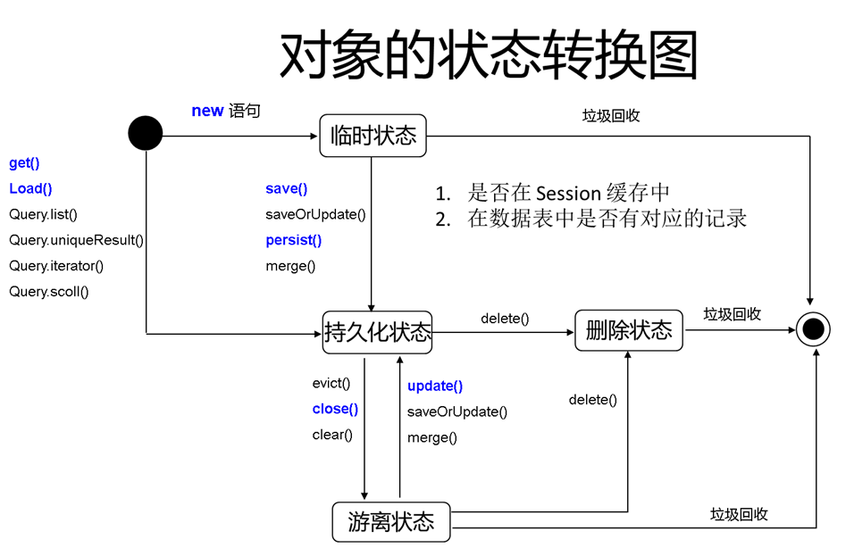

#  一、Helloworld实现

## 1.导入依赖

```xml
<!-- https://mvnrepository.com/artifact/org.hibernate/hibernate-core -->
<dependency>
    <groupId>org.hibernate</groupId>
    <artifactId>hibernate-core</artifactId>
    <version>4.2.4.Final</version>
</dependency>

<!-- https://mvnrepository.com/artifact/org.hibernate.javax.persistence/hibernate-jpa-2.1-api -->
<dependency>
    <groupId>org.hibernate.javax.persistence</groupId>
    <artifactId>hibernate-jpa-2.1-api</artifactId>
    <version>1.0.0.Final</version>
</dependency>
<!-- https://mvnrepository.com/artifact/mysql/mysql-connector-java -->
<dependency>
    <groupId>mysql</groupId>
    <artifactId>mysql-connector-java</artifactId>
    <version>5.1.47</version>
</dependency>

```

## 2.创建配置文件

创建一个hibernate的配置文件，添加基本的配置信息

```xml
<?xml version="1.0" encoding="UTF-8" ?>
<!DOCTYPE hibernate-configuration PUBLIC
        "-//Hibernate/Hibernate Configuration DTD 3.0//EN"
        "http://www.hibernate.org/dtd/hibernate-configuration-3.0.dtd">
<hibernate-configuration>
    <session-factory>
        <!--配置数据库连接的基本属性-->
        <property name="connection.username">root</property>
        <property name="connection.password">123456</property>
        <property name="connection.driver_class">com.mysql.jdbc.Driver</property>
        <property name="connection.url">jdbc:mysql://localhost:3306/hibernate</property>

        <!--配置hibernate所使用的的数据库方言，这里使用mysql-->
        <property name="dialect">org.hibernate.dialect.MySQLInnoDBDialect</property>
        <!--执行操作时是否在控制台打印sql-->
        <property name="show_sql">true</property>
        <!--是否对SQL进行格式化-->
        <property name="format_sql">true</property>
        <!--指定生成数据库表策略，一共有四种取值，update表示，如果数据库中没有表则创建，如果有则更新-->
        <property name="hbm2ddl.auto">update</property>
		
        <!--指定mapper配置文件-->
        <mapping resource="News.hbm.xml"/>
    </session-factory>
</hibernate-configuration>
```

## 3.创建实体类

创建一个新闻类，用于测试，该实体类一定要有一个无参构造器，用于反射创建对象

```java
@Data
@NoArgsConstructor
public class News {

    private Integer id;
    private String title;
    private String author;
    private Date date;

    public News(String title, String author, Date date) {
        this.title = title;
        this.author = author;
        this.date = date;
    }
}
```

## 4.创建mapper

该文件一定要在主配置文件中指定

```xml
<?xml version="1.0"?>
<!DOCTYPE hibernate-mapping PUBLIC 
"-//Hibernate/Hibernate Mapping DTD 3.0//EN"
"http://hibernate.sourceforge.net/hibernate-mapping-3.0.dtd">
<!-- package声明pojo类所在的包，如果不写那么在class中需要指明pojo类所在的包
   schema指数据库模式， 一个模式下可以有多张表
 -->
<hibernate-mapping package="xyz.thishome.pojo">
    <!--
      class：指映射一个pojo类
        1） 提供了公共的无参构造方法--通过反射产生对象
        2）属性用private修饰，并且生成对应的get/set方法
        3）类不能用final 来修饰--hibernate会产生代理类（cglib）
        4）类需要指明标识
      name：表示pojo类名
      table：表示pojo类对应数据库中的表名；如果不写默认是类名
     -->
    <class name="News" table="news">
     
        <id name="id" column="id" type="java.lang.Integer">

            <generator class="native"></generator>
        </id>
        <!-- 实体类属性
        name：指明pojo类属性名称（区分大小写）
        column：实体类属性对应的数据库表列名
        -->
        <property name="title">
            <column name="title"/>
        </property>
        <property name="author">
            <column name="author"/>
        </property>
        <property name="date">
            <column name="date"/>
        </property>
    </class>
</hibernate-mapping>
```

## 5.测试hibernate

```java
@Test
public void test(){

    //1.创建sessionfactory
    SessionFactory sessionFactory = null;
    //创建配置对象
    Configuration configuration = new Configuration().configure("/hibernate.cfg.xml");
    //创建一个服务注册
    ServiceRegistry serviceRegistry = new ServiceRegistryBuilder().applySettings(configuration.getProperties())
            .buildServiceRegistry();
    //通过配置对象，传入服务注册，获取session
    sessionFactory = configuration.buildSessionFactory(serviceRegistry);

    //2.创建会话
    Session session = sessionFactory.openSession();

    //3、开启事务
    Transaction transaction = session.beginTransaction();

    //4.执行保存操作
    News news = new News("这是一个新闻","鲁迅",new Date());
    session.save(news);

    //5.提交事务
    transaction.commit();

    //6.释放资源
    session.close();
    sessionFactory.close();
}
```

测试成功！创建一张News数据表，并成功插入一条数据

## 6.详解

### 1）实体类注意事项

- 必须要有一个无参构造器，用于反射创建对象。
- 提供要有一个标识属性，一般为数据库主键字段。
- 添加getter setter方法，用于属性赋值。
- 不能定义为final，在运行时hibernate会使用cglib生成一个代理对象，如果声明为final则无法生成代理。
- 添加eqauls和hashcode方法，如果返回值用set接收，会需要用到这两个方法。

### 2）Configuration 类

Configuration 类负责管理 Hibernate 的配置信息。包括如下内容：

- Hibernate 运行的底层信息：数据库的URL、用户名、密码、JDBC驱动类，数据库Dialect,数据库连接池等（对应 hibernate.cfg.xml 文件）。

- 持久化类与数据表的映射关系（*.hbm.xml 文件）

创建 Configuration 的两种方式

- 属性文件（hibernate.properties）:    （**很少使用**）

  Configuration cfg = new Configuration();

- Xml文件（**hibernate.cfg.xml**）（**经常使用**）

  Configuration cfg = new Configuration().configure();

  Configuration 的 configure 方法还支持带参数的访问：

  File file = new File(“simpleit.xml”);
  Configuration cfg = new Configuration().configure(file);

  或者直接传入一个字符串，指定文件路径

### 3）SessionFactory 接口

- 针对单个数据库映射关系经过编译后的内存镜像，是线程安全的。 

- SessionFactory 对象一旦构造完毕，即被赋予特定的配置信息

- SessionFactory是生成Session的工厂

- 构造 SessionFactory 很消耗资源，一般情况下一个应用中只初始化一个 SessionFactory 对象。

- Hibernate4 新增了一个 ServiceRegistry 接口，所有基于 Hibernate 的配置或者服务都必须统一向这个 ServiceRegistry  注册后才能生效

- Hibernate4 中创建 SessionFactory 的步骤

~~~java
	//创建sessionfactory
    SessionFactory sessionFactory = null;
    //创建配置对象
    Configuration configuration = new Configuration().configure("/hibernate.cfg.xml");
    //创建一个服务注册
    ServiceRegistry serviceRegistry = new ServiceRegistryBuilder()
        								.applySettings(configuration.getProperties())
            							.buildServiceRegistry();
    //通过配置对象，传入服务注册，获取session
    sessionFactory = configuration.buildSessionFactory(serviceRegistry);
~~~

### 4）session接口

​	Session 是应用程序与数据库之间交互操作的一个**单线程**对象，是 Hibernate 运作的中心，所有持久化对象必须在 session 的管理下才可以进行持久化操作。此对象的生命周期很短。Session 对象有一个一级缓存，显式执行 flush 之前，所有的持久层操作的数据都缓存在 session 对象处。**相当于 JDBC 中的 Connection。**

### 5）Transaction(事务)

代表一次原子操作，它具有数据库事务的概念。所有持久层都应该在事务管理下进行，即使是只读操作。 

  Transaction tx = session.beginTransaction();

常用方法:

- commit():提交相关联的session实例
- rollback():撤销事务操作
- wasCommitted():检查事务是否提交

# 二、通过session操作

测试类上下文：

```java
public class HibernateTest2 {

    private SessionFactory sessionFactory;
    private Session session;
    private Transaction transaction;

    @Before
    public void init() {
        Configuration configuration = new Configuration().configure();
        ServiceRegistry serviceRegistry = new ServiceRegistryBuilder().applySettings(configuration.getProperties()).buildServiceRegistry();
        sessionFactory = configuration.buildSessionFactory(serviceRegistry);

        session = sessionFactory.openSession();

        transaction = session.beginTransaction();
    }

    @After
    public void distroy(){
        transaction.commit();
        session.close();
        sessionFactory.close();
    }
```

## 1.session概述

Session 接口是 Hibernate 向应用程序提供的操纵数据库的最主要的接口, 它提供了**基本的保存, 更新, 删除和加载** Java 对象的方法.

Session 具有一个缓存, **位于缓存中的对象称为持久化对象**, 它和数据库中的相关记录对应. Session 能够在某些时间点, 按照缓存中对象的变化来执行相关的 SQL 语句, 来同步更新数据库, 这一过程被称为刷新缓存(flush)。

站在持久化的角度, Hibernate 把对象分为 4 种状态: **持久化状态, 临时状态, 游离状态, 删除状态**. Session 的特定方法能使对象从一个状态转换到另一个状态. 

## 2.一级缓存

在 Session 接口的实现中包含一系列的 Java 集合, 这些 Java 集合构成了 Session 缓存. **只要 Session 实例没有结束生命周期, 且没有清理缓存，则存放在它缓存中的对象也不会结束生命周期**
Session 缓存可减少 Hibernate 应用程序访问数据库的频率。

```java
public void test(){
    //查询id为1的News Bean对应数据库表的数据
    Object o = session.get(News.class, 1);
    System.out.println(o);
    //第二次查询
    Object o1 = session.get(News.class, 1);
    System.out.println(o1);
    //true，这里使用到了缓存机制
    System.out.println(o == o1);
}
```

### 1）flash缓存刷新

==如果缓存中对象被修改，提交后会同步刷新数据库中的值==

#### 1、提交事务前刷新

查询过的结果会被添加到缓存中去（java的一系列集合），如果修改了缓存中的java对象（修改缓存中对象的属性，并不修改数据库），在提交时，会向mysql执行一个update操作，刷新相应数据库记录中的值。

事务在提交之前，会先执行一个缓存flash刷新缓存，如果缓存中对象属性被改变，则会发出一个更新请求更新数据库中响应的记录。

```java
@Test
public void testSessionFlash(){
    News news = (News) session.get(News.class, 1);
    news.setTitle("这是一个好标题");
}
```

执行SQL：

~~~sql
Hibernate: 
    select  news0.id as id1_0_0, news0.title as title2_0_0, news0.author as author3_0_0, news0.date as date4_0_0 
    from  news news0_ 
    where news0_.id=?
Hibernate: 
    update news 
    set  title=?, author=?, date=? 
    where  id=?
~~~

#### 2、手动刷新

可以使用session对象显示调用flash方法，效果一样

```java
session.flush();
```

#### 3、特殊查询操作

使用特殊的查询操作也会先刷新缓存，如HQL或者QBC查询，这种查询会直接查询到数据表最新的状态。

### 2）reflash缓存刷新

==发出select语句，使session缓存中的的数据信息和数据库中信息保持一致，变为最新的==

## 3.对象的四种状态

持久状态、临时状态、游离状态、删除状态，session的特定方法可以使一个状态转到另一个状态

### 1）临时对象

- OID为空（数据库主键对应属性）
- 不在session缓存中
- 在数据库中没有对应的记录

### 2）持久化对象

- OID不为空

- 位于session缓存中
- 若数据库中已有响应记录，持久化对象与数据库中相关记录对应
- session在flush缓存时，会根据持久化对象的属性变化，来同步更新数据库
- ，在同一个session实例的缓存中，数据库表中的每条记录只对应唯一的持久化对象，否则会抛出异常

### 3）删除对象

- 在数据库中没有与其OID对应的记录
- 不再处于session缓存中
- 一般情况下，应用程序不该再使用被删除对象

### 4）游离对象（也叫“脱管”）

- OID不为null
- 不再处于session缓存中

- 一般情况下，游离对象是由持久对象转变过来的，因此在数据库中可能还存在与它对应的记录。

 


## 4.save和persist添加数据

- 将一个对象从临时对象转化为持久化对象（保存到数据库中）

- 为对象分配一个ID（添加到数据库后，对象的ID会被赋值）
- 在flush缓存的时候会发出一条insert语句

- 如果在save之前，对象中ID属性有值，依然会使用分配的ID，对象的属性ID无效
- 如果在persist之前，对象中ID属性有值，会抛出异常
- 持久化对象的ID不能被修改，会抛异常

## 5.get和load获取数据

- 执行get方法查询数据，会立即加载查询到的数据
- 执行load方法查询数据，如果不使用该对象，则不会立即执行查询操作，而是返回一个代理对象（延迟加载）

- 如果数据表中没有对应的记录，get会返回一个null值，load会在使用时抛出一个对象（不使用不会抛）
- 如果数据库表中有值，get和load返回对象正常，但是如果连接被关闭，get得到的对象依然可以使用，但是load得到的对象如果被使用，会抛出异常（懒加载异常）

- load得到的对象，如果session没有被关闭，数据表中有对应记录，会懒加载正常使用，否则会抛出异常

## 6.update

​	1、若更新一个持久化对象，无需使用update方法，因为在transaction提交时，会先调用flash方法，把持久化对象信息同步到数据表中。若对象信息为修改，而显示调动的update方法，依然不会发出update语句

​	2、若更新一个游离对象，需要显示的调用update方法，即便对象数据与数据表中数据完全一致，依然会发出update语句，调用update方法后，游离对象将转化为持久化对象

​    3、做一个修改，可以使游离对象在更新之前，先做查询语句，比较与数据表中对应记录是否一致，若不一致则发出update语句，否则不发出，从而减少update滥用现象。但是通常不会设置它

在hbm中，对应class标签上加一个属性

```xml
<class name="News" table="news" select-before-update="true">
```

​	4、如果对象在数据库表中没有对应记录，会抛出异常（场景，游离对象修改ID后update）

​	5、如果session缓存中已经有一条记录的持久化对象缓存，而上次会话关闭后，该记录生成的游离对象进行update（两个对象ID相同），会抛出异常，对象不唯一

```java
//获取一个持久化对象
News news = (News) session.get(News.class, 1);
//会话关闭后该对象以变为游离对象
transaction.commit();
session.close();

//再次获取该持久化对象，这时session中已经有id为1的记录的缓存
News news1 = (News) session.get(News.class,1);

//更新上次会话留下的id为1的游离对象
session.update(news);  //抛出异常
```

## 7.saveOrUpdate

保存或者更新，==如果有ID执行更新操作，如果没有ID执行保存操作==

如果有ID，但是数据表中没有ID对应的记录，会抛出异常

了解：如果OID等于配置文件中ID标签的unsaved-value属性值，也会执行添加操作

## 8.delete

1、若OID在数据库表中有对应记录，则删除数据

2、若OID在数据库表中没有对应记录，则抛出异常

3、一个对象被删除后，数据表中已经没有该数据，这个java对象变成了删除态，但是这个对象仍有ID属性，如果对其update和save又会出现问题，所以应该把id置为空。

通过==hibernate.cfg.xml==一个属性的设置可以达到自动把删除后的对象OID置空

```xml
<property name="use_identifier_rollback">true</property>
```

 开发中不是很常用

## 9.evict

从session缓存中把某个持久化对象移除，

# 三、Hibernate配置文件

hibernate.cfg.xml，

主要配置数据库连接和运行时所需的各种属性

每个hibernate配置文件对应一个configration对象，

常用属性：

1. JDBC连接属性

   ```properties
     <!--配置数据库连接的基本属性-->
     <property name="connection.username">root</property>
     <property name="connection.password">123456</property>
     <property name="connection.driver_class">com.mysql.jdbc.Driver</property>
     <property name="connection.url">jdbc:mysql://localhost:3306/hibernate-1</property>
   ```

2. 数据库连接池的基本配置

3. 其他

   - show_sql：是否将运行期间生成的SQL输出到日志以供调试。取值true|false
   - format_sql：是否将SQL转化为格式良好的SQL，取值true|false
   - hbm2ddl.auto：在启动和停止时自动地创建，更新或删除数据库模式。取值create|update（常用）|create-drop|validate
   - hibernate.jdbc.fetch_size：设置JDBC的Statement读取数据的时候每次从数据库中取出的记录条数。例：一次查询1万条记录，对于Orcale的JDBC驱动来说，是不会1次性把1万条取出来的，而只会取出fetchSize条数，当结果集遍历完了这些记录以后，再去数据库取fetchSize条数据。因此大大节省了五位的内存消耗
   - hibernate.jdbc.batch_size：

