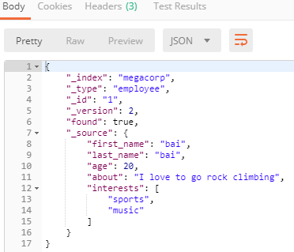

# 一、缓存

## 1.Spring缓存抽象

Spring从3.1开始定义了org.springframework.cache.Cache

和org.springframework.cache.CacheManager接口来统一不同的缓存技术；

并支持使用**JCache**（JSR-107）注解简化我们开发；

* **Cache接口为缓存的组件规范定义，包含缓存的各种操作集合；**

* **Cache接口下Spring提供了各种xxxCache的实现；如RedisCache，EhCacheCache , ConcurrentMapCache等；**

* ==每次调用需要缓存功能的方法时，Spring会检查检查指定参数的指定的目标方法是否已经被调用过；如果有就直接从缓存中获取方法调用后的结果（不再调用目标方法），如果没有就调用方法并缓存结果后返回给用户。下次调用直接从缓存中获取。==

* **使用Spring缓存抽象时我们需要关注以下两点；**

  **1、确定方法需要被缓存以及他们的缓存策略**

  **2、从缓存中读取之前缓存存储的数据**

## 2.重要的概念及缓存注解

|                |                                                              |
| -------------- | ------------------------------------------------------------ |
| Cache          | 缓存接口，定义缓存操作。实现有：RedisCache、EhCacheCache、ConcurrentMapCache等 |
| CacheManager   | 缓存管理器，管理各种缓存（Cache）组件                        |
| @Cacheable     | 主要针对方法配置，能够根据方法的请求参数对其结果进行缓存（被缓存后方法体不在执行，直接从缓存中取值，查询方法使用） |
| @CacheEvict    | 清空缓存（删除方法使用）                                     |
| @CachePut      | 保证方法被调用，又希望结果被缓存（每次都会执行方法体，并把返回结果放入缓存，更新方法使用）。 |
| @EnableCaching | 开启基于注解的缓存                                           |
| keyGenerator   | 缓存数据时key生成策略                                        |
| serialize      | 缓存数据时value序列化策略                                    |

## 3.缓存基本使用

### 1）环境搭建

#### 1、创建SpringBoot工程

springboot-01-cache

选择模块：web，cache，mysql，mybatis

#### 2、创建数据库

springboot_cache

两张表：department，employee

#### 3、整合mybatis操作数据库

配置数据源

```yaml
spring:
  datasource:
    url: jdbc:mysql://localhost:3306/springboot_cache
    username: root
    password: 123456
    driver-class-name: com.mysql.jdbc.Driver
```

配置扫描mappper包，配置在SpringBoot应用上

```java
@SpringBootApplication
@MapperScan("xyz.thishome.cache.mapper")
public class Springboot01CacheApplication {

    public static void main(String[] args) {
        SpringApplication.run(Springboot01CacheApplication.class, args);
    }

}
```

创建mapper

```java
package xyz.thishome.cache.mapper;

import org.apache.ibatis.annotations.*;
import xyz.thishome.cache.bean.Employee;

@Mapper
public interface EmployeeMapper {

    /**
     * 通过id查询员工
     * @param id
     * @return
     */
    @Select("SELECT * FROM employee WHERE id = #{id}")
    public Employee getEmpForId(Integer id);

    /**
     * 根据ID更新员工
     * @param employee
     */
    @Update("UPDATE employee set lastName = #{lastName},email = #{email},gender = #{gender},d_id = ${dId} WHERE id = #{id}")
    public void updateEmp(Employee employee);

    /**
     * 插入一个员工
     */
    @Insert("INSERT INTO employee(lastName,email,gender,d_id) value(#{lastName},#{email},#{gender},#{dId})")
    public void insertEmp(Employee employee);

    /**
     * 根据员工ID删除员工
     * @param id
     */
    @Delete("DELETE FROM employee WHERE id = #{id}")
    public void deleteEmpForId(Integer id);

}
```

#### 4、创建service和controller

```java
@Service
public class EmloyeeService {

    @Autowired
    private EmployeeMapper employeeMapper;

    public Employee getEmp(Integer id) {
        return employeeMapper.getEmpForId(id);
    }

}
```

```java
@RestController
public class EmployeeController {

    @Autowired
    private EmloyeeService emloyeeService;

    @GetMapping("/emp/{id}")
    public Employee getEmp(@PathVariable Integer id) {
        return emloyeeService.getEmp(id);
    }

}
```

### 2）缓存初体验

#### 1、开启基于注解的缓存

**@EnableCaching**

```java
@EnableCaching   //配置在SpringBoot应用上
public class Springboot01CacheApplication {
```

#### 2、在方法上添加缓存注解

**@Cacheable**

```java
@Service
public class EmloyeeService {

    @Autowired
    private EmployeeMapper employeeMapper;
    
	//该方法的返回值会被添加到缓存中，以后执行，不用再调用方法体
    @Cacheable(value = {"emp"}, key = "#id"）   
    public Employee getEmp(Integer id) {
        System.out.println("执行查询方法");
        return employeeMapper.getEmpForId(id);
    }

}
```

## 4.缓存详解


CacheManger表示，使用的缓存组件，比如redis，Memcache

Cache表示缓存中的分类（spring概念），比如员工缓存，部门缓存，商品缓存。Cache中存的才是真正缓存的信息

### 1）缓存原理

 原理：

 1、自动配置类；CacheAutoConfiguration

```java
@Import(CacheConfigurationImportSelector.class)
public class CacheAutoConfiguration {
```

 2、缓存的配置类

CacheConfigurationImportSelector添加的配置类组件

```java
org.springframework.boot.autoconfigure.cache.GenericCacheConfiguration
org.springframework.boot.autoconfigure.cache.JCacheCacheConfiguration
org.springframework.boot.autoconfigure.cache.EhCacheCacheConfiguration
org.springframework.boot.autoconfigure.cache.HazelcastCacheConfiguration
org.springframework.boot.autoconfigure.cache.InfinispanCacheConfiguration
org.springframework.boot.autoconfigure.cache.CouchbaseCacheConfiguration
org.springframework.boot.autoconfigure.cache.RedisCacheConfiguration
org.springframework.boot.autoconfigure.cache.CaffeineCacheConfiguration
org.springframework.boot.autoconfigure.cache.GuavaCacheConfiguration
org.springframework.boot.autoconfigure.cache.SimpleCacheConfiguration【默认】
org.springframework.boot.autoconfigure.cache.NoOpCacheConfiguration
```
3、哪个配置类默认生效：SimpleCacheConfiguration；

4、给容器中注册了一个CacheManager：ConcurrentMapCacheManager

5、可以获取和创建ConcurrentMapCache类型的缓存组件；他的作用将数据保存在ConcurrentMap中；

6、方法运行流程：

```java
@Cacheable：
使用springAOP功能
CglibAopProxy(AOP代理类，获取拦截器执行链，然后执行拦截器和目标方法)
->ReflectiveMethodInvocation(这里使用此类来执行拦截器方法)
->CacheInterceptor(缓存拦截器) extends CacheAspectSupport(真正执行缓存操作的类，翻译[缓存方面的支持])
```

关键在**CacheInterceptor**和它的父类**CacheAspectSupport**

```java
public class CacheInterceptor extends CacheAspectSupport implements MethodInterceptor, Serializable {
	@Override
    public Object invoke(final MethodInvocation invocation) throws Throwable {
        //获取被执行的方法
        Method method = invocation.getMethod();
        //创建缓存操作执行者对象，用它来执行aop的后续流程
        CacheOperationInvoker aopAllianceInvoker = new CacheOperationInvoker() {
            @Override
            public Object invoke() {
                try {
          			//执行aop的后续流程，最终会执行目标方法
                    return invocation.proceed();
                }
                catch (Throwable ex) {
                    throw new ThrowableWrapper(ex);
                }
            }
        };

        try {
            //执行真正的操作，并返回处理后的结果
            //方法中先从缓存中获取，如果获取成果，不在执行后续流程，直接返回目标对象
            //如果获取失败，执行后续流程，最终执行到方法体，把返回对象添加到缓存中并返回
            return execute(aopAllianceInvoker, invocation.getThis(), method, invocation.getArguments());
        }
        catch (CacheOperationInvoker.ThrowableWrapper th) {
            throw th.getOriginal();
        }
    }

}
```
**`CacheAspectSupport.execute()`方法流程文字描述**（可以看看源码）

[源码](CacheAspectSupport.execute().txt)

~~~
	1、目标方法运行之前，先去查询Cache（缓存组件），按照cacheNames指定的名字获取；
       （CacheManager先获取相应的缓存），第一次获取缓存如果没有Cache组件会自动创建。
    2、去Cache中查找缓存的内容，使用一个key，默认就是方法的参数；
       key是按照某种策略生成的；默认是使用keyGenerator生成的，默认使用SimpleKeyGenerator生成key；
           SimpleKeyGenerator生成key的默认策略；
                   如果没有参数；key=new SimpleKey()；
                   如果有一个参数：key=参数的值
                   如果有多个参数：key=new SimpleKey(params)；
    3、没有查到缓存就调用目标方法；
    4、将目标方法返回的结果，放进缓存中
~~~

总结：

@Cacheable标注的方法执行之前先来检查缓存中有没有这个数据，默认按照参数的值作为key去查询缓存，
如果没有就运行方法并将结果放入缓存；以后再来调用就可以直接使用缓存中的数据；

核心：
   1）、使用CacheManager【ConcurrentMapCacheManager】按照名字得到Cache【ConcurrentMapCache】组件
   2）、key使用keyGenerator生成的，默认是SimpleKeyGenerator

### 2）==spel表达式==

| 名字          | 位置               | 描述                                                         | 示例                  |
| ------------- | ------------------ | ------------------------------------------------------------ | --------------------- |
| methodName    | root object        | 当前被调用的方法名                                           | #root.methodName      |
| method        | root object        | 当前被调用的方法                                             | #root.method.name     |
| target        | root object        | 当前被调用的目标对象                                         | #root.target          |
| targetClass   | root object        | 当前被调用的目标对象类                                       | #root.targetClass     |
| args          | root object        | 当前被调用的方法的参数列表                                   | #root.args[0]         |
| caches        | root object        | 当前方法调用使用的缓存列表（如@Cacheable(value={"cache1",   "cache2"})），则有两个cache | #root.caches[0].name  |
| argument name | evaluation context | 方法参数的名字. 可以直接 #参数名 ，也可以使用 #p0或#a0 的形式，0代表参数的索引； | `#id 、 #a0 、  #p0 ` |
| result        | evaluation context | 方法执行后的返回值（仅当方法执行之后的判断有效，如‘unless’，’cache put’的表达式 ’cache evict’的表达式beforeInvocation=false） | #result               |

可以用and or连接多个判断，可以用eq判断字符串相等

案例：

```java
//"#id"：调用属性id的值     "#root.args[0]>0"：使用第一个参数的值    
//"#result==null"：使用返回结果   #root.methodName+'['+#id+']'：getEmp[id]
@Cacheable(value = {"emp", "temp"}, key = "#root.methodName+'['+#id+']'",condition = "#root.args[0]>0",unless = "#result==null")
public Employee getEmp(Integer id) {
    System.out.println("执行查询方法");
    return employeeMapper.getEmpForId(id);
}
```

### 3）**@Cacheable注解**

```java
public @interface Cacheable {
    //指定缓存名（缓存分类），CacheManager里Cache的名字，例如员工缓存：emp，可以指定多个缓存名
    @AliasFor("cacheNames")
    String[] value() default {};
    
	//和value一样
    @AliasFor("value")
    String[] cacheNames() default {};
	
    //缓存的键，可以使用spel表达式，默认为方法参数
    String key() default "";
	
    //key的生成器，可以用来指定使用哪个键生成器来自动生成key，和key属性二选一
    //org.springframework.cache.interceptor.KeyGenerator类型
    //默认使用SimpleKeyGenerator
    //填写的值为keyGenerator在springIOC容器中的id
    String keyGenerator() default "";
	
    //缓存管理器，添加到哪个缓存管理器中
    //org.springframework.cache.CacheManager类型
   	//默认使用ConcurrentMapCacheManager
    String cacheManager() default "";
	
    //缓存解析器，和cacheManager一样，二选一
    //org.springframework.cache.interceptor.CacheResolver类型
     //默认使用org.springframework.cache.interceptor.CacheResolver
    String cacheResolver() default "";
	
    //满足条件则缓存，可以使用spel表达式
    String condition() default "";
	
    //满足条件则不缓存，可以使用spel表达式，可以使用#result
    String unless() default "";
	
    //是否使用异步缓存，如果使用异步缓存，unless失效
    boolean sync() default false;
}
```

### 自定义keyGenerator

写一个配置类，添加到配置类中一个keyGenerator类型对象即可

注意，是==org.springframework.cache.interceptor.KeyGenerator==类型，包不能导错了

~~~java
@Configuration
public class MyCacheConfig {
    @Bean
    public KeyGenerator myKeyGenerator() {
        //直接实现接口，匿名内部类
        return new KeyGenerator() {
            @Override
            public Object generate(Object target, Method method, Object... params) {
                //方法名[参数]  为Key
                String key = method.getName() + "[" + Arrays.asList(params) + "]";
                return key;
            }
        };
    }
}
~~~

### 4）@CachePut注解

和`@Cacheable`类似，`@CachePut`注解标注的方法，每次会执行目标方法，然后把方法返回值缓存起来，一般用于更新操作，==注意，@Cacheable注解做查询，@CachePut做更新，搭配使用时，一定要把key值设为一致==

### 5）@CacheEvict注解

清空缓存

```java
public @interface CacheEvict {
//{
   @AliasFor("cacheNames")
   String[] value() default {};
   @AliasFor("value")
   String[] cacheNames() default {};
   String key() default "";
   String keyGenerator() default "";
   String cacheManager() default "";
   String cacheResolver() default "";
   String condition() default "";
//} 以上属性在@Cacheable注解中都有说明
    
    //是否删除所有缓存，默认删除key对应的缓存，可以通过该属性的设置，删除当前cache中所有缓存
   boolean allEntries() default false;
	
   //是否在方法执行之前清除缓存。默认为false（在方法执行之后清除缓存）
   //又一个场景，如果该方法执行删除后，发生异常，方法的缓存就没有清掉，所有可以通过设置该属性为true，调整清除缓存的时机
   boolean beforeInvocation() default false;
}
```

### 6）@Caching注解

用来写比较复杂的组合注解

```java
public @interface Caching {
	//多个@cacheable注解
	Cacheable[] cacheable() default {};
	
    //多个@CachePut注解
	CachePut[] put() default {};
	
    //多个@CacheEvict注解
	CacheEvict[] evict() default {};

}
```

案例：
~~~java
@Caching(
            cacheable = {
                    @Cacheable(value = "emp", key = "#id"),
                    @Cacheable(value = "emp", key = "#email")
            },
            put = {
                    @CachePut(value = "emp", key = "#lastName")
            },
            evict = {
                    @CacheEvict(value = "emp",key = "#gender")
            }
    )
    public void test(Employee employee) {
    }
~~~

### 7）@CacheConfig注解

该注解属性时其他缓存注解共同拥有的属性，**把该注解标注在类上，注解中的属性指定后，该注解中的所有缓存注解都会生效**，不需要重复指定多遍。

```java
public @interface CacheConfig {
   String[] cacheNames() default {};
   String keyGenerator() default "";
   String cacheManager() default "";
   String cacheResolver() default "";
}
```

## 5.SpringBoot整合redis

### 1）搭建环境

安装docker

docker中拉取redis镜像

`docker pull redis:3.2`

启动redis

`docker run -d -p 3306:3306 --name redis reids:3.2`

### 2）整合SpringBoot

pom文件添加启动器

```xml
<dependency>
    <groupId>org.springframework.boot</groupId>
    <artifactId>spring-boot-starter-data-redis</artifactId>
</dependency>
```

配置redis主机

在配置文件中配置

```yml
spring:
  redis:
    host: 192.168.153.128
```

### 3）redis自动配置类

`RedisAutoConfiguration`类

在配置类中添加了两个组件，用于redis简单操作

`RedisTemplate<Object, Object>` ：用于操作对象（存取对象，序列化机制）

`StringRedisTemplate`：专门用于操作字符串（存取字符串）

==使用RedisTemplate操作的对象必须是可序列化的==（**实现Serializable接口**）

```java
@Autowired
private StringRedisTemplate stringRedisTemplate;

@Autowired
private RedisTemplate redisTemplate;

@Test
public void testRedis(){
    //这里会使用jdk默认的序列化机制（JdkSerializationRedisSerializer），存取到redis中的是序列化后的数据（字符串也是）
    redisTemplate.opsForValue().set("k3",new Employee(1,"小红","123@qq.com",0,1));
    Object k3 = redisTemplate.opsForValue().get("k3");
    System.out.println(k3);
}

@Test
public void testStringRedis(){
    //直接存取字符串，无需序列化
    stringRedisTemplate.opsForValue().set("k2","v2");
    String k2 = stringRedisTemplate.opsForValue().get("k2");
    System.out.println(k2);
}
```

#### 使用ReditTemplate操作redis

1.redisTemplate.opsForValue();//操作字符串

2.redisTemplate.opsForHash();//操作hash

3.redisTemplate.opsForList();//操作list

4.redisTemplate.opsForSet();//操作set

5.redisTemplate.opsForZSet();//操作有序set

`RedisAutoConfiguration`中自动配置了`JdkSerializationRedisSerializer`这个序列化器，序列化后的数据可读性太差，还是习惯用通俗易懂的json格式来存储数据

**可以使用我们自己的序列化器**

### 4）自定义序列化器

写一个配置类，在配置类中添加自己的RedisTemplate，并设置序列化器

```java
@Configuration
public class RedisConfig {

    @Bean  //配置一个自定义的RedisTemplate，设置序列化器
    public RedisTemplate<Object, Employee> jsonRedisTemplate(
            RedisConnectionFactory redisConnectionFactory)
            throws UnknownHostException {
        RedisTemplate<Object, Employee> template = new RedisTemplate<Object, Employee>();
        template.setConnectionFactory(redisConnectionFactory);
        //设置json序列化器Jackson2JsonRedisSerializer
        template.setDefaultSerializer(new Jackson2JsonRedisSerializer(Employee.class));
        return template;
    }

}
```

测试

```java
@Autowired
private RedisTemplate jsonRedisTemplate;

@Test
public void testJsonRedisTemplate(){
    jsonRedisTemplate.opsForValue().set("k3",new Employee(1,"小红","123@qq.com",0,1));
    Object k3 = jsonRedisTemplate.opsForValue().get("k3");
    System.out.println(k3);
}
```

String使用json序列化后的字符串比较特殊，加上了双引号

 

所以在redis中获取需要加上\转义

 

### 5）投入使用

service

```java
@Service
public class EmloyeeService {

    @Autowired
    private EmployeeMapper employeeMapper;

    @Cacheable(value = {"emp"}, unless = "#result==null")
    public Employee getEmp(Integer id) {
        System.out.println("执行查询方法");
        return employeeMapper.getEmpForId(id);
    }

    @CachePut(value = {"emp"}, key = "#employee.id")
    public Employee updateEmp(Employee employee) {
        employeeMapper.updateEmp(employee);
        return employee;
    }

}
```

直接使用，发现使用的是默认的`RedisTemplate`是`RedisAutoConfiguration`中配置的，并不是我们自己配置的，序列化机制使用的`JdkSerializationRedisSerializer`，而我们需要`Jackson2JsonRedisSerializer`来做序列化

两种方式，可以使用我们自己的RedisTemplate

**==方法1==、把我们自己的RedisTemplate的ID和系统默认的ID（@Bean注解标注的方法名）设置为一样(redisTemplate)，系统默认的RedisTemplate就不会被注册到IOC容器中，容器中就会只有我们自己的RedisTemplate**

**==方法2==、需要进一步作出配置**

**找到`RedisCacheConfiguration`配置类**，在这个类中配置了默认的`RedisCacheManager`

```java
@Configuration
@AutoConfigureAfter(RedisAutoConfiguration.class)
@ConditionalOnBean(RedisTemplate.class)
//容器中没有CacheManager才会生效，意味着如果我们添加一个CacheManager，就会使用我们的，这个CacheManager就不会生效
@ConditionalOnMissingBean(CacheManager.class)
@Conditional(CacheCondition.class)
class RedisCacheConfiguration {

   private final CacheProperties cacheProperties;

   private final CacheManagerCustomizers customizerInvoker;

   RedisCacheConfiguration(CacheProperties cacheProperties,
         CacheManagerCustomizers customizerInvoker) {
      this.cacheProperties = cacheProperties;
      this.customizerInvoker = customizerInvoker;
   }

   @Bean
   public RedisCacheManager cacheManager(RedisTemplate<Object, Object> redisTemplate) {
       //直接new了一个RedisCacheManager，传入默认的redisTemplate，意味着我们可以也new一个RedisCacheManager对象，传入我们的redisTemplate，并添加到IOC容器中，缓存机制在调用的时候就会使用我们的RedisCacheManager
      RedisCacheManager cacheManager = new RedisCacheManager(redisTemplate);
      //设置使用前缀，设置后，在redis中存的key就会加上cache的名字+":"作为前缀，例如:emp:1
      cacheManager.setUsePrefix(true);
      List<String> cacheNames = this.cacheProperties.getCacheNames();
      if (!cacheNames.isEmpty()) {
         cacheManager.setCacheNames(cacheNames);
      }
      return this.customizerInvoker.customize(cacheManager);
   }

}
```

根据以上分析，我们可以模仿默认的RedisCacheConfiguration定制我们自己的配置文件，添加自定义RedisCacheManager

```java
@Configuration
public class RedisConfig {

    @Bean  //配置一个自定义的RedisTemplate，设置序列化器
    public RedisTemplate<Object, Object> jsonRedisTemplate(
            RedisConnectionFactory redisConnectionFactory)
            throws UnknownHostException {
        RedisTemplate<Object, Object> template = new RedisTemplate<Object, Object>();
        template.setConnectionFactory(redisConnectionFactory);
        //设置json序列化器Jackson2JsonRedisSerializer
        template.setDefaultSerializer(new Jackson2JsonRedisSerializer(Employee.class));
        return template;
    }

    @Bean  //添加自定义RedisCacheManager
    @Primary  //设置为默认的CacheManager
    public RedisCacheManager cacheManager(RedisTemplate<Object, Object> jsonRedisTemplate) {
        //传入我们自己的redisTemplate
        RedisCacheManager cacheManager = new RedisCacheManager(jsonRedisTemplate);
        cacheManager.setUsePrefix(true);
        return cacheManager;
    }

}
```

==一定要设置一个默认的CacheManager，防止多个CacheManager冲突==

### 6）编码中使用缓存

```java
@Qualifier("redisCacheManager")//如果有多个缓存管理器，可以通过设置该注解属性指定需要注入哪个组件
@Autowired     //也可以通过属性名
private RedisCacheManager redisCacheManager;

public Employee getEmp(Integer id) {
    Employee emp = employeeMapper.getEmpForId(id);
    //获取缓存对象
    Cache cache = redisCacheManager.getCache("emp");
    //添加到缓存
    cache.put(emp.getdId(), emp);
    return emp;
}
```


# 二、消息中间件

## 1.概述

### 1）重要概念

1、大多应用中，可通过消息服务中间件来提升系统异步通信、扩展解耦能力

2、消息服务中两个重要概念：

​       **消息代理**（message broker）和**目的地**（destination）

当消息发送者发送消息以后，将由消息代理接管，消息代理保证消息传递到指定目的地。

3、消息队列主要有两种形式的目的地

​	1.队列（queue）：点对点消息通信（point-to-point）

​	2.主题（topic）：发布（publish）/订阅（subscribe）消息通信

4、点对点式：

* 消息发送者发送消息，消息代理将其放入一个队列中，消息接收者从队列中获取消息内容，消息读取后被移出队列

* 消息只有唯一的发送者和接受者，但并不是说只能有一个接收者（多个接收者可以同时接收，只能有一个接收成功）

5、发布订阅式：

* 发送者（发布者）发送消息到主题，多个接收者（订阅者）监听（订阅）这个主题，那么就会在消息到达时同时收到消息

6、JMS（Java Message Service）JAVA消息服务：

* 基于JVM消息代理的规范。ActiveMQ、HornetMQ是JMS实现

7、AMQP（Advanced Message Queuing Protocol）

* 高级消息队列协议，也是一个消息代理的规范，兼容JMS

* RabbitMQ是AMQP的实现

### 2）消息中间件的运用


### 3）JMS和AMQP的区别 

|              | JMS                                                          | AMQP                                                         |
| ------------ | ------------------------------------------------------------ | ------------------------------------------------------------ |
| 定义         | Java   api                                                   | 网络线级协议                                                 |
| 跨语言       | 否                                                           | 是                                                           |
| 跨平台       | 否                                                           | 是                                                           |
| Model        | 提供两种消息模型：   （1）、Peer-2-Peer   （2）、Pub/sub     | 提供了五种消息模型：   （1）、direct   exchange   （2）、fanout   exchange   （3）、topic   change   （4）、headers   exchange   （5）、system   exchange   本质来讲，后四种和JMS的pub/sub模型没有太大差别，仅是在路由机制上做了更详细的划分； |
| 支持消息类型 | 多种消息类型：   TextMessage   MapMessage   BytesMessage   StreamMessage   ObjectMessage   Message   （只有消息头和属性） | byte[]   当实际应用时，有复杂的消息，可以将消息序列化后发送。 |
| 综合评价     | JMS   定义了JAVA   API层面的标准；在java体系中，多个client均可以通过JMS进行交互，不需要应用修改代码，但是其对跨平台的支持较差； | AMQP定义了wire-level层的协议标准；天然具有跨平台、跨语言特性。 |

### 4）Spring支持

* spring-jms提供了对JMS的支持

* spring-rabbit提供了对AMQP的支持

* 需要ConnectionFactory的实现来连接消息代理

* 提供JmsTemplate、RabbitTemplate来发送消息

* @JmsListener（JMS）、@RabbitListener（AMQP）注解在方法上监听消息代理发布的消息

* @EnableJms、@EnableRabbit开启支持

**Spring Boot自动配置**

* JmsAutoConfiguration

* RabbitAutoConfiguration

## 2.RabbitMQ

### 1）重要概念

RabbitMQ简介：

RabbitMQ是一个由erlang开发的AMQP(Advanved Message Queue Protocol)的开源实现。

核心概念

|     名称     | 解释                                                         |
| :----------: | ------------------------------------------------------------ |
|   Message    | 消息，消息是不具名的，它由消息头和消息体组成。消息体是不透明的，而消息头则由一系列的可选属性组成，这些属性包括routing-key（路由键）、priority（相对于其他消息的优先权）、delivery-mode（指出该消息可能需要持久性存储）等。 |
|  Publisher   | 消息的生产者，也是一个向交换器发布消息的客户端应用程序。     |
|   Exchange   | 交换器，用来接收生产者发送的消息并将这些消息路由给服务器中的队列。<br>Exchange有4种类型：direct(默认)，fanout, topic, 和headers，不同类型的Exchange转发消息的策略有所区别 |
|    Queue     | 消息队列，用来保存消息直到发送给消费者。它是消息的容器，也是消息的终点。一个消息可投入一个或多个队列。消息一直在队列里面，等待消费者连接到这个队列将其取走。 |
|   Binding    | 绑定，用于消息队列和交换器之间的关联。一个绑定就是基于路由键将交换器和消息队列连接起来的路由规则，所以可以将交换器理解成一个由绑定构成的路由表。<br>Exchange 和Queue的绑定可以是多对多的关系。 |
|  Connection  | 网络连接，比如一个TCP连接。                                  |
|   Channel    | 信道，多路复用连接中的一条独立的双向数据流通道。信道是建立在真实的TCP连接内的虚拟连接，AMQP 命令都是通过信道发出去的，不管是发布消息、订阅队列还是接收消息，这些动作都是通过信道完成。因为对于操作系统来说建立和销毁 TCP 都是非常昂贵的开销，所以引入了信道的概念，以复用一条 TCP 连接。 |
|   Consumer   | 消息的消费者，表示一个从消息队列中取得消息的客户端应用程序。 |
| Virtual Host | 虚拟主机，表示一批交换器、消息队列和相关对象。虚拟主机是共享相同的身份认证和加密环境的独立服务器域。每个 vhost 本质上就是一个 mini 版的 RabbitMQ 服务器，拥有自己的队列、交换器、绑定和权限机制。vhost 是 AMQP 概念的基础，必须在连接时指定，RabbitMQ 默认的 vhost 是 / 。 |
|    Broker    | 表示消息队列服务器实体                                       |

### 2）运行流程

 


AMQP 中的消息路由

AMQP 中消息的路由过程和 Java 开发者熟悉的 JMS 存在一些差别，AMQP 中增加了 **Exchange** 和 **Binding** 的角色。生产者把消息发布到 Exchange 上，消息最终到达队列并被消费者接收，而 Binding 决定交换器的消息应该发送到那个队列。

 

### 3）Exchange类型

Exchange分发消息时根据类型的不同分发策略有区别，目前共四种类型：**direct、fanout、topic**、headers 。headers 匹配 AMQP 消息的 header 而不是路由键， headers 交换器和 direct 交换器完全一致，但性能差很多，目前几乎用不到了，所以直接看另外三种类型：

#### 1、**direct**

直接的 单播模式

 

消息中的路由键（routing key）如果和 Binding 中的 binding key 一致，
交换器就将消息发到对应的队列中。路由键与队列名完全匹配，如果一个队列绑定到交换机要求路由键为“dog”，则只转发 routing key 标记为“dog”的消息，不会转发“dog.puppy”，也不会转发“dog.guard”等等。

==单播模式，要求路由键和队列名完全匹配，典型的点对点传播==

#### 2、fanout

扇出；展开；分列，广播模式

 

每个发到 fanout 类型交换器的消息都会分到所有绑定的队列上去。fanout交换器不处理路由键，只是简单的将队列绑定到交换器上，每个发送到交换器的消息都会被转发到与该交换器绑定的所有队列上。很像子网广播，每台子网内的主机都获得了一份复制的消息。fanout类型转发消息是最快的。

==广播模式，把事件传播到所有的队列，不看路由键==

#### 3、topic

主题；题目；一般规则，匹配模式

 

topic 交换器通过模式匹配分配消息的路由键属性，将路由键和某个模式进行匹配，此时队列需要绑定到一个模式上。它将路由键和绑定键的字符串切分成单词，这些单词之间用点隔开。它同样也会识别两个通配符：符号“#”和符号“\*”。#匹配0个或多个单词，*匹配一个单词。

==匹配模式，模糊匹配，单词级别的匹配，单词间 **.** 隔开==

### 4）安装RabbitMQ

使用docker安装

#### 1、拉取镜像

选择带management的版本，拥有web管理页面

`docker pull rabbitmq:3.6.16-management`

#### 2、创建容器

rabbitmq有两个暴露的端口

rabbitmq通信的端口**5672**              rabbitmq的web管理页面使用的端口**15672**

`docker run -d -p 5672:5672 -p 15672:15672 --name rabbitmq rabbitmq:3.6.16-management`

==web管理页面的用户名和密码默认均为guest==

### 5）web管理简单操作

#### 1、创建exchange


#### 2、创建队列


#### 3、队列绑定exchange

第一步

 


第二步

 

#### 4、测试发布消息

**第一步，选择一个测试的节点**

 

**第二步、发布消息**


**第三步，查看队列消息**

 

**选择每一个消息队列，可以操作消息队列里面的细节，如获取消息（可以通过设置，把获取后的消息删除）**

Requeue属性设置为yes，获取消息后消息依然保留，反之删除

#### 5、查看管理用户

 

 可以在此页面添加用户和对应的虚拟主机路径

### 6）测试RabbitMQ

测试图


根据上图，测试3个类型exchange消息分发情况

3个exchange：exchange.direct、exchange.fanout、exchange.topic

4个消息队列：atguigu、atguigu.news、atguigu.emps、atguigu.news

#### 1、测试环境

根据测试图绑定所有的消息队列与交换器

 

#### 2、测试

##### 测试direct：

**参数：**

exchange（交换机）：`exchange.direct`

Routing key（路由键）：`atguigu`

Payload（载体）： `exchanges:exchanges.direct`
​				   `Routing key:Routing key`

**结果：**

 

atguigu队列增加一条消息

##### 测试fanout：

**参数：**

exchange（交换机）：`exchange.fanout`

Routing key（路由键）：`atguigu`

Payload（载体）： `exchanges:exchanges.fanout`
​				   `Routing key:atguigu`

**结果：**

 

所有队列都增加一条消息

##### 测试topic：

参数：

exchange（交换机）：`exchange.topic`

Routing key（路由键）：`atguigu.news`

Payload（载体）： `exchanges:exchanges.topic`
​				   `Routing key:atguigu.news`

 

所有队列都增加一条消息

## 3.SpringBoot整合RabbitMQ

### 1）引入模块

```xml
<dependency>
    <groupId>org.springframework.boot</groupId>
    <artifactId>spring-boot-starter-amqp</artifactId>
</dependency>
```

### 2）查看SpringBoot自动配置

**RabbitAutoConfiguration**自动配置类

配置了一个**ConnectionFactory**连接工厂，该工厂绑定了**RabbitProperties**属性类

```java
@ConfigurationProperties(prefix = "spring.rabbitmq")
public class RabbitProperties {
```

我们可以通过配置`spring.rabbitmq`修改rabbit的配置

```yaml
spring:
  rabbitmq:
    host: 192.168.153.128    #主机地址
    port: 5672      #端口号 
    username: guest    #用户名
    password: guest    #密码
    virtual-host: /    #虚拟主机路径
```

配置了一个RabbitTemplate，给RabbitMQ发送和接受信息


配置了一个AmqpAdmin，RabbitMQ的系统管理组件


### 3）RabbitTemplate

```java
//发消息
@Test
public void contextLoads() {
    //两种发消息方法
    //1.需要传入exchange（String），routingKey（string），message（Message需要自己new一个对象）
    //rabbitTemplate.send(exchange,routingKey,message);

    //2.前两个对象和上面的一样，object序列化后会被默认放到Message的消息体中
    //如果不需要定制消息的消息头，属性等内容，可以直接使用这个方法
    //rabbitTemplate.convertAndSend(exchange,routingKey,object);
    
    //演示第二种
    Map<String,String> map = new HashMap<>();
    map.put("msg","rabbitTemplate");
    map.put("exchange","exchange.direct");
    map.put("routingKey","atguigu.news");
    //传入的对象被默认序列化后发送出去
    rabbitTemplate.convertAndSend("exchange.direct","atguigu.news",map);
}
//接收消息
@Test
public void testReceive(){
    //两种方式
    //1.接收消息，返回消息对象（Message）
    //Message receive = rabbitTemplate.receive("");

    //2.接收消息，把消息体转化为Object对象返回
    Object o = rabbitTemplate.receiveAndConvert("atguigu.news");
    System.out.println(o);
    //接收消息后，消息队列中的这条消息就会被移除
}
```

消息是被java默认的序列化机制序列化的，可读性太差，我们需要以json的方法进行序列化

### 4）配置json序列化

在RabbitTemplate中是使用MessageConverter对对象进行序列化的

```java
private volatile MessageConverter messageConverter = new SimpleMessageConverter();
```

这里直接new了一个`SimpleMessageConverter`，我们可以通过修改MessageConverter来定制序列化机制

在Rabbit自动配置类中，在添加RabbitTemplate组件的时候，有一个判断，如果IOC容器中存在MessageConverter，就会使用IOC中的，把默认的覆盖掉

```java
MessageConverter messageConverter = this.messageConverter.getIfUnique();
if (messageConverter != null) {
   rabbitTemplate.setMessageConverter(messageConverter);
}
```

通过分析，我们可以写一个配置类，在配置类中添加我们需要的MessageConverter到IOC容器中，就可以自动生效

```java
@Configuration
public class MyAMQPConfig {

    @Bean
    public MessageConverter messageConverter() {
        //添加json序列化的MessageConverter
        return new Jackson2JsonMessageConverter();
    }

}
```

==java默认的序列化机制需要类实现Serializable接口，json序列化机制无需实现==

### 5）Rabbit监听机制

场景：订单系统下了一个订单，会向rabbit中发一个消息到消息队列中，库存系统需要从消息队列中接收这个消息，减少库存，库存系统就要持续监听需要的消息队列，如果有消息进入队列，就接收，减库存。

第一步，开启基于注解的RabbitMQ模式

```java
@SpringBootApplication
@EnableRabbit
public class Springboot02RabbitApplication {
```

第二步，在需要监听的方法上添加`@RabbitListener`注解

```java
//queues指定需要监听的消息队列，数组类型，可以监听多个消息队列
@RabbitListener(queues = "atguigu")
//SpringBoot会自动把消息体中的内容反序列化为一个对象，传入方法参数
//也可以写一个Message类型
private void receive(Book book){  
    System.out.println(book);
}
```

测试：

发送消息

```java
//测试监听器，发送消息
@Test
public void testSend() {
    rabbitTemplate.convertAndSend("exchange.direct", "atguigu", new Book("三国演义", "吴承恩"));
}
```

先启动springboot主程序，加载监听rabbit方法，然后启动测试程序，发送消息。

主程序控制台会打印

Book{name='三国演义', auther='吴承恩'}

测试成功

### 6）AmqpAdmin

（可以用@Bean直接添加一个消息或队列到rabbit中）

用来创建和删除Queues（消息队列）、Exchange（交换器）、Binding（绑定关系）

- 该类封装了对 RabbitMQ 的管理操作

```java
@Bean
public RabbitAdmin rabbitAdmin(ConnectionFactory connectionFactory){
    return new RabbitAdmin(connectionFactory);
}

@Autowired
private RabbitAdmin rabbitAdmin;
```

#### 1、简单使用

```java
@Autowired
private AmqpAdmin amqpAdmin;

@Test
public void testAmqpAdmin(){
    //创建一个exchange，exchange类型参考Exchange的继承树，构造方法参数参考源码
    amqpAdmin.declareExchange(new DirectExchange("amqpAdmin.exchange"));
    //创建一个queues
    amqpAdmin.declareQueue(new Queue("amqpAdmin.queue"));
    //创建绑定关系
    amqpAdmin.declareBinding(new Binding("amqpAdmin.queue", Binding.DestinationType.QUEUE,"amqpAdmin","amqpAdmin",null));
    //删除
    //amqpAdmin.deleteXXX(name);
}
```

#### 2、Exchange 操作

```java
//创建四种类型的 Exchange，均为持久化，不自动删除
rabbitAdmin.declareExchange(new DirectExchange("direct.exchange",true,false));
rabbitAdmin.declareExchange(new TopicExchange("topic.exchange",true,false));
rabbitAdmin.declareExchange(new FanoutExchange("fanout.exchange",true,false));
rabbitAdmin.declareExchange(new HeadersExchange("header.exchange",true,false));
//删除 Exchange
rabbitAdmin.deleteExchange("header.exchange");
```

#### 3、Queue 操作

```java
//定义队列，均为持久化
rabbitAdmin.declareQueue(new Queue("debug",true));
rabbitAdmin.declareQueue(new Queue("info",true));
rabbitAdmin.declareQueue(new Queue("error",true));
//删除队列      rabbitAdmin.deleteQueue("debug");
//将队列中的消息全消费掉
rabbitAdmin.purgeQueue("info",false);
```

#### 4、Binding 绑定

```java
//绑定队列到交换器，通过路由键
rabbitAdmin.declareBinding(new Binding("debug",Binding.DestinationType.QUEUE,
        "direct.exchange","key.1",new HashMap()));

rabbitAdmin.declareBinding(new Binding("info",Binding.DestinationType.QUEUE,
        "direct.exchange","key.2",new HashMap()));

rabbitAdmin.declareBinding(new Binding("error",Binding.DestinationType.QUEUE,
        "direct.exchange","key.3",new HashMap()));

//进行解绑
rabbitAdmin.removeBinding(BindingBuilder.bind(new Queue("info")).
        to(new TopicExchange("direct.exchange")).with("key.2"));

//使用BindingBuilder进行绑定
rabbitAdmin.declareBinding(BindingBuilder.bind(new Queue("info")).
        to(new TopicExchange("topic.exchange")).with("key.#"));

//声明topic类型的exchange
rabbitAdmin.declareExchange(new TopicExchange("exchange1",true,false));
rabbitAdmin.declareExchange(new TopicExchange("exchange2",true,false));

//exchange与exchange绑定
rabbitAdmin.declareBinding(new Binding("exchange1",Binding.DestinationType.EXCHANGE,
        "exchange2","key.4",new HashMap()));
```

## 4.延迟队列

[SpringBoot使用RabbitMQ延时队列 - lizc_lizc的博客 - CSDN博客](https://blog.csdn.net/lizc_lizc/article/details/80722763)

### 1）配置队列、交换机和绑定关系

```java
@Configuration
@Component
//延迟队列配置类
public class DelayMQConfig {

    public static final String DELAY_QUEUE_PER_QUEUE_TTL_NAME = "delay.order";
    public static final String DELAY_EXCHANGE_NAME = "delay.exchange";
    public static final String DELAY_PROCESS_QUEUE_NAME = "process.order";
    public static final String DELAY_ORDER_ROUTING_KEY = "delay.order";
    public static final String DELAY_PROCESS_ROUTING_KEY = "process.order";


    @Bean   //添加缓存队列，过期后转到其他队列（不具体执行业务，用来30分钟过期调用订单取消具体业务）
    public Queue delayQueuePerQueueTTL() {
        return QueueBuilder.durable(DELAY_QUEUE_PER_QUEUE_TTL_NAME)
            	//设置消息过期后转发消息的交换机
                .withArgument("x-dead-letter-exchange", DELAY_EXCHANGE_NAME)
            	//设置消息过期后转发消息的路由键
                .withArgument("x-dead-letter-routing-key", DELAY_PROCESS_ROUTING_KEY)
                .build();
    }

    @Bean  //添加真正的订单执行队列（30分钟后执行）
    public Queue delayProcessQueue() {
        return QueueBuilder.durable(DELAY_PROCESS_QUEUE_NAME).build();
    }

    @Bean  //添加交换机，单播模式
    public DirectExchange delayExchange() {
        return new DirectExchange(DELAY_EXCHANGE_NAME);
    }

    @Bean   //添加绑定关系，绑定缓存队列
    public Binding dlxBinding() {
        return BindingBuilder.bind(delayQueuePerQueueTTL())
                .to(delayExchange())
                .with(DELAY_ORDER_ROUTING_KEY);

    }

    @Bean  //添加绑定关系，绑定真正的订单执行队列
    public Binding orderBinding(Queue delayProcessQueue, DirectExchange delayExchange) {
        return BindingBuilder.bind(delayProcessQueue)
                .to(delayExchange)
                .with(DELAY_PROCESS_ROUTING_KEY);
    }

}
```

### 2）创建消息后置处理器

用户在创建消息时，操作这个消息，可以更改(或替换)消息和/或更改其相关数据。

这里用于修改消息的过期时间（在发送消息时传入）

```java
/用户设置Message过期时间的消息后置处理器
public class ExpirationMessagePostProcessor implements MessagePostProcessor {

    private final Long ttl;  //过期时间

    public ExpirationMessagePostProcessor(Long ttl) {
        this.ttl = ttl;
    }

    @Override
    public Message postProcessMessage(Message message) throws AmqpException {
        //设置消息的过期时间
        message.getMessageProperties().setExpiration(ttl + "");
        return message;
    }
}
```

### 3）测试延迟队列 

向缓存队列中发送一个请求后，过五秒，消息过期，然后转发到执行队列，监听执行队列的方法进行相关操作

```java
@GetMapping("/createOrder")
public String createOrder() {
    Person person = new Person("大明", 19);
    System.out.println(System.currentTimeMillis());
    //向缓存队列中发送一个消息，传入后置处理器，设置消息过期时间，该消息过期后悔转发到真正的执行队列
    rabbitTemplate.convertAndSend(DelayMQConfig.DELAY_EXCHANGE_NAME/*交换机*/,
            DelayMQConfig.DELAY_ORDER_ROUTING_KEY/*路由键*/, person/*消息体*/, new ExpirationMessagePostProcessor(5000L))/*消息后置处理器*/;
    return "success";
}

//监听执行队列
@RabbitListener(queues = DelayMQConfig.DELAY_PROCESS_QUEUE_NAME)
private void saveOrder(Person person) {
    System.out.println(person);
    System.out.println(System.currentTimeMillis());
}
```


# 三、检索

主要讲述elasticsearch

elasticsearch使用restful风格URL进行数据查询和操作

存储数据格式为json

[详细参考官方文档](https://www.elastic.co/guide/cn/elasticsearch/guide/current/_full_text_search.html)

## 1.安装elasticsearch

使用docker安装

`docker run -e ES_JAVA_OPTS="-Xms256m -Xmx256m" -d -p 9200:9200 -p 9300:9300 --name elasticsearch elasticsearch:5.6.9`

解释：

`-e ES_JAVA_OPTS="-Xms256m -Xmx256m"`：elasticsearch启动默认需要2G的内容，虚拟机内存比较小，为了减小压力，强制指定最大最小内存为256m

`-p 9200:9200 -p 9300:9300`：elasticsearch默认端口号为9200，而9300是elasticsearch分布式时需要用到的端口

## 2.重要概念

以 员工文档 的形式存储为例：一个文档代表一个员工数据。存储数据到 ElasticSearch 的行为叫做 索引 ，但在索引一个文档之前，需要确定将文档存储在哪里。

一个 ElasticSearch 集群可以 包含多个 索引 ，相应的每个索引可以包含多个 类型 。 这些不同的类型存储着多个 文档 ，每个文档又有 多个 属性 。

类似关系：

* 索引-数据库

* 类型-表

* 文档-表中的记录

* 属性-列


## 3.使用postman测试

### 1）添加文档

索引：megacorp

类型：employee

文档id：1

文档内容：                        		

~~~json
{
    "first_name" : "John",
    "last_name" :  "Smith",
    "age" :        25,
    "about" :      "I love to go rock climbing",
    "interests": [ "sports", "music" ]
}
~~~

发出POST请求：`/megacorp/employee/1 `           （最后一位数字表示文档id，如果不指定会随机生成一个id）

==返回== 

### 2）查询文档

索引：megacorp

类型：employee

文档id：1

发出GET请求：`/megacorp/employee/1`

 
 

==如果文档不存在，报404错误==

### 3）修改文档

索引：megacorp

类型：employee

文档id：1

文档内容：

~~~json
{
    "first_name" : "bai",
    "last_name" :  "bai",
    "age" :        20,
    "about" :      "I love to go rock climbing",
    "interests": [ "sports", "music" ]
}
~~~

发出PUT请求：`/megacorp/employee/1`   （如果更新id不存在，会添加文档，等价于POST请求）

 ==返回==

再次查询：发出GET请求：`/megacorp/employee/1`

 内容已经修改，version属性+1

### 4）删除文档

索引：megacorp

类型：employee

文档id：1

发出DELETE请求：`/megacorp/employee/1`

 删除成功，再次查询

状态码为404

 

### 5）_search搜索文档

GET请求没有请求体，可以换成POST请求

_search搜索是单词级的检索，如果文档属性中有查询字段中的某个单词，就会得分（\_score），匹配查询字段中单词数量越多，得分越高，完全匹配得满分，最后按照得分排序

[详细参考官方文档](https://www.elastic.co/guide/cn/elasticsearch/guide/current/_full_text_search.html)

#### 1、搜索所有

GET请求：`_search`

如：`/megacorp/employee/_search`，会搜索megacorp索引中employee类型的所有文档

~~~json
{
    "took": 234,     
    "timed_out": false,
    "_shards": {
        "total": 5,
        "successful": 5,
        "skipped": 0,
        "failed": 0
    },
    "hits": {    #所有的文档信息都放在hits节点中
        "total": 3,   #文档数量
        "max_score": 1,   #
        "hits": [   #每个文档详情列表
            {
                "_index": "megacorp",  #索引
                "_type": "employee",   #类型
                "_id": "2",   #id
                "_score": 1,  #得分（在全文搜索中用于排序）
                "_source": {   #真正的文档内容
                    "first_name": "Jane",
                    "last_name": "Smith",
                    "age": 32,
                    "about": "I like to collect rock albums",
                    "interests": [
                        "music"
                    ]
                }
            },
            {
                "_index": "megacorp",
                "_type": "employee",
                "_id": "1",
                "_score": 1,
                "_source": {
                    "first_name": "Douglas",
                    "last_name": "Fir",
                    "age": 35,
                    "about": "I like to build cabinets",
                    "interests": [
                        "forestry"
                    ]
                }
            }
        ]
    }
}
~~~

#### 2、根据属性搜索文档

GET请求：`_search?q=属性名:属性值`

如：`/megacorp/employee/_search?last_name:Smith`

~~~json
{
    "took": 73,
    "timed_out": false,
    "_shards": {
        "total": 5,
        "successful": 5,
        "skipped": 0,
        "failed": 0
    },
    "hits": {
        "total": 1,
        "max_score": 0.2876821,
        "hits": [
            {
                "_index": "megacorp",
                "_type": "employee",
                "_id": "2",
                "_score": 0.2876821,
                "_source": {
                    "first_name": "Jane",
                    "last_name": "Smith",
                    "age": 32,
                    "about": "I like to collect rock albums",
                    "interests": [
                        "music"
                    ]
                }
            }
        ]
    }
}
~~~

#### 3、使用查询表达式

GET请求：`_search`   请求体中写入查询表达式

如：`/megacorp/employee/_search`   写入请求体

```json
{
    "query" : {
        "match" : {   
            "last_name" : "Smith"
        }
    }
}
```

可以写更为复杂的查询表达式

```json
{
    "query" : {
        "bool": {
            "must": {  #必须
                "match" : {  #匹配
                    "last_name" : "smith" 
                }
            },
            "filter": {  #过滤
                "range" : {  #范围
                    "age" : { "gt" : 30 }   #gt 大于
                }
            }
        }
    }
}
```

#### 4、短语搜索

必须完完整整的包含某个短语

GET请求：`_search`   请求体中写入查询表达式

如：`/megacorp/employee/_search`   写入请求体

```json
{
    "query" : {
        "match_phrase" : {  #短语匹配
            "about" : "rock climbing"
        }
    }
}
```

#### 5、高亮搜索

GET请求：`_search`   请求体中写入查询表达式

如：`/megacorp/employee/_search`   写入请求体

~~~json
{
    "query" : {
        "match_phrase" : {
            "about" : "rock climbing"
        }
    },
    "highlight": {  #高亮节点
        "fields" : {    #需要高亮的属性
            "about" : {}   
        }
    }
}
~~~

得到的返回结果

~~~json
{
    "took": 67,
    "timed_out": false,
    "_shards": {
        "total": 5,
        "successful": 5,
        "skipped": 0,
        "failed": 0
    },
    "hits": {
        "total": 1,
        "max_score": 0.53484553,
        "hits": [
            {
                "_index": "megacorp",
                "_type": "employee",
                "_id": "1",
                "_score": 0.53484553,
                "_source": {
                    "first_name": "John",
                    "last_name": "Smith",
                    "age": 25,
                    "about": "I love to go rock climbing",
                    "interests": [
                        "sports",
                        "music"
                    ]
                },
                "highlight": {   #高亮匹配内容
                    "about": [
                        "I love to go <em>rock</em> <em>climbing</em>"
                    ]
                }
            }
        ]
    }
}
~~~

## 4.SpringBoot整合es

SpringBoot默认支持两种技术操作elasticsearch：

1、Jest  （默认不生效，需要导入jest工具包io.searchbox.client）

2、SpringData ElasticSearch（导入相关模块）

### 2）Jest操作es

#### 1、导入相关jar包

版本号与elasticsearch版本相对应

```xml
<dependency>
    <groupId>io.searchbox</groupId>
    <artifactId>jest</artifactId>
    <version>5.3.3</version>
</dependency>
```

#### 2、查看自动配置

**绑定了一个Properties**：JestProperties    有一些关于es重要的配置如URI

```java
@ConfigurationProperties(prefix = "spring.elasticsearch.jest")
public class JestProperties {
	//重要，连接es的URI，默认为本机的9200端口
   private List<String> uris = new ArrayList<>(Collections.                                               singletonList("http://localhost:9200"));
   private String username;
   private String password;
   private boolean multiThreaded = true;
   private Duration connectionTimeout = Duration.ofSeconds(3);
   private Duration readTimeout = Duration.ofSeconds(3);
   private final Proxy proxy = new Proxy();
```

**配置了一个JestClient**：与elasticsearch进行交互

#### 3、配置URI

```yaml
spring:
  elasticsearch:
    jest:
      uris: http://192.168.153.128:9200/
```

#### 4、测试JestClient

为了测试方便，先创建一个bean，==必须在存储的Bean的ID字段加上@JestId注解==

```java
public class Article {
    
    @JestId    //告诉JestClient这是id字段
    private Integer id;
    private String author;
    private String title;
    private String content;
    //getter  setter  constructor 。。。
```

测试：

```java
@Autowired
private JestClient jestClient;

@Test
//存储文档
public void contextLoads() {
    Article article = new Article(1,"baibai","好消息","这是一个好消息");
    //创建一个Builder(构造者)类型(Index的内部类)的对象，传入构造器参数为需要存储的内容
    //调用构造者的index方法设置索引，tyoe方法设置类型，最终build一个Index对象
    Index index=new Index.Builder(article).index("atguigu").type("news").build();
    try {
        //执行索引
        jestClient.execute(index);
    } catch (IOException e) {
        e.printStackTrace();
    }
}

@Test
//搜索文档
public void testSearch(){
    //定义一个查询表达式
    String query = "{\n" +
            "    \"query\" : {\n" +
            "        \"match\" : {   \n" +
            "            \"title\" : \"好消息\"\n" +
            "        }\n" +
            "    }\n" +
            "}";
    //构建查询对象
    Search search = new Search.Builder(query).addIndex("atguigu").addType("news").build();
    try {
        //搜索
        SearchResult result = jestClient.execute(search);
        String jsonString = result.getJsonString();
        System.out.println(jsonString);
    } catch (IOException e) {
        e.printStackTrace();
    }
}
```


### 3）SpringData操作es

#### 1、引入模块

引入elasticsearch模块，获取创建工程时选择nosql的elasticsearch

```xml
<dependency>
    <groupId>org.springframework.boot</groupId>
    <artifactId>spring-boot-starter-data-elasticsearch</artifactId>
</dependency>
```

#### 2、查看自动配置类

三个自动配置类

**ElasticsearchAutoConfiguration**：

配置了一个Client（客户端）：elasticsearchClient

```java
@Bean
@ConditionalOnMissingBean
public Client elasticsearchClient() {
```

绑定了一个properties：ElasticsearchProperties

用于搭建集群配置

```java
@ConfigurationProperties(prefix = "spring.data.elasticsearch")
public class ElasticsearchProperties {
	//集群名称
   private String clusterName = "elasticsearch";
	//集群节点
   private String clusterNodes;
```

**ElasticsearchDataAutoConfiguration**：

配置了一个ElasticsearchTemplate，用于操作elasticsearch

**ElasticsearchRepositoriesAutoConfiguration**：

可以通过编写ElasticsearchRepository的子接口（指定泛型）来操作ES

#### 3、编写配置文件

```yaml
spring:
  data:
    elasticsearch:
      cluster-name: elasticsearch  #集群名称，通过访问es获取（可以通过修改配置文件修改集群名）
      cluster-nodes: 192.168.153.128:9300  #集群节点的地址，这里访问的是集群需要的端口9300
```

 

#### 4、测试ElasticsearchRepository

为了测试方便，先创建一个Bean，==存储的Bean必须加上一个@Document注解，指定索引和类型==

```java
@Document(indexName = "atguigu",type = "book")
public class Book {

    private Integer id;
    private String name;
    private String content;
    //getter  setter  Constructor. . . 
```

写一个ElasticsearchRepository的子接口，实现泛型

```java
//用来操作Book类型elasticsearch文档的接口，事项ElasticsearchRepository接口指定两哥泛型
//第一个泛型为操作的java类型，第二个泛型为id字段的类型
public interface BookRepository extends ElasticsearchRepository<Book,Integer> {
    //支持拓展方法
    //如，模糊查询
    public List<Book> findByNameLike(String name);
    //findByXXX
}
```

```java
public interface BookRepository extends Repository<Book, String> {

        List<Book> findByNameAndPrice(String name, Integer price);

        List<Book> findByNameOrPrice(String name, Integer price);
        
        Page<Book> findByName(String name,Pageable page);

        Page<Book> findByNameNot(String name,Pageable page);

        Page<Book> findByPriceBetween(int price,Pageable page);

        Page<Book> findByNameLike(String name,Pageable page);

        @Query("{\"bool\" : {\"must\" : {\"term\" : {\"message\" : \"?0\"}}}}")
        Page<Book> findByMessage(String message, Pageable pageable);
    }
```

参考[github](https://github.com/spring-projects/spring-data-elasticsearch)

参考[springdata官网](https://docs.spring.io/spring-data/elasticsearch/docs/3.0.12.RELEASE/reference/html/)

测试

```java
@Autowired
private BookRepository bookRepository;

@Test
public void testBookRepository() {
    Book book = new Book(1, "西游记", "唐僧取经的故事");
    //添加索引
    bookRepository.index(book);
}

@Test
public void testQuery() {
    List<Book> xiyouji = bookRepository.findByNameLike("西");
    System.out.println(xiyouji);
}
```

# 四、任务

## 1.异步任务

在一个逻辑中，可能某一个方法，并不是主要的业务逻辑，却需要很长时间才能执行完，用户就要一直等待结果，导致体验不佳。我们可以用异步的方式，新开一个线程去执行那个异步方法，先把结果返回给用户，但是每次都要编码太麻烦，就可以使用SpringBoot提供的便捷方式

一定要先开启异步任务功能

```java
@SpringBootApplication
@EnableAsync
public class Springboot04TaskApplication {
```

编写一个Service

~~~java
@Service
public class AsyncService {

    @Async   //被此注解标记的方法，都会在一个新开的线程中执行
    public void hello() throws InterruptedException {
        System.out.println("处理数据中：" + System.currentTimeMillis());
        Thread.sleep(2000);
        System.out.println("处理数据结束：" + System.currentTimeMillis());
    }

}
~~~

编写一个Controller

```java
@RestController
public class AsyncController {

    @Autowired
    private AsyncService asyncService;

    @GetMapping("/hello")
    public String async(){
        System.out.println("开始");
        try {
            asyncService.hello();
        } catch (InterruptedException e) {
            e.printStackTrace();
        }
        System.out.println("结束");
        return "success";
    }

}
```

## 2.定时任务

在程序运行过程中，可能会有需要定时处理的任务，如日志备份，日志打印。

先开启定时功能，在SpringBoot主程序上加上注解

```java
@SpringBootApplication
@EnableScheduling
public class Springboot04TaskApplication {
```

编写一个service

```java
@Service
public class ScheduledService {
    
    //@Scheduled(fixedRate = 5000) 上一次开始执行时间点之后5秒再执行
   	//@Scheduled(fixedDelay = 5000) 上一次执行完毕时间点之后5秒再执行
   	//@Scheduled(initialDelay=1000, fixedRate=5000) 第一次延迟1秒后执行，之后按fixedRate的规则每5秒//执行一次
    //@Scheduled(cron="*/5 * * * * *") 通过cron表达式定义规则
    
	//时间表达式，秒 分 时 日 月 周
    @Scheduled(cron = "0 * * * * MON-STA")  //周一周六每分钟执行依次，*表示所有
    public void hello() {
        System.out.println("hello");
    }

}
```

需要编写时间表达式

### 时间表达式

| 字段 | 允许值                  | 允许的特殊字符    |
| ---- | ----------------------- | ----------------- |
| 秒   | 0-59                    | , -   * /         |
| 分   | 0-59                    | , -   * /         |
| 小时 | 0-23                    | , -   * /         |
| 日期 | 1-31                    | , -   * ? / L W C |
| 月份 | 1-12                    | , -   * /         |
| 星期 | 0-7或SUN-SAT   0,7是SUN | , -   * ? / L C # |

| 特殊字符 | 代表含义                   |
| -------- | -------------------------- |
| ,        | 枚举                       |
| -        | 区间                       |
| *        | 任意                       |
| /        | 步长                       |
| ?        | 日/星期冲突匹配            |
| L        | 最后                       |
| W        | 工作日                     |
| C        | 和calendar联系后计算过的值 |
| #        | 星期，4#2，第2个星期四     |

## 3.邮件任务

### 1）先引入email启动器

```java
<dependency>
    <groupId>org.springframework.boot</groupId>
    <artifactId>spring-boot-starter-mail</artifactId>
</dependency>
```

### 2）查看自动配置类

**MailSenderAutoConfiguration**

1、绑定了一个properties：**MailProperties**，用于配置邮件发送信息

2、添加一个组件：**JavaMailSenderImpl**，用于实现邮件发送具体操作

### 3）开启邮箱服务


开启后把授权码保存起来

host为

### 4）添加配置

```yaml
spring:
  mail:
    username: 535122477@qq.com
    password: bgexffzlgxuhbgha
    host: smtp.qq.com   #为邮箱服务器主机，这里为qq的服务器主机
    properties:
      mail:
        smtp:
          ssl:
            enable: true    #开启安全连接，不开启无法发送
```

### 5）测试

1、简单邮件发送

```java
@Autowired
private JavaMailSenderImpl mailSender;

@Test
public void contextLoads() {
    //发送一个简单的邮件
    SimpleMailMessage message = new SimpleMailMessage();
    message.setSubject("这是一个标题");
    message.setText("这是邮件内容");
    //设置发送目标
    message.setTo("xinxiang0905@sina.com");
    //设置发送者
    message.setFrom("535122477@qq.com");
    mailSender.send(message);
}
```

2、发送复杂邮件

```java
@Autowired
private JavaMailSenderImpl mailSender;

@Test
public void testSend() throws Exception{
    //创建一个复杂邮件对象
    MimeMessage mimeMessage = mailSender.createMimeMessage();
    //创建复杂邮件帮助器，传入复杂邮件对象，第二个参数为是否发送附件
    MimeMessageHelper message = new MimeMessageHelper(mimeMessage, true);

    //添加第一个附件，第一个参数为文件名，第二个参数为文件流（可以是一个inputstream）
    message.addAttachment("1.png",new File("C:\\Users\\Administrator\\Desktop\\Idea配置版快捷键.png"));
    //添加第二个附件
    message.addAttachment("2.png",new File("C:\\Users\\Administrator\\Desktop\\索引优化关键.png"));

    message.setSubject("这是一个标题");
    //第二个参数为，是否是html片段
    message.setText("<b>这是邮件内容</b>",true);
    //设置发送目标
    message.setTo("xinxiang0905@sina.com");
    //设置发送者
    message.setFrom("535122477@qq.com");
    //获取邮件对象并发送
    mailSender.send(message.getMimeMessage());
}
```

# 五、安全

 主要讲解Spring Security

## 1.引入模块

```xml
<dependency>
    <groupId>org.springframework.boot</groupId>
    <artifactId>spring-boot-starter-security</artifactId>
</dependency>
```

## 2.编写配置类

需要写一个配置类自定义Security配置，该类需要继承于WebSecurityConfigurerAdapter（默认的Security配置类）

```java
@EnableWebSecurity   //开启web安全功能
public class SecurityConfig extends WebSecurityConfigurerAdapter {

    //重写请求配置方法
    @Override
    protected void configure(HttpSecurity http) throws Exception {
        //定制请求的授权规则
        http.authorizeRequests().antMatchers("/").permitAll()
                .antMatchers("/level1/**").hasRole("VIP1")
                .antMatchers("/level2/**").hasRole("VIP2")
                .antMatchers("/level3/**").hasRole("VIP3");
        // 开启登录页面跳转
        //默认
        // 1、如果未登录，默认发送/login请求
        // 2、重定向到/login?error，表示登录失败
        //http.formLogin();
        //设置我们的登录请求
        http.formLogin().loginProcessingUrl("/userLogin");
    }

    //重写用户配置方法
    @Override
    protected void configure(AuthenticationManagerBuilder auth) throws Exception {
        //添加用户到内存中
        auth.inMemoryAuthentication()
                .withUser("baibaibai1").password("{noop}123456").roles("VIP1", "VIP2")
                .and()
                .withUser("baibaibai2").password("{noop}123456").roles("VIP2", "VIP3")
                .and()                  //{noop}表示编码方式，这是使用明文编码，但是已过期
                .withUser("baibaibai3").password("{noop}123456").roles("VIP1", "VIP3");
    }

}
```

# 六、分布式

## 1.常用组合

在分布式系统中，国内常用zookeeper+dubbo组合，而Spring Boot推荐使用全栈的Spring，Spring Boot+Spring Cloud。

## 2.Zookeeper和Dubbo

### 1）简介

#### 1、ZooKeeper

ZooKeeper 是一个分布式的，开放源码的分布式应用程序协调服务。它是一个为分布式应用提供一致性服务的软件，提供的功能包括：配置维护、域名服务、分布式同步、组服务等。

#### 2、Dubbo

Dubbo是Alibaba开源的分布式服务框架，它最大的特点是按照分层的方式来架构，使用这种方式可以使各个层之间解耦合（或者最大限度地松耦合）。从服务模型的角度来看，Dubbo采用的是一种非常简单的模型，要么是提供方提供服务，要么是消费方消费服务，所以基于这一点可以抽象出服务提供方（Provider）和服务消费方（Consumer）两个角色。


[https://](https://github.com/alibaba/dubbo)[github.com/alibaba/dubbo](https://github.com/alibaba/dubbo)

### 2）安装zookeeper

使用docker的方式

`docker pull zookeeper`

创建容器

```console
docker run --name zookeeper -p 2181:2181 --restart always -d zookeeper
```

`EXPOSE 2181 2888 3888`

服务端口为2181，集群端口为2888，投票端口为3888

### 3）创建SpringBoot工程

为了测试dubbo，需要创建两个SpringBoot工程，一个为服务者（提供服务），一个为消费者（使用服务），

#### 1、服务工程

provider-ticket（买票服务）

##### （1）编写服务方法

写一个service

```java
public interface TicketService {
    String getTicket();
}
```

实现

```java
public class TicketServiceImpl implements TicketService {
    public String getTicket(){
        return "《厉害了，我的国》";
    }
}
```

**服务方法已经有了，我们需要使用dubbo将它注册到服务中心（zookeeper）**

整合dubbo，zookeeper

##### （2）导入依赖

dubbo依赖

```java
<dependency>
    <groupId>com.alibaba.boot</groupId>
    <artifactId>dubbo-spring-boot-starter</artifactId>
</dependency>
```

zookeeper客户端zkclient依赖

```java
<dependency>
    <groupId>com.github.sgroschupf</groupId>
    <artifactId>zkclient</artifactId>
    <version>0.1</version>
</dependency>
```

##### （3）编写配置

配置dubbo注册中心的地址

```yaml
dubbo:
  application:
    name: springboot-06-dubbo-provider-ticket    #应用名称
  registry:
    address: zookeeper://192.168.153.128:2181    #zookeeper地址
  scan:
    base-packages: xyz.thishome.ticket.service   #扫描的包（需要注册到zookeeper的类所在包）
```

##### （4）在服务类加上注解

```java
@Component    //注册到springIOC容器中
//com.alibaba.dubbo.config.annotation.Service;是dubbo的注解，并不是spring的注解
@Service   //将服务发布出去
public class TicketServiceImpl implements TicketService {
    public String getTicket(){
        return "《厉害了，我的国》";
    }
}
```

#### 2、消费工程

##### （1）导入依赖

同上

##### （2）编写配置

```yaml
dubbo:
  application:
    name: springboot-06-dubbo-consumer-user
  registry:
    address: zookeeper://192.168.153.128:2181
```

##### （3）复制服务工程接口

把服务工程中，提供服务的接口复制到消费工程下，==两个工程下的接口的全列名必须完全一样==

```java
public interface TicketService {
    String getTicket();
}
```

##### （4）远程调用服务

```java
@Service   //添加到spring中
public class UserService {

    @Reference    //远程调用对象
    TicketService ticketService;

    public void hello() {
        System.out.println("买到票了："+ticketService.getTicket());
    }

}
```

##### （5）测试


# 七、热部署

在工程pom中添加依赖

~~~xml
<dependency>
            <groupId>org.springframework.boot</groupId>
            <artifactId>spring-boot-devtools</artifactId>
            <optional>true</optional>
        </dependency>
~~~

每次编辑代码后，按Ctrl+F9即可实现热部署

# 八、监管

## 1.使用

导入依赖

```xml
<dependency>
    <groupId>org.springframework.boot</groupId>
    <artifactId>spring-boot-starter-actuator</artifactId>
</dependency>
```

监管和管理端点（访问方式：localhost:8080/beans）

| **端点名**   | **描述**                    |
| ------------ | --------------------------- |
| *autoconfig* | 所有自动配置信息            |
| auditevents  | 审计事件                    |
| beans        | 所有Bean的信息              |
| configprops  | 所有配置属性                |
| dump         | 线程状态信息                |
| env          | 当前环境信息                |
| health       | 应用健康状况                |
| info         | 当前应用信息                |
| metrics      | 应用的各项指标              |
| mappings     | 应用@RequestMapping映射路径 |
| shutdown     | 关闭当前应用（默认关闭）    |
| trace        | 追踪信息（最新的http请求）  |

## 2.定制端点信息

–定制端点一般通过endpoints+端点名+属性名来设置。

–修改端点id（endpoints.beans.id=mybeans）

–开启远程应用关闭功能（endpoints.shutdown.enabled=true）

–关闭端点（endpoints.beans.enabled=false）

–开启所需端点

•endpoints.enabled=false

•endpoints.beans.enabled=true

–定制端点访问根路径

•management.context-path=/manage

–关闭http端点

•management.port=-1