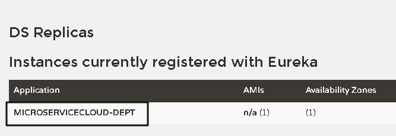
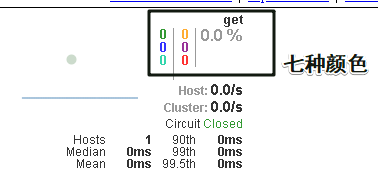

# 一、Eureka注册中心

## 1.介绍


Eureka 采用了 C-S 的设计架构。Eureka Server 作为服务注册功能的服务器，它是服务注册中心。

而系统中的其他微服务，使用 Eureka 的客户端连接到 Eureka Server并维持心跳连接。这样系统的维护人员就可以通过 Eureka Server 来监控系统中各个微服务是否正常运行。SpringCloud 的一些其他模块（比如Zuul）就可以通过 Eureka Server 来发现系统中的其他微服务，并执行相关的逻辑。

- Eureka Server 提供服务注册和发现
- Service Provider服务提供方将自身服务注册到Eureka，从而使服务消费方能够找到
- Service Consumer服务消费方从Eureka获取注册服务列表，从而能够消费服务

## 2.服务端构建

### 1）创建工程

创建一个maven模块

模块名：microservicecloud-eureka-7001
eureka服务注册中心Module

### 2）添加pom依赖

引入eurka-server依赖（服务端依赖）

~~~xml
		<!--eureka-server服务端 -->
        <dependency>
            <groupId>org.springframework.cloud</groupId>
            <artifactId>spring-cloud-starter-eureka-server</artifactId>
        </dependency>
~~~

### 3）编写yml配置

需要创建一个application.yml文件

~~~yml

server:
  port: 7001

eureka:
  instance:
    hostname: localhost #eureka服务端的实例名称
  client:
    register-with-eureka: false #false表示不向注册中心注册自己。
    fetch-registry: false #false表示自己端就是注册中心，我的职责就是维护服务实例，并不需要去检索服务
    service-url:
      defaultZone: http://${eureka.instance.hostname}:${server.port}/eureka/       
      #对外暴露提供服务的接口，注册和寻找服务都需要使用这个端口


~~~

### 4）启动类加注解

一定要加上服务注册注解

~~~java
@SpringBootApplication
@EnableEurekaServer//EurekaServer服务器端启动类,接受其它微服务注册进来
public class EurekaServer7001_App {

    public static void main(String[] args) {
        SpringApplication.run(EurekaServer7001_App.class, args);
    }

}
~~~

### 5）测试

输入http://localhost:7001/

返回页面

 


因为还没有注册，所以没有信息

## 3.客户端注册服务

### 1）.添加pom依赖

在需要注册到Eureka的生产模块的pom文件中，添加已下依赖

~~~xml
 <!--eureka客户端依赖-->
   <dependency>
     <groupId>org.springframework.cloud</groupId>
     <artifactId>spring-cloud-starter-eureka</artifactId>
   </dependency>
 <!-- cloud标配 -->
   <dependency>
     <groupId>org.springframework.cloud</groupId>
     <artifactId>spring-cloud-starter-config</artifactId>
   </dependency>

~~~

### 2）.添加yml配置

**指明需要注册到的Eureka地址**

~~~yml

spring:
  application:
    name: microservicecloud-dept #指明微服务下暴露服务的名称，极其重要


eureka:
  client: #客户端注册进eureka服务列表内
    service-url: 
      defaultZone: http://localhost:7001/eureka
 		#对应注册中心的eureka.client.service-url.defaultZone值
~~~

### 3）启动类加注解

~~~java
@SpringBootApplication
@MapperScan("xyz.thishome.cloud.dao")
@EnableEurekaClient  
//EurekaClient客户端启动类,自动将服务注册到注册中心，对应服务端的@EnableEurekaServer注解
public class DeptProvider8001_App {
~~~

### 4）测试

访问刚才的页面，http://localhost:7001/

 

多了一个服务名称，这个名称与该服务配置文件中的==spring.application.name==属性项对应

## 4.修改客户端的显示细节

### 1）主机名称：服务名修改


修改yml文件

~~~yml
eureka:
  instance:
    instance-id: microservicecloud-dept8001
~~~

 

### 2）访问信息有ip信息提示


添加yml配置

```yml
eureka:
  instance:
    prefer-ip-address: true
```

 

### 3）微服务info内容详细信息 

点击服务连接到info请求返回信息

#### 1、导入pom依赖

~~~xml
<dependency>
       <groupId>org.springframework.boot</groupId>
       <artifactId>spring-boot-starter-actuator</artifactId>
   </dependency>
~~~

#### 2、在总的父工程中添加bulid构建信息

~~~xml
<build>
    	<!-- 项目名 -->
        <finalName>microservicecloud</finalName>
        <resources>
            <resource>   <!-- 需要解析的资源目录 -->
                <directory>src/main/resources</directory>
                <filtering>true</filtering>
            </resource>
        </resources>
        <plugins>
            <plugin>   <!-- 配置解析插件 -->
                <groupId>org.apache.maven.plugins</groupId>
                <artifactId>maven-resources-plugin</artifactId>
                <configuration> 
                    <delimiters>  
                        <!-- 配置资源解析表示符（如果出现$version$ version会被解析） -->
                        <delimit>$</delimit>
                    </delimiters>
                </configuration>
            </plugin>
        </plugins>
    </build>
~~~

#### 3、在yml文件中添加配置

内容可以自定义

```yml
info:
  app.name: atguigu-microservicecloud
  company.name: www.atguigu.com
  build.artifactId: $project.artifactId$   #会被maven解析
  build.version: $project.version$    #会被maven解析
```

## 5.自我保护机制

​	默认情况下，如果EurekaServer在一定时间内没有接收到某个微服务实例的心跳，EurekaServer将会注销该实例（默认90秒）。但是当网络分区故障发生时，微服务与EurekaServer之间无法正常通信，以上行为可能变得非常危险了——因为微服务本身其实是健康的，此时本不应该注销这个微服务。

​	**Eureka通过“自我保护模式”来解决这个问题——当EurekaServer节点在短时间内丢失过多客户端时（可能发生了网络分区故障），那么这个节点就会进入自我保护模式。一旦进入该模式，EurekaServer就会保护服务注册表中的信息，不再删除服务注册表中的数据（也就是不会注销任何微服务）。当网络故障恢复后，该Eureka Server节点会自动退出自我保护模式。**

​	在自我保护模式中，Eureka Server会保护服务注册表中的信息，不再注销任何服务实例。当它收到的心跳数重新恢复到阈值以上时，该Eureka Server节点就会自动退出自我保护模式。它的设计哲学就是==宁可保留错误的服务注册信息，也不盲目注销任何可能健康的服务实例==。一句话讲解：好死不如赖活着

​	综上，自我保护模式是一种应对网络异常的安全保护措施。它的架构哲学是宁可同时保留所有微服务（健康的微服务和不健康的微服务都会保留），也不盲目注销任何健康的微服务。使用自我保护模式，可以让Eureka集群更加的健壮、稳定。

在Spring Cloud中，可以使用eureka.server.enable-self-preservation = false 禁用自我保护模式。

①服务超过一定时间，没有与注册中心交互


## 6.集群配置

### 1）创建集群

另外创建两个模块

microservicecloud-eureka_7002   （7002端口）

microservicecloud-eureka_7003   （7003端口）

除去yml文件，所有都一致


为了便于观察，在hosts文件加上以下映射

127.0.0.1  eureka7001.com      （访问时，eureka7001.com:7001）
127.0.0.1  eureka7002.com
127.0.0.1  eureka7003.com

### 2）修改配置

eureka7001

~~~yml

server:
  port: 7001

eureka:
  instance:
    hostname: eureka7001.com   #eureka服务端的实例名称
  client:
    register-with-eureka: false #false表示不向注册中心注册自己。
    fetch-registry: false #false表示自己端就是注册中心，我的职责就是维护服务实例，并不需要去检索服务
    service-url:
      #defaultZone: http://${eureka.instance.hostname}:${server.port}/eureka/
      defaultZone: http://eureka7002.com:7002/eureka/,http://eureka7003.com:7003/eureka/
      #设置为另外两个节点的IP

~~~

==修改服务端实例名称更具辨识度，修改对外暴露IP为另外两个节点的IP==

另外两个类似


修改客户端配置

```yml
eureka:
  instance:
    prefer-ip-address: true
    instance-id: microservicecloud-dept8001
  client: #客户端注册进eureka服务列表内
    service-url:
      defaultZone: http://eureka7001.com:7001/eureka/,http://eureka7002.com:7002/eureka/,http://eureka7003.com:7003/eureka/
  ://localhost:7001/eureka
```

把注册到单个节点，改为注册到多个节点

## 7.zookepper和eureka

zookepper满足cp（强一致和分区容错性）

master宕机后会选举新的master，停止服务30秒左右

eureka满足ap（高可用和分区容错性）

Eureka在一个节点宕机后，不会将它移除，而是使用自我保护机制，Eureka没有master

# 二、Ribbon负载均衡 

==消费端==

## 1.介绍


Spring Cloud Ribbon是基于Netflix Ribbon实现的一套客户端       负载均衡的工具。

简单的说，Ribbon是Netflix发布的开源项目，主要功能是提供==客户端的软件负载均衡算法==，将Netflix的中间层服务连接在一起。Ribbon客户端组件提供一系列完善的配置项如连接超时，重试等。简单的说，就是在配置文件中列出Load Balancer（简称LB）后面所有的机器，Ribbon会自动的帮助你基于某种规则（如简单轮询，随机连接等）去连接这些机器。我们也很容易使用Ribbon实现自定义的负载均衡算法。

将LB逻辑集成到消费方，消费方从服务注册中心获知有哪些地址可用，然后自己再从这些地址中选择出一个合适的服务器。

Ribbon就属于进程内LB，它只是一个类库，==集成于消费方进程，消费方通过它来获取到服务提供方的地址==。

==是对请求服务的客户端进行的修改==

## 2.使用配置

### 1）修改pom文件

添加到客户端中pom配置（消费者客户端）

~~~xml
<!-- Ribbon相关 -->
   <dependency>
     <groupId>org.springframework.cloud</groupId>
     <artifactId>spring-cloud-starter-eureka</artifactId>
   </dependency>
   <dependency>
     <groupId>org.springframework.cloud</groupId>
     <artifactId>spring-cloud-starter-ribbon</artifactId>
   </dependency>
   <dependency>
     <groupId>org.springframework.cloud</groupId>
     <artifactId>spring-cloud-starter-config</artifactId>
   </dependency>
~~~

### 2）修改yml文件

指明服务中心位置

~~~yml
eureka:
  client:
    register-with-eureka: false
    service-url: 
      defaultZone: http://eureka7001.com:7001/eureka/,http://eureka7002.com:7002/eureka/,http://eureka7003.com:7003/eureka/
~~~

### 3）加上两个注解

#### 1、主类上加开启Eureka注解

```java
@SpringBootApplication
@EnableEurekaClient
public class DeptConsumer80_App {
```

#### 2、RestTemplate加上负载均衡注解

```java
@Bean
@LoadBalanced   //使RestTemplate负载均衡（客户端负载均衡）
public RestTemplate restTemplate(){
    return new RestTemplate();
}
```

### 4）修改访问地址

访问地址由直接访问服务地址路径，改为访问服务名称路径

```java
//private static final String REST_URL_PREFIX = "http://localhost:8001";
private static final String REST_URL_PREFIX = "http://MICROSERVICECLOUD-DEPT";
```

这样才是真正开启了微服务！！

## 3.负载均衡

 

### 1）新建模块

参考microservicecloud-provider-dept-8001，新建两份，分别命名为8002，8003

pom文件一致

### 2）修改yml文件

标注部分要修改，其他部分一致即可

~~~yml
#################################端口一定要修改#############################
server:
  port: 8002

mybatis:
  config-location: classpath:mybatis/mybatis.cfg.xml        # mybatis配置文件所在路径
  type-aliases-package: xyz.thishome.cloud.entities    # 所有Entity别名类所在包
  mapper-locations:
    - classpath:mybatis/mapper/**/*.xml                       # mapper映射文件

spring:
  application:
   ######################三个项目这里一定要统一！！！#########################
    name: microservicecloud-dept                            #微服务下暴露的服务名，极其重要
  datasource:
    type: com.alibaba.druid.pool.DruidDataSource            # 当前数据源操作类型
    driver-class-name: org.gjt.mm.mysql.Driver              # mysql驱动包
    
    ###################这里可以修改成自己的数据库#########################
    url: jdbc:mysql://localhost:3306/cloudDB02              # 数据库名称
    username: root
    password: 123456
    dbcp2:
      min-idle: 5                                           # 数据库连接池的最小维持连接数
      initial-size: 5                                       # 初始化连接数
      max-total: 5                                          # 最大连接数
      max-wait-millis: 200                                  # 等待连接获取的最大超时时间


eureka:
  instance:
    prefer-ip-address: true
    ####################这里一定要改，如果不改，负载均衡失效#####################
    instance-id: microservicecloud-dept8002
  client: #客户端注册进eureka服务列表内
    service-url:
      defaultZone: http://eureka7001.com:7001/eureka/,http://eureka7002.com:7002/eureka/,http://eureka7003.com:7003/eureka/


info:
  app.name: atguigu-microservicecloud
  company.name: www.atguigu.com
  build.artifactId: $project.artifactId$
  build.version: $project.version$

~~~

## 4.核心组件Rule负载均衡策略

根据特定算法从服务列表中选取一个要访问的服务

### 1）内置负载均衡策略对象


|         算法类名          |                           算法功能                           |
| :-----------------------: | :----------------------------------------------------------: |
|      RoundRobinRule       |              轮询（即使服务宕机，依然轮询访问）              |
|        RandomRule         |                             随机                             |
| AvailabilityFilteringRule | 会先过滤掉由于多次访问故障而处于断路器跳闸状态的服务，还有并发的连接数量超过阙值的服务，然后对剩余的服务列表按照轮询策略进行访问 |
| WeightedResponseTimeRule  | 根据平均响应时间计算所有服务的权重，响应时间越快的服务权重越大，被选中的概率越高。刚启动时如果统计信息不足，则使用RoundRobinRule策略，等统计信息足够，会切换到WeightedResponseTimeRule |
|         RetryRule         | 先按照RoundRobinRule的策略获取服务，如果获取服务失败，则在指定时间内会进行重试，获取可用服务（如果一个服务宕机，轮询几次，如果一直无法访问，则不再访问该服务。） |
|     BestAvailableRule     | 会先过滤由于多次访问故障而处于断路器跳闸状态的服务，然后选择一个并发量最小的服务 |
|     ZoneAvoidanceRule     | 默认规则，复合判断server所在区域的性能和server的可用性选择服务器 |

### 2）更换策略

在请求服务的客户端的配置类中添加一个bean

例如选用随机算法，更换后对当前客户端发出的所有服务请求有效，所有服务生效

```java
@Bean
public RandomRule randomRule(){
    return new RandomRule();
}
```

### 3）指定单个服务使用特定策略

使用后，当前客户端指定对某个服务的请求使用特定的算法

#### 1、创建一个配置类

==注意：该配置类，不能放在Spring能扫描到的地方（不能在主运行程序的同一包或者子包下）==，如果被spring扫描到，则当前客户端发出的所有请求都会被改变，没有达到指定服务使用指定算法的目的

```java
@Configuration
public class MySelRule {

    @Bean
    public RandomRule randomRule(){
        return new RandomRule();  //使用随机策略
    }

}
```

现在这个配置类并不生效，与我们的程序毫无关联

#### 2、使用注解，启用配置类

```java
@SpringBootApplication
@EnableEurekaClient
//name为指定的服务名称，configuration为指定算法规则的配置类
@RibbonClient(name = "MICROSERVICECLOUD-DEPT", configuration = MySelRule.class)
public class DeptConsumer80_App {

    public static void main(String[] args) {
        SpringApplication.run(DeptConsumer80_App.class, args);
    }
}
```

### 4）编写自己的策略

把RandomRule源码复制下来，改动一部分策略

~~~java

public class MyRule extends AbstractLoadBalancerRule {

    //当前执行服务在集合中的下标
    private int currentIndex;
    //执行数量，如果到5，切换执行服务，否则累加
    private int totle;

    public Server choose(ILoadBalancer lb, Object key) {
        if (lb == null) {
            return null;
        }
        Server server = null;

        while (server == null) {
            if (Thread.interrupted()) {
                return null;
            }
            //获取状态良好的服务列表
            List<Server> upList = lb.getReachableServers();
            //获取所有的服务列表
            List<Server> allList = lb.getAllServers();
			
            int serverCount = allList.size();
            if (serverCount == 0) {
                /*
                 * No servers. End regardless of pass, because subsequent passes
                 * only get more restrictive.
                 */
                return null;
            }
            //修改部分
            synchronized (this) {
                if (totle <= 3) {
                    totle++;
                } else {
                    totle = 0;
                    currentIndex = currentIndex >= upList.size() - 1 ? 0 : currentIndex + 1;
                }
            }

            server = upList.get(currentIndex);

            if (server == null) {
                /*
                 * The only time this should happen is if the server list were
                 * somehow trimmed. This is a transient condition. Retry after
                 * yielding.
                 */
                Thread.yield();
                continue;
            }

            if (server.isAlive()) {
                return (server);
            }

            // Shouldn't actually happen.. but must be transient or a bug.
            server = null;
            Thread.yield();
        }

        return server;

    }

    @Override
    public Server choose(Object key) {
        return choose(getLoadBalancer(), key);
    }

    @Override
    public void initWithNiwsConfig(IClientConfig clientConfig) {
        // TODO Auto-generated method stub

    }
}

~~~

# 三、Feign负载均衡牛逼

==消费端==

## 1.介绍

Feign是一个**声明式的Web服务客户端**，使得编写Web服务客户端变得非常容易，
==只需要创建一个接口，然后在上面添加注解即可。==

**Feign旨在使编写Java Http客户端变得更容易。**
	前面在使用Ribbon+RestTemplate时，利用RestTemplate对http请求的封装处理，形成了一套模版化的调用方法。但是在实际开发中，由于对服务依赖的调用可能不止一处，往往一个接口会被多处调用，所以通常都会针对每个微服务自行封装一些客户端类来包装这些依赖服务的调用。所以，Feign在此基础上做了进一步封装，由他来帮助我们定义和实现依赖服务接口的定义。在Feign的实现下，我们只需创建一个接口并使用注解的方式来配置它(以前是Dao接口上面标注Mapper注解,现在是一个微服务接口上面标注一个Feign注解即可)，即可完成对服务提供方的接口绑定，简化了使用Spring cloud Ribbon时，自动封装服务调用客户端的开发量。

**Feign集成了Ribbon**
	利用Ribbon维护了MicroServiceCloud-Dept的服务列表信息，并且通过轮询实现了客户端的负载均衡。而与Ribbon不同的是，通过feign只需要定义服务绑定接口且以声明式的方法，优雅而简单的实现了服务调用

## 2.简单使用

### 1）创建一个模块

创建模块microservicecloud-consumer-dept-feign，参考microservicecloud-consumer-dept-80

复制所有文件，修改主类类名


### 2）修改pom文件

~~~xml
		<!-- Ribbon相关 -->
        <dependency>
            <groupId>org.springframework.cloud</groupId>
            <artifactId>spring-cloud-starter-eureka</artifactId>
        </dependency>
        <dependency>
            <groupId>org.springframework.cloud</groupId>
            <artifactId>spring-cloud-starter-ribbon</artifactId>
        </dependency>
        <dependency>
            <groupId>org.springframework.cloud</groupId>
            <artifactId>spring-cloud-starter-config</artifactId>
        </dependency>
		<!--#################新添加部分###############-->
        <dependency>
            <groupId>org.springframework.cloud</groupId>
            <artifactId>spring-cloud-starter-feign</artifactId>
        </dependency>
~~~

### 3）修改通用API工程

#### 1、修改pom文件

添加feign依赖

~~~xml
		 <dependency>
            <groupId>org.springframework.cloud</groupId>
            <artifactId>spring-cloud-starter-feign</artifactId>
        </dependency>
~~~

#### 2、创建service

之所以放在api通用工程里，是因为以后想调用该服务的工程，只需要依赖该工程，即可访问

```java
@FeignClient(value = "MICROSERVICECLOUD-DEPT")   //服务名称
public interface DeptClientService
{
    @RequestMapping(value = "/dept/get/{id}",method = RequestMethod.GET)
    public Dept get(@PathVariable("id") long id);

    @RequestMapping(value = "/dept/list",method = RequestMethod.GET)
    public List<Dept> list();

    @RequestMapping(value = "/dept/add",method = RequestMethod.POST)
    public boolean add(Dept dept);
}
```

### 4）主类加上注解

在需要发出请求的客户端的主类上加上注解，扫描

```java
@SpringBootApplication
@EnableEurekaClient
//扫描fegin客户端
@EnableFeignClients(basePackages = "xyz.thishome.cloud")
//spring包扫描
@ComponentScan("xyz.thishome.cloud")
public class DeptConsumerFeign_App {
```

### 5）修改controller

注入service，调用service实现功能

```java
@Autowired
private DeptClientService service = null;
```

猜测，底层使用动态代理，代理对象根据service方法注解，代理对象使用restTemplate发出请求，将方法参数传入，返回结果。类似于mybatis底层

# 四、Hystrix断路器

## 1.介绍

### 1）分布式系统面临的问题

​	复杂分布式体系结构中的应用程序有数十个依赖关系，每个依赖关系在某些时候将不可避免地失败。

服务雪崩


​	多个微服务之间调用的时候，假设微服务A调用微服务B和微服务C，微服务B和微服务C又调用其它的微服务，这就是所谓的“扇出”。如果扇出的链路上某个微服务的调用响应时间过长或者不可用，对微服务A的调用就会占用越来越多的系统资源，进而引起系统崩溃，所谓的“雪崩效应”.

​	对于高流量的应用来说，单一的后端依赖可能会导致所有服务器上的所有资源都在几秒钟内饱和。比失败更糟糕的是，这些应用程序还可能导致服务之间的延迟增加，备份队列，线程和其他系统资源紧张，导致整个系统发生更多的级联故障。这些都表示需要对故障和延迟进行隔离和管理，以便单个依赖关系的失败，不能取消整个应用程序或系统。

###  2）Hystrix简介

​	Hystrix是一个用于处理分布式系统的延迟和容错的开源库，在分布式系统里，许多依赖不可避免的会调用失败，比如超时、异常等，==Hystrix能够保证在一个依赖出问题的情况下，不会导致整体服务失败，避免级联故障，以提高分布式系统的弹性==。

​	“断路器”本身是一种开关装置，当某个服务单元发生故障之后，通过断路器的故障监控（类似熔断保险丝），**向调用方返回一个符合预期的、可处理的备选响应（FallBack），而不是长时间的等待或者抛出调用方无法处理的异常**，这样就保证了服务调用方的线程不会被长时间、不必要地占用，从而避免了故障在分布式系统中的蔓延，乃至雪崩。

​	==类似于电器的保险杠，电压过大时会直接断电，防止爆炸==

### 3）功能

****

- 服务降级
- 服务熔断
- 服务限流
- 接近实时的监控

## 2.服务熔断

==生产端==

​	熔断机制是应对雪崩效应的一种微服务链路保护机制。
​	当扇出链路的某个微服务不可用或者响应时间太长时，会进行服务的降级，进而熔断该节点微服务的调用，快速返回"错误"的响应信息。当检测到该节点微服务调用响应正常后恢复调用链路。在SpringCloud框架里熔断机制通过Hystrix实现。Hystrix会监控微服务间调用的状况，当失败的调用到一定阈值，缺省是5秒内20次调用失败就会启动熔断机制。

​	熔断机制的注解是==@HystrixCommand==。

### 1）创建模块

新建microservicecloud-provider-dept-hystrix-8001

参考microservicecloud-provider-dept-8001

把microservicecloud-provider-dept-8001里的文件拷贝到新工程，修改部分信息

主类名修改为DeptProvider8001_Hystrix_App

### 2）添加pom依赖

~~~xml
<dependency>
     <groupId>org.springframework.cloud</groupId>
     <artifactId>spring-cloud-starter-hystrix</artifactId>
   </dependency>
~~~

### 3）修改yml配置文件

```yml
eureka:
  instance:
    prefer-ip-address: true
    #########################这里的名字改一下，用于在Eureka页面区分##########################
    instance-id: microservicecloud-dept8001-hystrix
```

### 4）主类添加注解

```java
@SpringBootApplication
@MapperScan("xyz.thishome.cloud.dao")
@EnableEurekaClient
//开启回路断路器
@EnableCircuitBreaker
public class DeptProvider8001_App {
```

### 5）使用Hystrix

```java
@RequestMapping(value = "/dept/get/{id}", method = RequestMethod.GET)
//标注如果此方法出异常，使用备用方法的返回值
@HystrixCommand(fallbackMethod = "processHystrix_Get")
public Dept get(@PathVariable("id") Long id) {
    Dept dept = service.get(id);
    if (dept == null) {
        //如果返回值为null，模拟异常
        throw new RuntimeException();
    }
    return dept;
}
//备用方法
public Dept processHystrix_Get(@PathVariable("id") Long id) {
    return new Dept().setDeptno(id).setDname("部门信息不存在").setDb_source("不存在数据库中");
}
```

### 6）测试

 

## 3.服务降级

解释：

整体资源快不够了，忍痛将某些服务先关掉，待渡过难关，再开启回来。

服务降级处理是在客户端实现完成的，与服务端没有关系

**当服务端provider已经down了，但是我们做了服务降级处理，让客户端在服务端不可用时也会获得提示信息而不会挂起耗死服务器**

==消费端==

### 1）修改通用工程API

在service接口处（消费端调用时处理），处理所有的服务熔断

DeptClientService（在使用Feign时创建的服务调用接口）

创建一个专门处理服务熔断的类

DeptClientServiceFallbackFactory，继承FallbackFactory接口，泛型指定需要集中处理的service

```java
@Component   //千万别忘记加！！！                                    //这里泛型指定service接口
public class DeptClientServiceFallbackFactory implements FallbackFactory<DeptClientService> {

    @Override    //这里返回一个service对象，该对象用于对应方法的熔断处理
    public DeptClientService create(Throwable throwable) {

        return new DeptClientService() {
            @Override
            public Dept get(long id) {
                return new Dept().setDeptno(id).setDname("部门信息不存在").setDb_source("不存在数据库中");
            }

            @Override
            public List<Dept> list() {
                return null;
            }

            @Override
            public boolean add(Dept dept) {
                return false;
            }
        };
    }
}
```

### 2）在service上指定

指定FallbackFactory参数为对应的class

```java
@FeignClient(value = "MICROSERVICECLOUD-DEPT", fallbackFactory = DeptClientServiceFallbackFactory.class)
public interface DeptClientService {
```

### 2）修改消费端

修改yml文件，添加一下配置

~~~yml
feign:
  hystrix:
    enabled: true
~~~

## 4.熔断降级小总结

【熔断】

一般是某个服务故障或异常引起，类似现实世界中的”保险丝“，当某个异常条件被触发，直接熔断整个服务，而不是一直等到此服务超时。

【降级】

所谓降级，一般是从整体负荷考虑。就是当某个服务熔断之后，服务器将不再被调用，此时客户端可以为自己准备一个本地的fallback回调，返回一个缺省值。这样做，虽然服务水平下降，但好歹可用，比直接挂掉要强。

## 5.服务监管Dashboard

​	除了隔离依赖服务的调用以外，Hystrix还提供了准实时的调用监控（Hystrix Dashboard），Hystrix会持续地记录所有通过Hystrix发起的请求的执行信息，并以统计报表和图形的形式展示给用户，包括每秒执行多少请求多少成功，多少失败等。Netflix通过hystrix-metrics-event-stream项目实现了对以上指标的监控。Spring Cloud也提供了Hystrix Dashboard的整合，对监控内容转化成可视化界面。

### 1）创建监管微服务

新建工程microservicecloud-consumer-hystrix-dashboard

### 2）修改pom文件

~~~xml
  <dependencies>
        <!-- 自己定义的api -->
        <dependency><!-- 引入自己定义的api通用包，可以使用Dept部门Entity -->
            <groupId>xyz.thishome.cloud</groupId>
            <artifactId>microservicecloud-api</artifactId>
            <version>${project.version}</version>
        </dependency>
        <dependency>
            <groupId>org.springframework.boot</groupId>
            <artifactId>spring-boot-starter-web</artifactId>
        </dependency>
        <!-- 修改后立即生效，热部署 -->
        <dependency>
            <groupId>org.springframework</groupId>
            <artifactId>springloaded</artifactId>
        </dependency>
        <dependency>
            <groupId>org.springframework.boot</groupId>
            <artifactId>spring-boot-devtools</artifactId>
        </dependency>
        <!-- Ribbon相关 -->
        <dependency>
            <groupId>org.springframework.cloud</groupId>
            <artifactId>spring-cloud-starter-eureka</artifactId>
        </dependency>
        <dependency>
            <groupId>org.springframework.cloud</groupId>
            <artifactId>spring-cloud-starter-ribbon</artifactId>
        </dependency>
        <dependency>
            <groupId>org.springframework.cloud</groupId>
            <artifactId>spring-cloud-starter-config</artifactId>
        </dependency>
        <!-- feign相关 -->
        <dependency>
            <groupId>org.springframework.cloud</groupId>
            <artifactId>spring-cloud-starter-feign</artifactId>
        </dependency>
        <!--############### hystrix和 hystrix-dashboard相关###############-->
        <dependency>
            <groupId>org.springframework.cloud</groupId>
            <artifactId>spring-cloud-starter-hystrix</artifactId>
        </dependency>
        <dependency>
            <groupId>org.springframework.cloud</groupId>
            <artifactId>spring-cloud-starter-hystrix-dashboard</artifactId>
        </dependency>
    </dependencies>
~~~

### 3）添加yml配置

```yml
server:
  port: 9001
```

### 4）创建主类

```java
@SpringBootApplication
@EnableHystrixDashboard
public class DeptConsumer_DashBoard_App
{
    public static void main(String[] args)
    {
        SpringApplication.run(DeptConsumer_DashBoard_App.class,args);
    }
}
```

### 5）注意

==所有Provider微服务提供类(8001/8002/8003)都需要监控依赖配置==

~~~xml
   <dependency>
     <groupId>org.springframework.boot</groupId>
     <artifactId>spring-boot-starter-actuator</artifactId>
   </dependency>
~~~

### 6）测试

http://localhost:9001/hystrix监管服务启动

 


  

7色

 对应

 其中颜色

一圈

实心圆：共有两种含义。它通过颜色的变化代表了实例的健康程度，它的健康度从绿色<黄色<橙色<红色递减。
该实心圆除了颜色的变化之外，它的大小也会根据实例的请求流量发生变化，流量越大该实心圆就越大。所以通过该实心圆的展示，就可以在大量的实例中快速的发现故障实例和高压力实例。

一线

曲线：用来记录2分钟内流量的相对变化，可以通过它来观察到流量的上升和下降趋势。

 

# 五、Zuul路由网管

## 1.简介

Zuul包含了对请求的路由和过滤两个最主要的功能：
其中路由功能负责将外部请求转发到具体的微服务实例上，是实现外部访问统一入口的基础。

而过滤器功能则负责对请求的处理过程进行干预，是实现请求校验、服务聚合等功能的基础。

Zuul和Eureka进行整合，将Zuul自身注册为Eureka服务治理下的应用，同时从Eureka中获得其他微服务的消息，也即以后的访问微服务都是通过Zuul跳转后获得。

注意：**Zuul服务最终还是会注册进Eureka**

==提供=代理+路由+过滤三大功能==

##  2.路由基本配置

### 1）创建工程

新建Module模块microservicecloud-zuul-gateway-9527

### 2）pom文件

~~~xml
<dependencies>
        <!-- zuul路由网关 -->
        <dependency>
            <groupId>org.springframework.cloud</groupId>
            <artifactId>spring-cloud-starter-zuul</artifactId>
        </dependency>
        <dependency>
            <groupId>org.springframework.cloud</groupId>
            <artifactId>spring-cloud-starter-eureka</artifactId>
        </dependency>
        <!-- actuator监控 -->
        <dependency>
            <groupId>org.springframework.boot</groupId>
            <artifactId>spring-boot-starter-actuator</artifactId>
        </dependency>
        <!--  hystrix容错-->
        <dependency>
            <groupId>org.springframework.cloud</groupId>
            <artifactId>spring-cloud-starter-hystrix</artifactId>
        </dependency>
        <dependency>
            <groupId>org.springframework.cloud</groupId>
            <artifactId>spring-cloud-starter-config</artifactId>
        </dependency>
        <!-- 日常标配 -->
        <dependency>
            <groupId>com.atguigu.springcloud</groupId>
            <artifactId>microservicecloud-api</artifactId>
            <version>${project.version}</version>
        </dependency>
        <dependency>
            <groupId>org.springframework.boot</groupId>
            <artifactId>spring-boot-starter-jetty</artifactId>
        </dependency>
        <dependency>
            <groupId>org.springframework.boot</groupId>
            <artifactId>spring-boot-starter-web</artifactId>
        </dependency>
        <dependency>
            <groupId>org.springframework.boot</groupId>
            <artifactId>spring-boot-starter-test</artifactId>
        </dependency>
        <!-- 热部署插件 -->
        <dependency>
            <groupId>org.springframework</groupId>
            <artifactId>springloaded</artifactId>
        </dependency>
        <dependency>
            <groupId>org.springframework.boot</groupId>
            <artifactId>spring-boot-devtools</artifactId>
        </dependency>
    </dependencies>
~~~

### 3）yml配置文件

```yml
server:
  port: 9527

spring:
  application:
    name: microservicecloud-zuul-gateway

eureka:
  client:
    service-url:
      defaultZone: http://eureka7001.com:7001/eureka,http://eureka7002.com:7002/eureka,http://eureka7003.com:7003/eureka
  instance:
    instance-id: gateway-9527.com
    prefer-ip-address: true


info:
  app.name: atguigu-microcloud
  company.name: www.atguigu.com
  build.artifactId: $project.artifactId$
  build.version: $project.version$
```

### 4）添加主启动类

```java
@SpringBootApplication
//#################该注解用户启动Zuul
@EnableZuulProxy
public class Zuul_9527_StartSpringCloudApp {

    public static void main(String[] args) {
        SpringApplication.run(Zuul_9527_StartSpringCloudApp.class, args);
    }

}
```

### 5）测试

不使用路由：http://localhost:8001/dept/get/2

使用路由：http://myzuul.com:9527/microservicecloud-dept/dept/get/2

//通过zuul转发请求

## 3.路由访问映射规则

虽然基本配置可以保证路由转发可用，但是我们的需求是，对外暴露自定义服务名，而隐藏真实服务名，增加过滤规则，所以要进行进一步配置

### 1）映射代理名称

对yml文件添加配置

```yml
zuul:
  routes:    #添加映射规则
    mydept.serviceId: microservicecloud-dept   #服务名
    mydept.path: /mydept/**   #映射路径
```

配置后，可以通过  http://myzuul.com:9527/mydept/dept/get/2  进行访问，但是原服务名依然可以直接访问

### 2）隐藏真实服务名

~~~yml
zuul: 
  ignored-services: microservicecloud-dept  #隐藏服务 多个可以用*表示 ignored-services: "*"
  routes: 
    mydept.serviceId: microservicecloud-dept
    mydept.path: /mydept/**
~~~

### 3）服务添加前缀

可以为所有服务添加一个自定义的前缀

~~~yml
zuul: 
  prefix: /thishome   #前缀
  ignored-services: "*"
  routes: 
    mydept.serviceId: microservicecloud-dept
    mydept.path: /mydept/**
~~~

http://myzuul.com:9527/thishome/mydept/dept/get/2  

# 六、Config分布式配置中心

 


## 1.服务端配置与测试 

### 1）创建一个GitHub仓库

复制ssh服务连接或https连接


### 2）创建本地仓库

创建一个文件夹springcloud-config，在此文件夹中打开git

输入

`git clone https://github.com/bigbaibaibai/microservice-config.git`

克隆远程库到本地

### 3）创建需要添加到远程的yml配置文件

现在就可以在本地库中创建配置文件了

 

==该文件必须以utf-8的方式去保存，如果配置文件写错，会一直出现类型转换异常！！！！！==

~~~yml
spring: 
  profiles: 
    active: dev

---
spring: 
  profiles: dev     #开发环境
  application: 
    name: microservicecloud-config-dev

---
spring: 
  profiles: test   #测试环境
  application: 
    name: microservicecloud-config-test
~~~

### 4）提交到远程GitHub上

 

git已经检测到有新文件到git文件夹中，现在需要将它添加到临时库

 把所有文件添加到临时库

然后把本次操作提交到本地仓库

 提交到本地库，并添加描述

提交到远程GitHub上 

 

### 5）创建config-server工程配置pom

创建一个microservicecloud-config_3344工程

```xml
<dependencies>

    <dependency><!-- 自己定义的api -->
        <groupId>xyz.thishome.cloud</groupId>
        <artifactId>microservicecloud-api</artifactId>
        <version>${project.version}</version>
    </dependency>
    <dependency>
        <groupId>org.springframework.boot</groupId>
        <artifactId>spring-boot-starter-web</artifactId>
    </dependency>
    <!-- 修改后立即生效，热部署 -->
    <dependency>
        <groupId>org.springframework</groupId>
        <artifactId>springloaded</artifactId>
    </dependency>
    <dependency>
        <groupId>org.springframework.boot</groupId>
        <artifactId>spring-boot-devtools</artifactId>
    </dependency>
    <dependency>
        <groupId>org.springframework.cloud</groupId>
        <artifactId>spring-cloud-starter-eureka</artifactId>
    </dependency>
    <dependency>
        <groupId>org.springframework.cloud</groupId>
        <artifactId>spring-cloud-starter-config</artifactId>
    </dependency>
	<!--#####################添加配置服务端依赖#####################-->
    <dependency>
        <groupId>org.springframework.cloud</groupId>
        <artifactId>spring-cloud-config-server</artifactId>
    </dependency>
    <!--hystrix依赖-->
    <dependency>
        <groupId>org.springframework.cloud</groupId>
        <artifactId>spring-cloud-starter-hystrix</artifactId>
    </dependency>
    <dependency>
        <groupId>org.springframework.boot</groupId>
        <artifactId>spring-boot-starter-jetty</artifactId>
    </dependency>

    <dependency>
        <groupId>org.springframework.boot</groupId>
        <artifactId>spring-boot-starter-actuator</artifactId>
    </dependency>

</dependencies>
```

### 6）创建注册中心服务的yml配置文件

```yml
server:
  port: 3344
spring:
  application:
    name: microservicecloud-config
  cloud:
    config:
      server:
        git:
          uri: https://github.com/bigbaibaibai/microservice-config.git  #github上面仓库的ssh的uri
```

### 7）创建主类添加注解

```java
@SpringBootApplication
@EnableConfigServer    //开启配置服务
public class Config_3344_StartSpringCloudApp {

    public static void main(String[] args) {
        SpringApplication.run(Config_3344_StartSpringCloudApp.class, args);
    }

}
```

### 8）测试

启动主类，hosts配置   127.0.0.1  config-3344.com

获取开发环境配置

http://config-3344.com:3344/application-dev.yml

 

获取测试环境配置

http://config-3344.com:3344/application-test.yml

 

如果输入一个不存在的环境

 

### 9）配置读取规则

 


label代表GitHub分支，如master

 

 

## 2.客户端配置与测试

### 1）创建客户端

创建一个配置客户端模块

microservicecloud-config-client_3355

### 2）添加pom依赖

```xml
<dependencies>

    <dependency><!-- 自己定义的api -->
        <groupId>xyz.thishome.cloud</groupId>
        <artifactId>microservicecloud-api</artifactId>
        <version>${project.version}</version>
    </dependency>
    <dependency>
        <groupId>org.springframework.boot</groupId>
        <artifactId>spring-boot-starter-web</artifactId>
    </dependency>
    <!-- 修改后立即生效，热部署 -->
    <dependency>
        <groupId>org.springframework</groupId>
        <artifactId>springloaded</artifactId>
    </dependency>
    <dependency>
        <groupId>org.springframework.boot</groupId>
        <artifactId>spring-boot-devtools</artifactId>
    </dependency>
    <dependency>
        <groupId>org.springframework.cloud</groupId>
        <artifactId>spring-cloud-starter-eureka</artifactId>
    </dependency>

    <!--################################配置中心客户端依赖##############################-->
    <dependency>
        <groupId>org.springframework.cloud</groupId>
        <artifactId>spring-cloud-starter-config</artifactId>
    </dependency>

    <dependency>
        <groupId>org.springframework.cloud</groupId>
        <artifactId>spring-cloud-config</artifactId>
    </dependency>

    <!--hystrix依赖-->
    <dependency>
        <groupId>org.springframework.cloud</groupId>
        <artifactId>spring-cloud-starter-hystrix</artifactId>
    </dependency>
    <dependency>
        <groupId>org.springframework.boot</groupId>
        <artifactId>spring-boot-starter-jetty</artifactId>
    </dependency>

    <dependency>
        <groupId>org.springframework.boot</groupId>
        <artifactId>spring-boot-starter-actuator</artifactId>
    </dependency>

</dependencies>
```

### 3）添加yml配置文件

这里比较特殊，创建的是==bootstrap配置文件==

application配置文件：用户级配置文件的资源配置项

bootstrap配置文件：系统级配置文件，优先级最高

bootstrap配置文件在此负责加载外部配文件并解析，比application配置文件有更高的优先级，所以不会被覆盖

```yml
spring:
  cloud:
    config:
      name: microservicecloud-config-client   #GitHub上配置文件的名字
      profile: dev
      label: master
      uri: http://config-3344.com:3344    #配置中心服务端的uri
```

 

可以创建一个application.yml文件，不用写太多内容，留个名字即可

```yml
spring:
  application:
    name: microservicecloud-config-client   #一定要 和bootstrap中的name一致！
```

### 4）测试

#### 1、创建application一个yml配置文件，推送到云端

在本地库创建**microservicecloud-config-client.yml**文件

~~~yml
spring:
  profiles: 
    active: dev


---
server: 
  port: 8201

spring: 
  profiles: dev     #开发环境
  application: 
    name: microservicecloud-config-client

eureka:
  client: #客户端注册进eureka服务列表内
    service-url:
      defaultZone: http://eureka-dev.com:7001/eureka/

---
server: 
  port: 8202

spring: 
  profiles: test   #测试环境
  application: 
    name: microservicecloud-config-client

eureka:
  client: #客户端注册进eureka服务列表内
    service-url:
      defaultZone: http://eureka-test.com:7001/eureka/
~~~

一系列操作

   

#### 2、写一个测试controller

```java
@RestController
public class ConfigController {

    @Value("${server.port}")
    private String port;

    @Value("${spring.profiles}")
    private String profiles;

    @Value("${spring.application.name}")
    private String name;

    @GetMapping("/config")
    public Map getConfig() {
        Map map = new HashMap();
        map.put("port", port);
        map.put("profiles", profiles);
        map.put("name", name);
        return map;
    }

}
```


 

