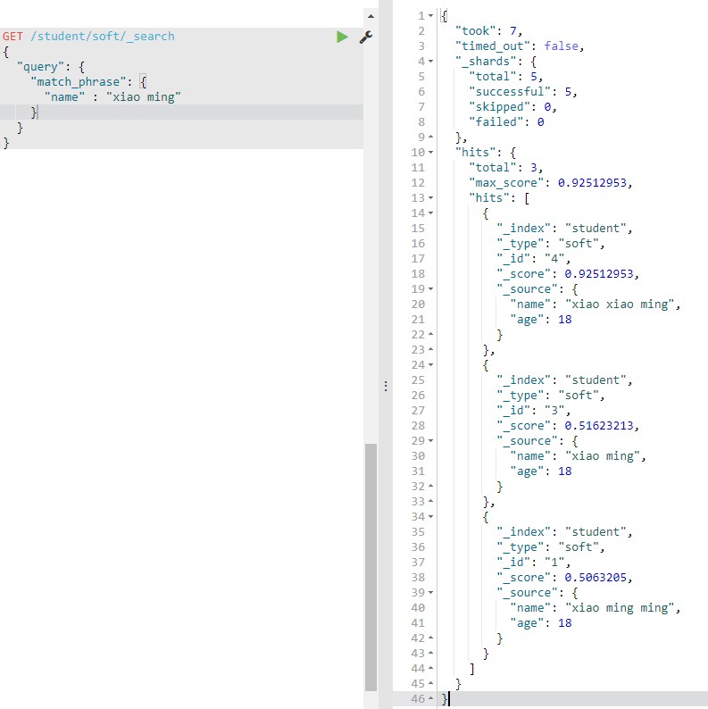

# 1.介绍

## 1.1 核心概念

**①Near Realtime（NRT）**：近实时，两个意思，从写入数据到数据可以被搜索有一个小延迟，基于es执行搜索和分析可以达到秒级（大概1秒）

**②Cluster**：集群，包含多个节点，每一个节点数据那个集群是通过一个配置（集群名称，默认是elasticsearch）来决定的。

**③Node**：节点，集群中的一个节点，节点也有一个名称（默认随机分配），节点名称很重要，默认节点会去加入一个名称为elasticsearch的集群，如果直接启动一堆节点，那么会自动组成一个名为elasticsearch的集群

**④Document**：文档，es中最小数据单元，一个document可以是一条客户数据，一条商品分类数据，一条订单数据，通常用JSON数据结构表示，每个Index下的type，都可以存储多个document，可以理解为mysql记录 

**⑤Index**：索引，es中最大的分类，可以理解为mysql的库，比如可以有一个客户索引，商品分类索引，订单索引，索引有一个名称

**⑥Type**：类型，每个索引里都可以有一个或多个type，type是index中的一个逻辑数据根类，一个type下的document，都有相同的field，比如博客系统，有一个索引，可以定义用户数据type，博客数据type，评论数据type，可以理解为mysql表

**⑦shard**：分片式存储，单台机器无法存储大量数据，es可以将一个索引中的数据切分为多个shard，分布在多台服务器上存储。有了shard就可以横向扩展，存储更多的数据。

**⑧replica**：冗余式存储，会用来负载和容灾，任何一个服务器随时可能故障或者宕机，此时shard可能就会丢失，因此可以为每个shard创建多个replica副本。replica可以在shard故障时提供备用服务，保证数据不丢失，多个replica还可以提升搜索操作的吞吐量和性能。

shard又称primary shard，replica又称replica shard

primary shard（建立索引时一次设置，不能修改，默认5个），replica shard（随时修改数量，默认1个），默认每个索引10个shard，5个primary shard，5个replica shard，最小的高可用配置是2台服务器。

elasticsearch规定，primary shard和replica shard必须不在一个节点上

## 1.2 安装Es

官网下载，解压到本地

## 1.3 安装Kibana

官网下载，解压到本地

# 2 Es基本操作

## 2.1 es集群简单管理

es提供一套API叫做cat api，可以查看es中各种各样的数据

### 2.1.1 查看集群健康状况

`GET /_cat/health?v`          （加参数v可以把列头显示出来）

最后一个参数表示有多少shard是活跃的，这里因为是单节点，索引replica shard不会被启动，索引是50%

**status**，有三种取值

green：每个索引的primary shard和replica shard都是active状态的（活跃的，即可用的）

yellow：每个索引的primary shard都是active状态的，但是部分replica shard不是active状态的，处于不可用状态

red：不是所有索引的primary shard都是active状态的，部分索引有数据丢失了

如果是单节点，一定是yellow，因为primary shard和replica shard不能在一个节点上（为了容灾），replica shard一定处于不可用状态，只有两个节点才可能为green ，es会自动把replica shard分配到第二个节点上。

### 2.1.2 快速查看集群中有哪些索引

`GET /_cat/indices?v`

store.size：该索引存储的总大小（primary shard和replica shard加在一块）

pri.store.size：该索引primary shard存储使用的大小

## 2.2 简单的索引操作

最基础的增删改查

### 2.2.1 创建索引

`PUT /student`

3.2.2 有指定shard的语法

### 2.2.2 查询索引

`GET /student`

会返回索引的一些基本信息

### 2.2.3 删除索引

`DELETE /student`

 

## 2.3 简单的文档操作

### 2.3.1 创建文档

`PUT /index/type/id`

案例：在student索引下的soft类型中添加id为1的文档

~~~json
PUT /student/soft/1
{
  "name" : "xiaoming",
  "age": 18,
  "class":"soft"
}
~~~

 

补充知识：

如果ID存在，创建操作会变成==全量替换==的操作，也就是覆盖性更新操作

如果ID不存在，则创建，需要使用以下语句

`PUT /student/soft/1/_create`

使用这条语句，如果ID已存在，则不会创建成功

### 2.3.2 查询文档

`GET /index/type/id`

案例：在student索引的soft类型下查询id为1的数据

`GET /student/soft/1`

_version牵扯到修改的版本，一个乐观锁机制，每次更新操作都会使版本+1，即使删除也不会是版本重置，依然会+1

### 2.3.3 修改文档partial update

partial update即局部更新，只更新文档中的一个或多个属性，并不是全量替换

partial update补充内容在4.3.3的内容

如果需要全量替换，可直接用PUT添加指令，这里演示局部替换

`POST /index/type/id/_update`       ==如果不加_update会变成全量替换==

案例：修改student索引soft类型id为1的文档的name为xiaoming111

~~~json
POST /student/soft/1/_update
{
  "doc" : {
    "name" : "xiaoming111"
  }
}
~~~

这种写法如果文档不存在会直接报错

### 2.3.4 删除文档

DELETE /index/type/id/

案例：删除student索引下soft类型id为1的文档

DELETE /student/soft/1

## 2.4 多种搜索方式

### 2.4.1 Query String

把搜索的条件构建成字符串，不常用

#### 2.4.1.1 搜索所有

`GET /student/soft/_search`    多个index或者type，用逗号隔开

timed_out：是否超时

took：耗费了几毫秒

_shard：数据拆成了5个分片，所以对于搜索请求会打到所有的primary shard（或者某个replica shard上）

hits.total：查询结果的数量

hits.max_score：所有document对一个search的最大相关匹配分数

hits.hits：抱哈了匹配搜索到的document的详细数据，是一个数组

#### 2.4.1.2 值匹配加排序搜索

加上字段等值限制和排序

q表示查询等值的字段和值，sort表示排序的字段和排序方式，desc表示倒序

`GET /student/soft/_search?q=name:xiao&sort=age:desc`

### 2.4.2 Query DSL

使用特定的查询语法查询，常用，重量级

查询语法在HTTP request body中，可以使用json的格式来构建查询语法

#### 2.4.2.1 搜索所有

~~~json
GET /student/soft/_search     #多个index或者type，用逗号隔开
{
  "query": {
    "match_all": {}  #匹配所有
  }
}
~~~

#### 2.4.2.2 值匹配加排序搜索

~~~json
GET /student/soft/_search
{
  "query": {
    "match": {  #匹配
      "name": "xiao"
    }
  },
  "sort": [
    {
      "age": {
        "order": "desc"
      }
    }
  ]
}
~~~

#### 2.4.2.3 分页查询

~~~json
GET /student/soft/_search
{
  "query": {
    "match_all": {}
  },
  "from": 1,  #从第几个开始查，索引从0开始
  "size": 20  #一共查询多少个
}
~~~

#### 2.4.2.4 指定查询属性

**不指定id情况**

~~~json
GET /student/soft/_search
{
  "query": {
    "match_all": {}
  },
  "_source": ["name","age"]  #指定返回的属性列表
}
~~~

**如果指定ID**

`GET /student/soft/1?_source=age,like`

### 2.4.3 Query Filter

对数据进行过滤

~~~json
GET /student/soft/_search
{
  "query": {
    "bool": {
      "must": {
        "match" : {
          "name" : "xiao"
        }
      },
      "filter": {
        "range": {
          "age": {
            "gt": 18   #大于18
          }
        }
      }
    }
  }
}
~~~

### 2.4.4 Full-text Search

全文检索，最重要

 ~~~json
GET /student/soft/_search
{
  "query": {
    "match": {
      "name" : "xiao ming"
    }
  }
}
 ~~~

会根据匹配得分排序

xiao ming 这个句子会被拆解成xiao 和 ming两个单词，然后和索引库中的倒排索引去匹配

倒排索引：

现在有四个文档的name属性：1.xiao ming，2.xiao xiao ming，3.xiao hong，4.xiao xiao hong

xiao     1,2,2,3,4,4,

ming    1,2

hong    3,4      

全文检索会根据分词后与倒排索引的匹配度计算评分

### 2.4.5 phrase search

短语搜索

跟全文检索相反，短语搜索，会直接把整个短语，与索引库中的倒排索引去匹配，不会进行分词处理

倒排索引中必须完全包含一模一样的短语，才能匹配的到

~~~json
GET /student/soft/_search
{
  "query": {
    "match_phrase": {
      "name" : "xiao ming"
    }
  }
}
~~~

 

### 2.4.6 highlight search

高亮显示匹配关键词

~~~json
GET /student/soft/_search
{
  "query": {
    "match": {
      "name" : "xiao ming"
    }
  },
  "highlight": {
    "fields": {"name": {}}  #需要高亮的属性
  }
}
~~~

会把匹配的属性的关键词加上\<em\>标签

## 2.5 聚合分析

### 2.5.1 计算分组数量

计算学生每个爱好的数量

~~~json
GET /student/soft/_search
{
  "aggs": {
    "likes_num": {
      "terms": {
        "field": "like"
      }
    }
  }
}
~~~

直接执行聚合会报一个错误

大致意思

默认情况下，文本字段禁用Fielddata。在[like]上设置fielddata=true，以便通过反转反向索引在内存中加载fielddata。注意，这可能会占用大量内存。或者使用关键字字段。

先修改属性的fileddata属性

~~~java
PUT /student/_mapping/soft
{
  "properties": {
    "like" : {
      "type": "text",
      "fielddata": true
    }
  }
}
~~~

 

再次聚合就会显示结果，在正常的搜索结果下面，会多一个aggregations聚合信息

如果只需要聚合信息，其他信息不显示，则加一个size0即可

注意likes_num在返回结果的位置

### 2.5.2 计算平均值

计算每个爱好学生的平均年龄，聚合嵌套聚合（聚合分组计算每个爱好的学生数量，再次聚合算出分组下学生年龄的平均值）

~~~json
GET /student/soft/_search
{
  "size": 0, 
  "aggs": {
    "like_group": {
      "terms": {
        "field":"like"
      },
      "aggs": {   
        "avg_age": {  #在结果中多的一个聚合属性的属性名
          "avg": {
            "field": "age"
          }
        }
      }
    }
  }
}
~~~

### 2.5.3 按平均值排序

计算每个爱好的平均年龄，降序排序

~~~json
GET /student/soft/_search
{
  "size": 0, 
  "aggs": {
    "like_group": {
      "terms": {
        "field":"like",
        "order":{"avg_age":"desc"}
      },
      "aggs": {
        "avg_age": {
          "avg": {
            "field": "age"
          }
        }
      }
    }
  }
}
~~~

### 2.5.4 范围分组加最大值

对年龄进行阶段范围分组，并计算每个阶段的按爱好分组的平均年龄

~~~json
GET /student/soft/_search
{
  "size": 0, 
  "aggs": {
    "age_group": {
      "range": {
        "field": "age",
        "ranges": [
          {
            "from": 0,
            "to": 18
          },{
            "from": 18,
            "to": 20
          },{
            "from": 20,
            "to": 100
          }
        ]
      },
      "aggs": {
        "avg_age": {
          "terms": {
            "field": "like"
          },
          "aggs": {
            "age_avg": {
              "avg": {
                "field": "age"
              }
            }
          }
        }
      }
    }
  }
}

~~~

# 3 Es运行机制

## 3.1 Es分布式架构

### 3.1.1 Es隐藏特性

1、隐藏了分布式机制，分片机制，我们在添加文档的时候，是无需关注文档被添加到那个shard中，es自动帮我们做了分片

2、集群发现机制，es能够自动扫描同服务器下的其他es进程，形成集群

3、shard负载均衡，我们在读请求的时候无需关注文档存在多少shard中，也无需指定从那个shard中查询

shard副本，请求路由，集群扩容，shard重分配等

### 3.1.2 Es扩容

垂直扩容，换更大的服务器，把普通服务器替换掉，成本高

水平扩容，直接添加普通的服务器，常用

扩容只需要做少量的配置，es可以自动进行资源分配和使用

### 3.1.3 rebalance

每当添加新的节点时，es会自动的根据当前的资源情况进行负载均衡，进行Rebalance，尽量让每个节点承载的数据量均匀些

### 3.1.4 master节点

1、管理集群的元数据。比如索引的创建和删除，维护索引元数据。节点的增加和移动，维护集群的元数据

2、默认情况下，会自动选择一台节点，作为master节点

3、master不会承载所有请求，不会成为单点瓶颈（并不是请求转发负载，只维护元数据）

### 3.1.5 节点对等的分布式架构

每个节点都可以收到请求，然后路由到指定的节点，并负责返回

客户端发送的请求有可能被任意一个节点接受，这个节点并不一定存储客户端想要的数据，这个节点会把请求发给存储该数据的节点，然后在把数据返回给客户端，相当于一个中间人

## 3.2 shard机制

### 3.2.1 shard重要知识

1、iindex包含多个shard

2、每个shard都是一个最小工作单元，承载部分数据，Lucene实例，完整的建立索引和处理请求的能力

3、增减节点时，shard会自动在nodes中负载均衡

4、primary shard和replica shard，每个document肯定只存在某一个primary shard以及其对应的replica shard（一个primary shard可能对应多个replica shard）中，不可能存在于多份primary shard

5、replica shard是primary shard的副本，负责容错，以及承担读请求负载

6、primary shard的数量在创建索引的时候就固定了，replica shard的数量可以修改

7、primary shard默认数量是5（每一个index默认是5个primary shard），replica shard默认是1（每一个primary shard默认是1个replica shard），默认有10个shard，5个primary shard和5个replica shard

8、primary shard不能和自己的replica shard放在同一个节点上（否则节点宕机，primary shard和副本都会丢失，起不到容灾作用），但是可以和其他的primary shard的replica shard放在同一个节点上

### 3.2.2 添加索引时指定shard

~~~json
PUT /student
{
  "settings": {
    "number_of_shards": 5,   #primary shard 数量，后续不可改变
    "number_of_replicas": 1  #replica shard 数量，后续可以修改
  }
}
~~~

### 3.2.3 横向扩容shard变化

1、primary&replica自动负载均衡

案例：如果现在一共有6个shard，两台服务器，每台服务器上有3个shard，现在添加了一台服务器，es会自动进行Rebalance，把两个节点转移到新节点上，但是会遵循primary shard和自己的replica shard不在一个节点上的原则

2、每个node有更少的shard，IO/CPU/Memory资源给每个shard分配的更多，每个shard性能更好。

3、扩容极限，一个节点一个shard，每个shard占用节点所有资源，性能最好

4、超出扩容极限，动态修改replica数量，增加吞吐量，提高容灾率

5、3台机器下，9个shard（3个primary，6个replica），比6个shard资源更少，但是容错性好，最多容纳2台机器宕机，6个shard只能容纳1台机器宕机

（在机器数固定的情况下，机器数个primary shard，机器数-1个replica shard，容错性最好）

### 3.2.4 shard容错机制

案例，3个primary sahrd，每个primary shard，3个replica shard。

|    master node     |       node1        |        node2         |
| :----------------: | :----------------: | :------------------: |
| p0      r1      r2 | r0     p1     r2-1 | r0-0     p2     r1-1 |

现在突发情况，master node宕机。

①容错第一步，master选举，自动在所有的node中选举出一个新的master。

| new master | node2 |
| :--------: | :---: |
| r0     p1     r2-1 | r0-0     p2     r1-1 |

在这个时候集群的状态会变成red，因为p0这个primary shard已经不是active的了。

②容错第二步，新的master将丢失掉的primary shard的某个replica shard提升为primary shard      。

|       new master        |        node2         |
| :---------------------: | :------------------: |
| **p0↑**     p1     r2-1 | r0-0     p2     r1-1 |

这个时候集群状态会变成yellow，所有的primary shard已经可以访问，但是有部分replica shard仍是非active的。

③容错第三步，如果者宕机节点被启动，master会将缺失的副本（replica shard元数据）都copy到该节点上，还会使用宕机之前的数据，只是会同步一下宕机之后发生过的修改。

|     new master     |        node2         |      restart node      |
| :----------------: | :------------------: | :--------------------: |
| p0     p1     r2-1 | r0-0     p2     r1-1 | **r0      r1      r2** |

# 4 文档系统

## 4.1 document元数据

`GET /student/soft/1`

\_index、\__type、\_id、\_version这些就叫做document的元数据

### 4.1.1 _index元数据

1、代表document存放在哪个index中

2、类似的数据结构放在一个索引，非类似的数据结构放不同的索引：product index（包含了所有商品），sales index（包含了所有的商品销售数据），inventory index（包含了所有库存相关数据）。

类似是什么意思，其实指的就是说，这些document的fields很大一部分是相同的，所需要处理的方式也都是类似的，比如单个频繁查询，比如大数据量聚合分析

3、索引名称必须是小写的，不能用下划线开头，不能包含逗号

### 4.1.2 _type元数据

新版本已经不推荐使用了

属于index下面细分的一个分类

### 4.1.3 _id元数据

1、代表document的唯一标识，与index和type一起，可以唯一标识和定位一个document

2、我们可以手动指定document的id，也可以不指定，有es自动创建一个id

**id生成方式**

1、手动指定

如果从其他地方导入的数据适合手动指定，比如数据库中导入到es的数据

2、自动生成

如果是直接存储到es中的数据，适合自动生成，比如用es做日志系统，日志的id就适合不手动指定

1. 长度为20个字符

2. URL安全（可以直接放在URL中使用），base编码，

3. GUID，可以保证分布式系统并行生成时不会发生冲突

### 4.1.4 _version元数据

_version表示该文档被修改的版本

在es底层，每一次对文档的修改、添加的全量替换，都会生成一条新的记录，版本+1，然后把旧的记录标记为deleted，显示的时候显示最新的记录

删除的时候也只是把当前记录复制一份，标记为deleted，版本+1，然后不会被查询到，并不会直接的物理删除

这些deleted记录会在数据越来越多的时候被自动清除

_version元数据和es底层乐观锁并发机制息息相关

## 4.2 并发机制

### 4.2.1 并发中的问题

原子性操作问题

A用户和B用户同时购买了商品1，商品1的库存为100，并发冲突下单代码流程如下

1、A线程从es中查询出商品1

2、B线程从es中查询出商品1

3、A线程修改库存为99到es

4、B线程修改库存为99到es

由于查询个修改不是原子性的操作，所以就会出现线程安全问题

### 4.2.2 es乐观锁机制

在修改es文档的时候，根据文档的版本号控制

**在es底层的使用**

在并发修改一条文档时，es需要异步去执行从primary shard同步到replica shard的一个流程，这样就会有一个并发问题，场景：

1、A线程修改文档1，把值修改为aa，触发异步执行同步到replica shard的操作

2、B线程修改文档1，把值修改为bb，触发异步执行同步到replica shard的操作

这里由于是异步执行，可能会出现B线程先到

3、B线程修改文档1的操作被先同步到replica shard，把值修改为bb

4、A线程修改文档1的操作被后同步到replica shard，把值修改为aa

这种情况下，primary shard的值是B线程操作的结果，而replica shard中的值确因为异步操作，变成了A线程操作的结果，产生了数据不一致的线程

这个时候就es底层就采用了乐观锁比较版本号的机制来确保数据的一致性

文档1目前版本号为1

1、A线程修改文档1，值修改为aa，es在修改操作结束后，把版本号修改为2，触发异步执行同步到replica shard的操作，版本号为1

2、B线程修改文档1，值修改为bb，es在修改操作结束后，把版本号修改为3，触发异步执行同步到replica shard的操作，版本号为2

在replica shard这边会触发乐观锁版本号校对的机制，replica先比较当前版本是否小于或等于此版本，如果满足则修改，如果大于则丢掉数据（个人猜测应该是添加到该文档的当前版本号-1的位置）

3、B线程修改文档1的操作被先同步到replica shard，B线程携带版本为2，shard中版本为1，满足条件，修改，版本+1，为3

4、A线程修改文档1的操作被后同步到replica shard，A线程携带版本为1，shard中版本为2，不满足条件，丢掉数据（猜测是添加到该文档的2版本上）

### 4.2.3 es版本并发控制使用

更新时携带版本号即可，表示需要修改的版本

下列演示partial update，其他操作一样

#### 4.2.3.1 version等值修改

~~~json
POST /student/soft/1/_update?version=11   #当版本号不为11时，修改失败
{
  "doc":{
    "age":"17"
  }
}
~~~

修改失败截图，状态为409

当前版本为12，而需要修改的版本为11，所以失败

#### 4.2.3.2 version大于则修改

~~~json
POST /student/soft/1/_update?version=13&version_type=external
{
  "doc":{
    "age":"16"
  }
}
~~~

## 4.3 文档复杂操作

### 4.3.1 更新初始化

**如果文档存在则更新，如果不存在则初始化的写法**

~~~json
POST /student/soft/10/_update
{
  "doc": {
    "age": 17
  },
  "upsert": {
    "name": "name",
    "age": 16
  }
}
~~~

### 4.3.2 groovy脚本

#### 4.3.2.1 使用脚本进行更新

~~~json
POST /student/soft/1/_update
{
  "script": "ctx._source.age+=1"       #把查询到结果的年龄字段+1
}
~~~

#### 4.3.2.2 条件删除

~~~json
POST /student/soft/1/_update
{
  "script": "ctx.op = ctx._source.age == 17 ? 'delete' : none"       
}
~~~

#### 4.3.2.3 执行外部脚本

写一个脚本，放在elasticsearch根部目录/config/scripts目录下

命名为test-delete-document.groovy   （文件名可以随意更换）

文本内容：`ctx.op = ctx._source.age == count ? 'delete' : none`     （count为变量，通过es传入）

在es中使用这个外部脚本的语法：

~~~json
POST /student/soft/1/_update
{
    "script": {
        "lang": "groovy",    #使用的脚本语言
        "file": "test-delete-document",  #脚本文件名
        "params": {      #可以为脚本中使用的变量赋值
            "count": 1
        }
    }
}
~~~

### 4.3.3 partial update乐观锁控制

es在执行partial update的时候，会触发乐观锁机制

1、es查出需要更新的文档

2、把partial update中的字段更新旧文档生成一个新的文档，版本号+1

3、比对版本号，当前版本和查询时的版本是否一致

4、如果版本校验通过，则添加文档，并把之前的文档置为deleted

5、如果不通过则更新失败

如果需要保证partial update在更新失败后自动重试，则需要另外添加一个参数retry_on_conflict，表示如果更新失败，重试更新的次数

~~~json
POST /student/soft/10/_update?retry_on_conflict=5    #这里如果更新失败，会重试5次
{
  "doc": {
    "age": 17
  }
}
~~~

也可以加上version属性，手动指定更新版本号

~~~json
POST /student/soft/10/_update?version=5   
{
  "doc": {
    "age": 17
  }
}
~~~

### 4.3.4 批量查询mget

~~~json
GET /_mget
{
  "docs": [
    {
      "_index": "student",
      "_type": "soft",
      "_id": 1
    },
    {
      "_index": "student",
      "_type": "soft",
      "_id": 2
    }
    ]
}
~~~

或者

~~~json
GET /student/_mget
{
  "docs": [
    {
      "_type": "soft",
      "_id": 1
    },
    {
      "_type": "soft",
      "_id": 2
    }
    ]
}
~~~

或者

~~~json
GET /student/soft/_mget
{
  "docs": [
    {
      "_id": 1
    },
    {
      "_id": 2
    }
    ]
}
~~~

### 4.3.5 bulk批量增删改

~~~json
POST /_bulk
{"create": {"_index": "test_index","_type": "test_type","_id": 3}}
{"test_field": "test3"} 
{"index": {"_index": "test_index","_type": "test_type","_id": 2}}
{"test_field": "test2"} 
{"update": {"_index": "test_index", "_type": "test_type", "_id": 1}}
{"doc":{"test_field2": "test12"}}
{"delete":{"_index": "test_index","_type": "test_type","_id": 2}}
~~~

上面的每一条记录执行失败，都不会影响其他记录的执行，不会有回滚的作用

语法解释：

**create**：表示强制添加，如果文档已存在不会执行更新全量替换，而是直接报错

==两个json串==表示一个强制添加操作，第一个描述添加文档的元数据信息，第二个描述文档的具体数据

**index**：表示普通添加操作，如果文档已经存在会执行更新全量替换操作

同样是==两个json串==，同上

**update**：partial update，局部更新，同样是==两个json串==，同上（第二个json串需要加doc）

**delete**：删除记录，==一个json串==

==_bluk语法规范非常严格，每个json串只能占一行，否则报错==

另一种写法（推荐）

~~~json
POST /test_index/test_type/_bulk
{"create": {"_id": 3}}
{"test_field": "test3"} 
{"index": {"_id": 2}}
{"test_field": "test2"} 
{"update": { "_id": 3}}
{"doc":{"test_field2": "test12"}}
{"delete":{"_id": 2}}
~~~

**bulk size最佳大小**

bulk request会加载到内存里，如果太大的话，性能反而会下降，因此需要反复尝试一个最佳的bulk size。一般从1000-5000条数据开始，尝试逐渐增加。另外如果看大小的话，最好是在5-15MB之间

### 4.3.6 写操作一致性

consistemcy，每次写操作都可以带上这个参数，用来保障es异常情况内部分布式存储一致性

三种取值：one，all，quorum(default)

one：要求只要primary shard是活跃的，就可以执行

all：要求必须所有的primary shard和replica shard都是活跃的，才可以执行

quorm：要求所有的shard中，必须大部分primary shard和replica shard都是活跃的，才可以执行

案例：`PUT /index/type/id?consistemcy=quorum`

**quorm机制**：

​    `  活跃shard数量 >= int((number_of_primary + number_of_replicas) / 2) + 1`

number_of_replicas：replica shard的数量

number_of_primary：primary shard的数量

当number_of_replicas > 1时才生效，因为单节点下，无法分配replica shard，如果只有一个primary shard，那么将无法进行任何写操作

quorm不齐全时，会wait默认1分钟的时间，等待shard增加，最后timeout

可以加一个参数timeout指定等待时间，后面加一个s表示单位为秒

案例：`PUT /index/type/id?timeout=30s`

### 4.3.7 timeout机制

`GET /index/type/id?timeout=30s`

默认不开启，搜索时常用，如果搜索开启，请求会在time_out时间范围内进行搜索，将搜索的部分数据（或者全量数据）直接返回，确保用户搜索的时长

s表示单位为秒，ms表示毫秒，m表示分钟

## 4.4 document底层原理

### 4.4.1 数据路由原理

#### 4.4.1.1 document路由介绍

document路由：一个index的数据会被分开存储到多个primary shard中，每个document只能存储在一个primary shard中，当客户端创建一个document时，es使用一定算法通过一个routing number把该document添加到某个shard，es通过routing number计算一个文档对应存储shard的过程，就叫document数据路由。

#### 4.4.1.2 document路由算法

路由算法：

`shard = hash(routing) % number_of_primary_shards`

1.每次正删改查一个document的时候，都会带来一个routing number，默认是这个document的_id（可能是指定，也可能是自动生成的）

2.使用哈希算法计算出routing number的哈希值

3.用这个哈希值对primary shard的数量求余

4.放入这个primary shard中

决定一个document在哪个shard上，最重要的一个值就是routing值，默认是_id值，也可以手动指定，相同的routing值每次传过来，通过hash函数计算的结果都是一样的。

#### 4.4.1.3 手动指定routing

手动指定routing案例：`PUT /index/type/id?routing=user_id`   

post，delete，get也一样

手动指定routing value是很有用的，可以保证某一类document一定会被路由到一个shard上去，那么在后续进行应用级别的负载均衡，以及提升批量读取的性能的时候，是很有帮助的

#### 4.4.1.4 primary shard不变之谜

如果primary shard数量变化，同一个routing多次路由算法的值就发生变化，那么存储的数据，在通过routing去查，就有可能查不到，间接发生数据丢失

### 4.4.2 增删改内部原理

~~~
1.java客户端可以发送请求到集群中的任意一个节点上

2.接受到Java请求的节点就是协调节点，如果请求的文档在自己节点上的primary shard中，跳过后续3和6操作，操作节点和协调节点为同一个节点

3.协调节点将操作请求转发给文档所在primary shard的操作节点

4.操作节点修改目标文档，并发出请求同步到replica shard中去

5.replica shard同步完成，返回给操作节点

6.操作节点返回到协同节点，操作已成功完成

7.协调节点返回给客户端
~~~

### 4.4.3 查询内部原理

~~~json
1.java客户端可以发送请求到集群中的任意一个节点上

2.接受到Java请求的节点就是协调节点，对于读请求，不一定会转发到primary shard上，也可以转发到replica shard上，会采用round-robin随机轮询算法，尽量让所有shard均匀的服务请求，得到负载均衡

3.最后协调节点将文档返回给客户端
~~~

这里有一个特殊情况，如果协调节点转发到的shard为replica shard，而这时候primary shard有更新，正在建立索引，因为同步请求是异步的，索引可能还未同步到该replica shard。

### 4.4.4 bulk json缘由

bulk json的格式非常奇怪，限制有很多，那么为什么会这样的

如果bulk json格式是非常常规的json格式，那么es将做以下步骤

~~~json
1.把json转化为对象

2.根据每个操作对象，执行具体操作

这在JVM内存中将会是双倍+的内存开销（存储一份json字符串，一组json对象），并且json字符串和这批对象都是临时使用，用完就要回收，会增加GC的负担
~~~

如果bulk json格式为这种特殊的格式

~~~json
1.切割字符串

2.执行具体操作

省去了大量临时对象的产生，直接操作字符串
~~~

# 5 搜索引擎

## 5.1 _search通用详情

### 5.1.1 _search返回结果详情

`GET /_search`

~~~json
{
  "took": 4,
  "timed_out": false,
  "_shards": {
    "total": 11,
    "successful": 11,
    "skipped": 0,
    "failed": 0
  },
  "hits": {
    "total": 9,
    "max_score": 1,
    "hits": [
      {
        "_index": ".kibana",
        "_type": "config",
        "_id": "5.6.15",
        "_score": 1,
        "_source": {
          "buildNum": 15686
        }
      }
    ]
  }
}
~~~

took：整个搜索请求花费了多少毫秒

_shards：这个请求打到了多少个shard上去，成功了多少个，失败了多少个，跳过多少个

hits.total：本次搜索返回了多少条结果

hits.max_score：本次搜索的所有结果中，最大的相关度分数是多少

hits.hits：默认查询前10条，完整数据，_score降序排序

**timed_out机制**

timed_out：默认不开启，即使搜索非常缓慢，也会等到所有数据搜索完成，才会返回

如果开启，请求会在time_out时间范围内进行搜索，将搜索的部分数据（或者全量数据）直接返回，确保用户搜索的时长

### 5.1.2 查询多个index&type

| 请求                                     |         解释          |
| :--------------------------------------- | :-------------------: |
| `GET /index/_search`                     |     查询单个index     |
| `GET /index1,index2/_search`             |     查询多个index     |
| `GET /*index*/_search`                   |      通配符index      |
| `GET /index/type/_search`                |     查询单个type      |
| `GET /index/type1,type2/_search`         | 查询一个index多个type |
| `GET /index1,index2/type1,type2/_search` | 查询多个index多个type |
| `GET /_all/type1,type2/_search`          | 查询所有索引多个type  |

~~~json
GET /student/soft/_search
{
  "size": 1,
  "search_after": [22],
  "sort": [
    {"age":  "desc"}
  ]
}
~~~

### 5.1.3 _all metadata作用

在搜索时，如果指定filed，则会根据该filed的倒排索引进行匹配，如果不指定filed，则会对所有filed进行匹配，但并不是对document中的每一个filed进行一次匹配

在建立索引的时候，我们插入一条document，它里面包含了多个filed，此时es会自动将多个filed的值全部用字符串的方式串联起来，变成一个长的字符串，作为_all filed的值，同时建立索引

我们在搜索的时候，如果没有对某个filed指定搜索，就会默认搜索_all field，其中就是包含了所有filed的值

## 5.2 分页搜索&深度

### 5.2.1 普通分页

语法：

`GET /index/type/_search?from=3&size=3`

默认不会以id排序，会以\_score排序，\_score全部为1则乱序

### 5.2.2 深度分页性能问题

类似于mysql的分页，每次都要取大量数据根据分数进行排序，然后取对应的值

~~~json
假设，3个primary shard，现在查询10000-10010的数据，一共60000数据，每个shard有20000数据

1.es会从3个不同primary shard的shard中（可能是primary shard，也可能是replica sahrd）分别拿10010条数据，一共是30030条数据

2.按得分排序，取出10000-10010的数据返回
~~~

大量的数据加载到内存中会十分的耗性能

### 5.2.3 search_after深度分页

search_after 是根据上一页的最后一条数据来确定下一页的位置，同时在分页请求的过程中，如果有索引数据的增删改查，这些变更也会实时的反映到游标上。

为了找到每一页最后一条数据，每个文档必须有一个全局唯一值，这种分页方式其实和目前 moa 内存中使用rbtree 分页的原理一样，官方推荐使用 _uid 作为全局唯一值，其实使用业务层的 id 也可以。

**第一次分页请求**

~~~json
GET /student/soft/_search
{
  "size": 1,
  "sort": [
    {"age":  "desc"}
  ]
}
~~~

**第二次分页请求**，使用第一页返回结果的最后一个数据的排序的值，加上 search_after 字段来取下一页。注意，使用 search_after 的时候要将 from 置为 0 或 -1 

~~~json
GET /student/soft/_search
{
  "size": 1,
  "search_after": [22],
  "sort": [
    {"age":  "desc"}
  ]
}
~~~

## 5.3 分词器

### 5.3.1 分词器简介

切分词语，normalization，一段文本经过分词器的处理之后的结果才会拿去建立倒排索引，所以分词器很重要

由三部分组成

character filter：在一段文本进行分词之前，先进行预处理，比如说最常见的过滤HTML标签

tokenizer：分词，把一段文本分词一个个的单词

token filter：大小写转换，时态转换，单复数转换，去掉无用词和字符，同义词转换

### 5.3.2 内置分词器介绍

standard analyzer：默认分词器，会进行大小写转换，-分隔符转化，和去掉无用字符等基本操作，没有中文分词功能

simple analyzer：支持默认分词器的转换，同时会取出无用词，同样没有中文分词功能

whitespace analyzer：空格分词器，单纯的根据空格进行分词

language analyzer：特定语言分词器，支持英语，可以对英语进行大小写转换，时态转换，取出无用词，单复数转换等高级操作

### 5.3.3 测试指定分词器分词

~~~json
GET /_analyze
{
  "analyzer": "standard",   #测试的分词器
  "text": "Text to analyze"   #测试分词的文本
}
~~~

 

## 5.4 mapping

### 5.4.1 mapping简介

1.在往es中插入数据时，es会自动建立索引，同时建立type以及对应的mapping

2.mapping中自动定义了每个filed的数据类型

3.不同的数据类型会建立索引时的方式，也决定了查询时相同的匹配方式

​	exact value，精准匹配，在建立倒排索引的时候，分词是将整个值作为一个关键词建立到倒排索引中；

​	full value，全文检索，会经过各种各样的处理，通过分词器（时态转换，同义词转换，大小写转换0=），才会建立索引

4.可以使用es的dynamic mapping（自动建立mapping）包括自动设置数据类型，也可以手动创建index和type的mapping，自己对各个filed进行设置，包括数据类型，索引行为，分词器等

### 5.4.2 查看mapping

`GET /student/_mapping` OR `GET /student/_mapping/soft`

student为index，soft为type，properties表示该index，type下所有的属性

### 5.4.3 核心数据类型

~~~json
string（text）
byte，short，integer，long
float，double
boolean
date
~~~

es可以自动推测符合的数据类型

### 5.4.4 手动创建mapping

只能创建index时手动建立mapping，或者新增filed mapping，但是不能update field mapping

#### 5.4.4.1 创建index时指定

索引的几种方式指定

`index:true`：表示建立全文检索的索引

`index:false`：表示不建立索引

`type: keyword`：表示不使用分词器建立索引，使用精准匹配的方式

~~~json
PUT /website
{
  "mappings": {
    "article": {   #type
      "properties": {
        "author_id":{   #属性1
          "type": "long"
        },
        "title":{      	#属性2
          "type": "text",
          "analyzer": "english"	#分词器使用英文分词器
        },
        "content":{		#属性3
          "type": "text"
        },
        "post_date":{	#属性4
          "type": "date"	#数据类型date
        },
        "publisher_id":{#属性5
          "type": "keyword"	#不使用分词器建立索引，使用精准匹配的方式
        }
      }
    }
  }
}
~~~

#### 5.4.4.2 添加属性指定

~~~json
PUT /website/_mapping/article
{
  "properties": {
    "tags": {
      "type": "text"
    }
  }
}
~~~

可以使用5.3.3来进行测试分词结果

### 5.4.5 特殊类型

#### 5.4.5.1 数组

[1.2.3]

数组类型建立索引时与string类型一样，分词和匹配都是一致的

一个数组里的数据类型都是一致的，不能混乱

#### 5.4.5.2 Object

会嵌套properties

~~~json
{
  "commony": {
    "mappings": {
      "employee": {
        "properties": {
          "address": {   #object类型，相当于一个type
            "properties": {   
              "city": {
                "type": "text"
              },
              "desc": {
                "type": "text"
              },
              "district": {
                "type": "text"
              }
            }
          },
          "id": {
            "type": "long"
          },
          "name": {
            "type": "text"
          }
        }
      }
    }
  }
}
~~~

在底层的存储：

~~~json
{
    "id": [1],
    "age": 18,
    "address.city": [shang hai],
    "address.district": [song jiang],
    "address.desc": [yong qiang lu]
}
~~~

#### 5.4.5.3 Object数组

从行式存储转化为列式存储，和string类似

~~~json
{
    "authors":[
        {"age":26,"name":"jack white"},
        {"age":27,"name":"tom jones"},
        {"age":28,"name":"kitty smith"}
    ]
}
~~~

在底层的存储：

~~~json
{
    "authors.age": [26,27,28],
    "authors.name": [jack,white,tom,jones,kitty,smith]
}
~~~

## 5.5 详讲搜索

### 5.5.1 Query DSL语法

~~~json
GET /_search
{
    query_name:{
        argument:value,
        argument:value
    }
}

OR 

GET /_search
{
    query_name:{
        filed_name:{
            argument:value,
        	argument:value
        }
    }
}
~~~

案例：

#### 5.5.1.1 查询所有

~~~json
GET /student/soft/_search     #多个index或者type，用逗号隔开
{
  "query": {
    "match_all": {}  #匹配所有
  }
}
~~~

#### 5.5.1.2 匹配单条件查询

~~~json
GET /student/soft/_search
{
  "query": {
    "match": {  #匹配
      "name": "xiao"
    }
  }
}
~~~

#### 5.5.1.3 匹配多条件查询

~~~json
GET /student/soft/_search
{
  "query": {
    "bool": {
      "must": [       #必须满足
        {"match": {   
          "name": "ming"
        }}
      ],
      "should": [     #可以满足，也可以不满足，会影响得分
        {"match": {
          "like": "learn"
        }}
      ],
      "must_not": [   #必须不满足
        {"match": {
          "like": "travel"
        }}
      ]
    }
  }
}
~~~

可以嵌套bool

### 5.5.2 filter和query对比

filter案例：

~~~json
GET /student/soft/_search
{
  "query": {
    "bool": {
      "must": [
        {"match": {
          "name": "ming"
        }}
      ],
      "filter": [
        {"range": {
          "age": {
            "gte": 10,   #大于等于10
            "lte": 20    #小于等于20
          }
        }}
      ]
    }
  }
}
~~~

filter：仅仅只是条件过滤出需要的数据，不计算任何相关分数，对相关度没有影响

query：会计算每个document相对于搜索条件的相关度，并按照相关度进行排序

一般来说，如果你是在进行搜索，需要将最匹配搜索条件的数据先返回，那么用query，如果你只是要根据一些条件筛选出一部分主句，不关注其排序，那么用filter

**性能**

filter不需要计算相关度得分，同时内置自动cache最常用的filter功能，性能更好

query需要计算相关得分，无法cache结果

### 5.5.3 常用的搜索语法

#### 5.5.3.1 匹配多个filed

multi_match同一个字符串匹配多个指定字段

~~~json
GET /student/soft/_search
{
  "query": {
    "multi_match": {
      "query": "ming",
      "fields": ["name","like"]
    }
  }
}
~~~

#### 5.5.3.2 rang query

范围查询，和filter一样，只是换了位置

~~~json
GET /student/soft/_search
{
  "query": {
    "range": {
      "age": {
        "gte": 10,
        "lte": 15,
        "gte": 18,
        "lte": 20
      }
    }
  }
}
~~~

可以写多个范围

#### 5.5.3.3 整串查询

将整个串去倒排索引中去查，不会对查询字符串进行分词（倒排索引可能是分词过的），不常用，可以使用mapping方式替代

~~~json
GET /student/soft/_search
{
  "query": {
  	"term": {
    	"name": {
      	"value": "hong"
   	 }
  	}
  }
}
~~~

#### 5.5.3.4 单纯的filter过滤

~~~json
GET /student/soft/_search
{
  "query": {
    "constant_score": {
      "filter": {
        "range": {
          "age": {
            "gte": 10,
            "lte": 20
          }
        }
      }
    }
  }
}
~~~

使用constant_score表示不计算得分，一般用来简单过滤，不可与bool，match等同时存在

#### 5.5.3.5 自定义排序

~~~json
GET /student/soft/_search
{
  "query": {
    "range": {
      "age": {
        "gte": 10,
        "lte": 20
      }
    }
  },
  "sort": [
    {
      "age": {
        "order": "desc"
      }
    }
  ]
}
~~~

### 5.5.4 执行计划

验证查询json的语法正确性，如果出现语法错误，返回错误的原因

一般用在那种特别庞大的搜索下，比如一下子写了上百行的搜索，可以先用此方式验证语法

语法：

~~~json
GET /student/soft/_validate/query?explain    #_explain会有评分规则及详细内容
{
  "quer": {    #注意这里少了个y
    "range": {
      "age": {
        "gte": 10,
        "lte": 15
      }
    }
  }
}
~~~

如果查询json中有语法错误，会返回错误内容

纠正语法后

### 5.5.5 string filed排序问题

一个普通的string字符串会被分词器分词后建立索引，不能进行排序（报异常）

解决方案，建立两次索引，一次分词处理，用于搜索，一次不分词，用于排序

mapping：

~~~json
PUT /website
{
  "mappings": {
    "article": {   #type
      "properties": {
        "author_id":{   
          "type": "long"
        },
        "title":{      	#对该属性进行排序，需要建立二次索引
          "type": "text",
          "analyzer": "english",	
          "fields": {
                 "sort": {
                 	"type": "string",     #类型为string
                 	"index":"not_analyzed"   #不分词
					}
                }       
        },
        "content":{		
          "type": "text"
        },
        "post_date":{	
          "type": "date"	
        },
        "publisher_id":{
          "type": "keyword"	
        }
      }
    }
  }
}
~~~

排序时使用字段**title.sort**排序

### 5.5.6 相关度评分

#### 5.5.6.1 Term frequency

搜索文本中各个词条在field文本中出现了多少次，出现次数越多，越相关

搜索请求：hello world

doc1：hello you，and world is very good          	#出现了hello 和 world

doc2：hello，how are you										#出现了world

doc1相关度更高

#### 5.5.6.2 Inverse document frequency

搜索文本中的各个词条在整个索引的所有文档中出现了多少次，出现的次数越多就越不相关

搜索请求：hello world

在index中有一万条文档中包含hello这个单词，而只有100个文档中包含world这个单词，那么匹配world单词文档的相关度评分就更高

#### 5.5.6.3 Field-length norm

匹配到的field长度越长，相关度越弱

搜索请求：hello world

doc1：{"title":"hello boy","content":"balabala ... 1万字 ... "}

doc2：{"title":"my boy","content":"balabala ... 1万字 ... world "}

doc1更相关，title匹配到了hello，filed长度较短，而doc2的content匹配到了world，但是content长度太长

# 书籍补充知识

## 1 集群重启

### 1.1 关闭分片分配

当我们试图关闭一个节点的时候，es会立即试图复制这个节点的数据到集群中的其他节点上。这将导致大量IO请求。在关闭该节点的时候可以通过设置以下参数来避免此问题的发生：

~~~json
PUT /_cluster/settings
{	
	"transient": {"cluster.routing.alloction.enable": "none"}
}
~~~

### 1.2 执行同步刷新

当停止一个索引时，分片的恢复会很快，所以要进行同步刷新请求

~~~json
POST /_flush/synced
~~~

同步刷新请求是非常有效的一种操作，当任何索引操作失败的时候，可以执行同步刷新请求，必要的时候可以执行多次。

### 1.3 关闭和升级所有节点

停止在集群中的所有节点上的服务，每一个节点都要进行单独升级，这个主要就是文件替换操作，注意保留日志目录。

### 1.4 启动集群

如有有专门的主节点（node.master节点设置为true，node.data节点设置为false），则先启动主节点。等待它形成一个集群，然后选择一个主数据节点进行启动，你可以通过日志来检查启动情况，通过下面的命令可以监控集群的启动情况，检查所有节点是否成功加入到集群中。

`GET /_cat/health`    #查看健康状况

`GET /_cat/nodes`      #查看所有节点

### 1.5 等待黄色集群状况

当节点加入集群后，它首先恢复存储在本地的主分片数据，最初的时候，通过_car/health请求发现状态是红色，意味着不是所有主分片都已经分配，当每个节点都恢复完成后，集群的状态就会变成黄色，这意味着，所有主分片已经被找到，但不是所有副本分片都恢复。

### 1.6 重新分配

延迟副本的分配直到所有节点都加入集群，在集群的所有节点，可以重新启用碎片分配：

~~~json
PUT /_cluster/settings
{
	"persistent": {"cluster.routing.alloction.enable": "all"}
}
~~~

### 1.7 结束

这个时候集群将开始复制所有副本到数据节点上，这样可以安全地索引和搜索。比如你能延迟索引和搜索直到所有分片已经恢复，这样可以加快集群的恢复，可以通过以下API监控恢复的进度和健康状况

`GET /_cat/health`    #查看健康状况

`GET /_cat/recovery`    #查看恢复状况

## 2 滚动升级

### 2.1 关闭分片分配

当我们试图关闭一个节点的时候，es会立即试图复制这个节点的数据到集群中的其他节点上。这将导致大量IO请求。在关闭该节点的时候可以通过设置以下参数来避免此问题的发生：

~~~json
PUT /_cluster/settings
{	
	"transient": {"cluster.routing.alloction.enable": "none"}
}
~~~

### 2.2 执行同步刷新

当停止一个索引时，分片的恢复会很快，所以要进行同步刷新请求

~~~json
POST /_flush/synced
~~~

同步刷新请求是非常有效的一种操作，当任何索引操作失败的时候，可以执行同步刷新请求，必要的时候可以执行多次。

### 2.3 停止和升级一个节点

在升级之前，先将节点关闭，要保留之前的文件不被破坏，再把新的版本中path.conf和path.data指向之前的数据

### 2.4 启动升级节点

启动升级的节点，并通过节点检查

`GET /_cat/nodes`      #查看所有节点

### 2.5  启动共享配置

一旦节点加入集群，在节点上重新启动碎片分配

~~~json
PUT /_cluster/settings
{	
	"transient": {"cluster.routing.alloction.enable": "all"}
}
~~~

### 2.6 等待节点恢复

应该在集群下一个节点升级之前完成碎片分配。可以通过以下指令进行检査：
`GET /_cat/health`    #查看健康状况
等待的状本栏从黄到绿色。状所有主分片和副本分片巳经完成分配。一但另一个节点升级，副本将被分配，集群的健康状态将达到绿色。没有同步的新碎片可能需要一些时间来恢复。恢复的状态和每个节点的监控可以用以下接口
`GET /_cat/recovery`    #查看恢复状况
如果你停止了索引，那么索引的安全的。

### 2.7 升级其他节点

当集群是稳定的，节点已经恢复，重复上述步骤，把所有剩余节点进行升级

## 3 索引

### 3.1 索引管理

#### 3.1.1 创建索引

创建索引的时候可以通过修改number_of_shards和number_of_replicas参数的数量来修改分片和副本的数量。在默认情况下分片的数量是5个，副本是1个。

例如，创建三个主分片，两个副本分片的索引 

~~~json
PUT /student
{
    "settings": {
		"index": {"number_of_shards": 3,"number_of_replicas":2}
    }
}
~~~

参数可以简写为：

~~~json'
{
    "settings": {"number_of_shards": 3,"number_of_replicas":2}
}
~~~

后续修改replicas：

~~~json
PUT /student/_settings
{
    "number_of_replicas":1
}
~~~

创建索引时带上mapping

~~~json
PUT /student
{
    "settings": {"number_of_shards": 3,"number_of_replicas":2},
    "mappings":{
        "soft":{	#type名
            "properties":{
                "name":{
                    "type":"string",
                    "index":"not_analyzed"	#不进行分词器分词
                }
            }
        }
    }
}
~~~

#### 3.1.2 删除索引

`DELETE /student`

删除索引需要指定索引名称，或者别名，或者通配符

删除索引可以用逗号分隔符，或者使用_all或者*号删除全部索引

为了防止误删除，可以设置elasticsearch.yml属性action.destructive_requires_name为true，禁止使用通配符或_all删除索引，必须使用名称或别名才能删除该索引

#### 3.1.3 获取索引

~~~json
GET /student
~~~

通过这个请求会将系统中的索引信息都显示出来，包括一些默认配置

索引名可以使用别名或者通配符

返回结果过滤：可以自定义返回结果的属性

~~~json
GET /student/_settings,_mappings
~~~

可配置的属性包括\_settings、\_mappings、\_warmers和\_aliases。

如果索引不存在会报错

#### 3.1.4 打开/关闭索引

关闭的索引只能显示索引元数据信息，不能进行读写操作

~~~json
POST /student/_close
POST /student/_open
~~~

可以同时打开或关闭多个索引，如果索引不存在会抛出异常，可以使用配置ignore_unavilable=true，不显示异常

可以使用_all或者通配符

可以设置elasticsearch.yml属性action.destructive_requires_name为true，禁止使用通配符或_all

关闭的索引会继续占用磁盘空间而不能使用，所以关闭索引接口可能会造成磁盘空间浪费

禁止使用关闭索引功能，可以设置settingscluster.indices.close.enable为false，默认是true

### 3.2 索引映射管理

索引相关的高级参数，比如索引分词，是否存储，类似元数据，如果不指定，es会默认生成

#### 3.2.1 增加映射

添加index时指定_mappings

~~~json
PUT /student
{
    "mappings":{
        "soft":{    #type
            "properties":{
                name:{
                    "type":"string"   #指定name的类型为string
                }
            }
        }
    }
}
~~~

在添加索引后，单独添加mappings

~~~json
PUT /student/_mappings/soft   #soft为类型
{
    "properties":{
        "name":{
            "type":"string"
        }
    }
}
~~~

可以同时设置多个index的mappings，使用逗号分隔，或者_all和通配符

#### 3.2.2 更新字段映射

一般情况下，对现有字段的映射不会更新，但是有一些例外

- 新的属性被添加到对象数据类型的字段
- 新的多域字段被添加到现有的字段
- doc_values可以被禁用
- 增加ignore_above参数

例如：

~~~json
PUT /student
{
    "mappings":{
        "soft":{
            "properties":{
                "name":{
                    "properties":{
                        "first":{
                            "type":"string"
                        }
                    }
                },
                "stu_id":{
                    "type":"string",
                    "index":"not_analyzed"
                }
            }
        }
    }
}
~~~

soft类型的第一个name属性是对象数据类型，对上个index的mappings进行修改

~~~json
PUT /student/_mappings/soft
{
    "properties":{
        "name":{
            "properties":{    #这里为name这个object类型添加了一个新的属性映射
                "last":{
                    "type":"string"
                }
            }
        },
        "stu_id":{
            "type":"string",
            "index":"not_analyzed",
            "ignore_above":100     #这里设置了ignore_above属性
        }
    }
}
~~~

#### 3.2.3 不同type之间的冲突

==在同一个index的不同type中，相同名称的字段中必须有相同的映射==，因为它们内部是在同一个领域内，如果试图在这种情况下更新映射参数，系统将会抛出异常。除非在更新的时候指定update_all_types参数，这种情况下它会将更新所有统一索引同名称的映射参数。

案例：

~~~json
PUT /student
{
    "mappings":{
        "type_one":{
            "properties":{
                "text":{
                    "type":"string",
                    "analyzer":"standard"
                }
            }
        },
        "type_two":{
            "properties":{
                "text":{
                    "text":"string",
                    "analyzer":"standard"
                }
            }
        }
    }
}
~~~

现在需要修改映射：

~~~json
PUT /student/_mappings/type_one
{
   "properties":{
       "text":{
           "type":"string",
           "analyzer":"standard",
           "search_analyzer":"whitespace"
       }
   }
}
~~~

此时会发生异常，需要增加update_all_types，同时更新两个type中的text属性

~~~json
PUT /student/_mappings/type_one?update_all_types
{
   "properties":{
       "text":{
           "type":"string",
           "analyzer":"standard",
           "search_analyzer":"whitespace"
       }
   }
}
~~~

ok

#### 3.2.4 获取映射

获取文档映射接口允许通过索引或者索引和类型来搜索

`GET /student/_mappings/soft`

index和type可以使用通配符或者_all，多个使用逗号分隔，支持+包含-排除

#### 3.2.5 获取字段映射

获取文档字段接口允许你搜索一个或多个filed，这个用来搜索想要搜索的filed，而不是某个索引或者文档类型的全部内容

~~~json
GET /{index}/_mapping/{type}/filed/{filed_name}
GET /student/_mappings/soft/filed/name
~~~

支持通配符，多个用逗号分隔

如果是对象属性，可以用类似name.last来表示

#### 3.2.6 判断类型是否存在

`HEAD /student/soft`

`HEAD /${index}/${type}`

存在返回200，否则返回400

### 3.3 索引别名

es可以对一个或者多个index指定别名，通过别名可以查询到一个或者多个索引的内容。在系统中，别名不能重复，也不能和index名重复。

#### 3.3.1 创建别名

~~~json
POST /_aliases
{
    "actions":[{
        "add":{
            "index":"test_index",
            "alias":"alias1"   
        }
    }]
}
~~~

#### 3.3.2 删除别名

~~~json
POST /_aliases
{
    "actions":[{
        "remove":{
            "index":"test_index",
            "alias":"alias1"
        }
    }]
}
~~~

别名不能修改，只能删除重建

~~~json
POST /_aliases
{
    "actions":[{
        "remove":{
            "index":"test_index",
            "alias":"alias1"
        }
    },{
        "add":{
            "index":"test_index",
            "alias":"alias1"   
        }
    }]
}
~~~

#### 3.3.3 别名关联多个索引

~~~json
POST /_aliases
{
    "actions":[
        "add":{
        	"index":"test_index1",
        	"alias":"alias1"
        },
		"add":{
            "index":"test_index2",
            "alias":"alias1"
        }
    ]
}
~~~

或者简写：

~~~json
POST /_aliases
{
    "actions":{
        "add":{"indices":["test_index1","test_index2"],"alias":"alias1"}
    }
}
~~~

或者使用通配符

~~~json
POST /_aliases
{
    "actions":{
        {"add":{"index":"test_*","alias":"alias1"}}
    }
}
~~~

#### 3.3.4 过滤别名

通过过滤索引来指定别名提供了对索引查看不同视图，该过滤器可以使用查询DSL来定义适用于所有搜索，计数，查询删除等，以及更多类似这样的与此别名的操作。

~~~json
PUT /test1
{
    "mappings":{
        "type1":{
            "properties":{
                "user":{
                    "type":"text",
                    "index":"not_analyzed"
                }
            }
        }
    }
}
~~~

创建过滤别名

~~~json
POST /_aliases
{
    "actions":{
        "add":{
            "index":"test1",
            "alias":"alias2"
            "filter":{    #过滤user为kimchy的
            	"term":{
            		"user":"kimchy"
        		}
        	}
        }
    }
}
~~~

#### 3.3.5 创建索引时指定别名

~~~json
PUt /test_index
{
    "mappings":{
        "type":{
            "properties":{
                "name":{
                    "type":"text"
                }
            }
        }
    },
    "aliases":{
        "current_day":{},
        "test_aliases":{
            "filter":{
                "term":{
                    "name":"li hua"
                }
            }
        }
    }
}
~~~

### 3.4 settings

es的所有有很多配置参数，有些配置是可以在建好索引后重新设置和管理的，有些只能在创建时指定

#### 2.4.1 更新索引settings

基本语法案例：

~~~json
PUT /test_index/_srttings
{
    "index":{
        "number_of_replicas":4
    }
}
~~~

更新分词器。推荐更新分词器前先关闭索引，添加后再打开

~~~json
POST /test_index/_close
PUT /test_index/settings
{
    "analysis":{
        "analyzer":{
            "content":{   #content  filed
                "type":"custom",   #类型为自定义
                "tokenizer":"whitespace"   #分析策略是空格分词器
            }
        }
    }
}
~~~

#### 3.4.2 索引分词器

索引分词器的运作流程：先把文本块分析成一个个单独的词（term），然后标准化词（时态，单复数转换等），提高可搜索性，一个分词器是可以组合的。

三个功能：

字符过滤器（character filter）：字符串经过字符过滤器处理，能够去除HTML标签，把&转化为and等功能

分词器（tokenizer）：能够把一段文本分成一个一个的词，简单的分词器可以根据空格或者逗号把单词分开

标记过滤器（token filters）：大小写转化，单复数转化，同义词转化等

##### 3.4.2.1 测试分词器

~~~json
POST /_analyze
{
    "analyzer": "standard",   #内置分词器
    "text":"this is a test"
}
~~~

自定义分词器

~~~json
POST /_analyze
{
 	"tokenizer":"keword",
    "token_filters":["lowercase"],
    "char_filters":["html_strip"],       #该字符过滤器会将下方字符串的HTML标签过滤掉
    "text":"this is a <b>test</b>"      
}
~~~

##### 3.4.2.2 获取索引的分词器

`GET /test_index/_analyze`

如果需要知道详细细节，把explain设置为true

#### 3.4.3 索引模板

索引模板就是创建好一个索引参数的settings和mappings的模板，在创建新的索引时，指定模板名就可以使用模板定义好的参数设置和映射

##### 3.4.3.1 创建索引模本

~~~json
PUT /_template/template1
{
    "template":"te*",     #使用通配符适配，即创建的索引名为teXXX即会使用到该模板
    "settings":{
    	"number_of_shards":1
	},
	"mappings":{
        "type1":{
            "name":{
                "type":"text"
            }
        }
    }
}
~~~

##### 3.4.3.2 删除索引模板

`DELETE /_template/template1`

##### 3.4.3.3 获取索引模板

`GET /_template/template1`

可以使用通配符，多个以逗号分隔

##### 3.4.3.4 多个模板匹配冲突

如果有两个模板，template1、template2，都是用te*匹配，则会匹配到同样的index，es会将两个模板的配置合并，如果配置重复，应该设置模板的order属性，从0开始，先匹配order数字小的，在匹配数字大的，如果有相同的属性，后匹配的覆盖先前的，意思就是order越大，越被使用

#### 3.4.4 索引重建

实验性功能，预留

### 3.5 索引监控

在es中提供接口来监控索引状态，包括索引统计信息，碎片信息，恢复的状态和分片的信息

#### 3.5.1 索引统计

