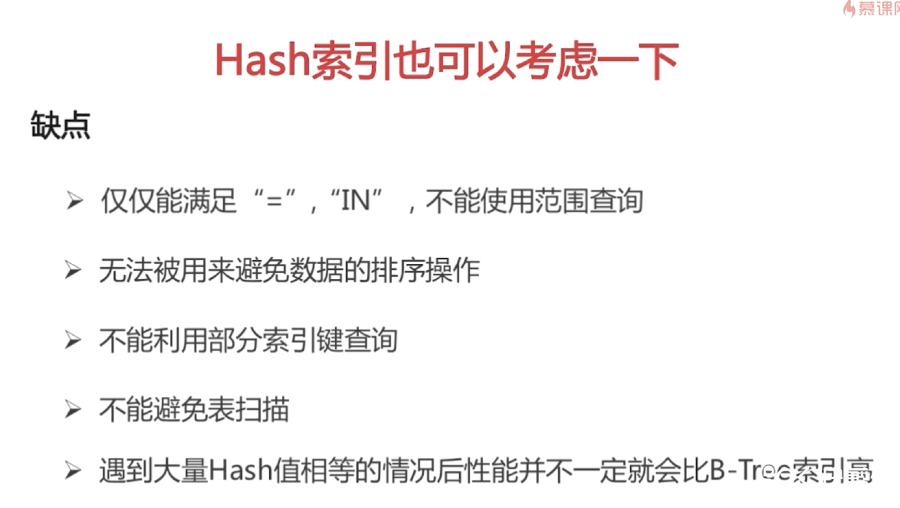
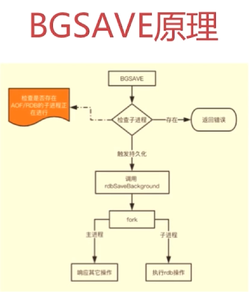

# 一、剑指offer

## 1.网络相关知识

### 1）网络基础知识

#### 1、OSI7层架构及含义


应用层：规定应用接受发送数据的格式，如Http协议。

表示层：不同系统之间语法问题。

会话层：自动收发包和寻址。

传输层：最重要的一层，向用户提供可靠的端到端的差错和流量控制，保证报文的正确传输。传输层的作用是向高层屏蔽下层数据通信的细节，即向用户透明地传送报文，把大量数据分成一个个数据段，交给网络层。

网络层：网络中点对点通信的路由选择，最佳路径，把帧解析为数据包，物理设备：路由器。

数据链路层：定义了如何格式化数据，进行数据格式化校验，把比特数据组成帧，物理设备：交换机。

物理层：两台设备物理连接，发送单位为比特，物理设备：网卡。


#### 2、TCP/IP协议


==TCP是全双工协议，server可以发送数据给client，client也可以发送数据给server，在三次握手或四次挥手时，双方都要受到SYN和ACK包或者FIN和ACK包==

https://blog.csdn.net/qzcsu/article/details/72861891

### 2）TCP三次握手

#### 1、传输控制协议TCP简介

 面向连接的，可靠的，基于字节流的传输层控制协议

将应用层的数据流分割成报文段，并发送给目标节点的tcp层

每个数据包都有序号，如果对方成功接收则发送ack确认，否则重传

#### 2、TCP消息头


32位序号：Sequence Number（SEQ） TCP连接中传送的字节流中的每个字节都按顺序编号，分段后，此字段为分段排序的依据

32位确认号：ACK number期望收到对方下一次发出报文的第一个字节的序号

窗口大小：Window滑动窗口大小，用来告知发送端，接收端空闲的缓存大小，用来控制发送端发送的速率，进行流量控制

TCP标志位含义：


#### 3、三次握手

 

 

**第一次握手**：客户端发出SYN（seq=X）包到服务端，并进入到SYN_SEND状态，等待服务器确认

**第二次握手**：服务器收到SYN包，必须确认客户端的SYN，同时也发一个自己的SYN，即SYN，ACK（ack=X+1，seq=Y）包，此时服务器进入SYN_RECV状态

**第三次握手**：客户端收到服务器的SYN+ACK包，向服务器发送ACK（ack=Y+1，seq=X+1）确认包，此包发送完毕后客户端和服务器进入ESTABLISHED状态，完成三次握手。

#### 4、为什么要进行三次握手

为了确定Sequence Number的初始化值，方便后续接受数据能够有序拼接

#### 5、首次握手的隐患--SYN超时

Server收到Client的SYN，恢复ACK，SYN。没有收到ACK确认。

连接处于未成功，未失败的状态，server不断重试直至超时，Linux默认需要63秒后才会断开连接。

63 = 1 + 2 + 4 + 8 + 16 + 32，每次间隔秒乘2

这样就会出现SYN flood的攻击，即，有恶意攻击者，发出SYN请求连接，然后就下线，反复操作，把SYN队列占满，正常的SYN连接就进不去了

**防护措施**：SYN队列满后，Linux会有一个==tcp_syncookies==参数回发SYN Cookie，通过目标地址端口，主机地址端口，时间戳打造。如果是正常的连接，会把这个SYN Cookie带回来，即可建立连接。如果是攻击者，对方主机已经下线，就不会响应并带回。

#### 6、建立连接后Client出现故障

保活机制：keep live time 服务端会发出保活请求，如果未收到相应，会带一定时间后再次进行保活探测，达到保活探测数后，确定连接为不可达，中断连接

### 3）四次挥手

#### 1、四次挥手过程

四次挥手是为了终止连接，服务端和客户端总共发出4个包，来确认连接的终止，由客户端和服务端，任意一方，发出close来触发

 

假设是客户端主动关闭

**第一次挥手**：client向server发出FIN包，假设seq=u，用来关闭client到server的数据传送，并进入到FIN-WAIT-1状态，等待server回应。

**第二次挥手**：server发出ACK确认包，ack为u+1，告诉client消耗掉了一个序号（此时client并不会立即用到这个ack号），然后传入自己的seq=v，server进入到CLOSE-WAIT状态，进入到该状态后可以做最后的发送。client收到ACK确认包后进入到FIN-WAIT-2的状态，等待server发出FIN包终止连接，处于这一状态的client可以接收来自server发出的最后的数据。

**第三次挥手**：server数据发出完毕后，向client发出FIN包，确认终止连接，即发出FIN，ACK包，seq假设为w，ack为u+1，告诉client消耗掉了一个序号，发出包后server进入到LAST-ACK，等待最后的确认

**第四次挥手**：client发出ACK确认包，最后一次确认连接关闭，seq=u+1，ack=w+1，告知server确认关闭连接，服务端收到确认后，立即释放连接，但是客户端在发出ack包后，会进入到TIME-WAIT，等待2MSL（MSL最大连接时长，linux中为30秒）时间后释放连接

**等待2MSL的原因**：1、防止客户端在发出ACK确认包后，包丢失，服务端并未接收到，然后服务端会给客户端重发FIN，ACK包，如果客户端直接释放连接，服务端会一直重发，所以要保证服务端正确的接收到包，需要客户端等待一段时间。msl表示最大连接时长，等待一来一回两个msl即可 2、防止新旧连接混淆

#### 2、服务器大量出现CLOSS-WAIT的原因

1.有连接未释放导致的，检查代码，查看是否有资源未释放

2.线程池配置不合理，特别是处理请求的线程配置

### 4）UDP

特点：

为无连接传输协议

相比TCP的消息头更简单，额外开销更小

不需要做流量限制，发送的速率只和数据生成速率，带宽，机器速率有关

尽最大能力交付，不保证可靠交付，不需要维系复杂的连接状态表

UDP直接面向报文，应用程序的报文到UDP后，不拆分不合并，保留报文的边界，所以==应用程序要选择报文的大小==

 

头部一共8个字节（不加数据）

### 5）TCP滑动窗口

RTT：发送一个数据包，到收到ACK回应，所耗费的时间

RTO：重传时间间隔（发送数据包后，在一定时间内没有收到ACK回应，则会重新发送数据包，这个时间就叫做RTO，不是固定写死的数据，是根据RTT来计算出来的）

TCP要发送大量数据，所以不可能一个包一个包的发，就需要用滑动窗口机制解决批量发送包的问题

**用滑动窗口机制做流量控制和乱序重排**

保证TCP的可控性

保证TCP的流控特性（流量控制）

使用消息头中window来告知发送方，还有多少空闲的缓冲区可以接收数据

**滑动窗口的大小并不是固定的**

 

LastByteAcked：发送端收到接收端最后一次发出ACK已确认的字节位置，也就是接收方确认收到数据的最后一个字节编号

LastByteSent：指向发出的最后一个字节位置，LastByteAcked到LastByteSent之间的数据表示发送端已经发出，但是接收端还没有发出ACK回应

LastByteWritten：表示应用程序准备好的最后一个数据段，LastByteSent到LastByteWritten之间表示应用程序已经准备好，还未向接收端发出的数据

LastByteRead：表示接收端向发送端发出确认ACK包的最后一个字节位置

NextByteExpected：表示收到的最大的连续数据的字节位置，还没收完，LastByteRead到NextByteExpected的数据表示接收端已经接受的数据，但是还未接受到完整的包，未发出ACK确认

LastByteRcvd：表示已收到的最后一个字节的位置，与NextByteExpected之间有间隔，间隔部分表示有一些数据还未到达

**计算接收方还可以处理多少数据**

AdvertisedWindow = MaxRevdBuffer - (LastByteRcv - NextByteExpected)

MaxRevdBuffer表示接收方总共的缓存区大小

**计算发送方还可以发出多少数据**

EffectiveWindow = AdvertisedWindow - (LastByteSend - LastByteAcked)


 

#1：已经发送，并且受到对端的回应的

#2：已经发送，但未收到对端回应的

#3：未发送，但对端允许发送的

#4：未发送，因为对端大小限制，暂时不可发送的

**#2-#3所组成的连续空间，就称为滑动窗口**

 

当发送端接收到新的ACK，已经发送并且确认接收到的**连续数据临界值**改变时，窗口就会发生滑动，

前面的发好了，就往后移，后面的也可以发了。

 

#1+2：已接收，并且回复ACK的值（不存在已接收但为ACK的数据，因为接收数据完成后，回发ACK是即时操作）

#3：未接收，但是可接受的数据

#4：未接收，因超出窗口大小，不能接受的数据

**滑动窗口在#3区域**

左边连续数据临界值改变后，会发生窗口滑动

### 6）HTTP

HTTP的主要特点：

- 支持客户机/服务器的模式

- 简单快速：发送请求时，只需发送请求方法和路径，即可，通信规模小，速度快

- 灵活：可以传输任意类型的数据，用content-type加以标记
- 无连接：客户机向服务器发出请求，并受到应答之后，即断开连接

（HTTP1.1起，默认使用长链接，在服务器返回客户机信息后，服务器会等待一段时间后，才断开连接，以保证连接特性，但是我们无法得知HTTP请求是否处于连接状态，只得把它当做无连接请求）

- 无状态：不会保存每一次连接的状态，即后面需要前面信息，则需要重传

#### 1、请求结构

 

请求行+请求头部+请求正文，请求正文即消息体，body，只在pos请求中用到

请求正文前面的回车符合换行符是必须的，即使没有请求正文

 

#### 2、响应结构

 

状态行+响应头部+响应正文

 

#### 3、HTTP请求流程

1. 客户端连接到web服务器（三次握手）
2. 发送HTTP请求，默认是80端口
3. 服务器接收请求并返回HTTP响应
4. 释放TCP连接（四次挥手）
5. 客户端解析HTML内容

#### 4、在浏览器地址栏输入HTTP URL后会出现的流程

1. DNS解析，解析域名对应的IP地址（先后顺序：浏览器缓存，系统缓存（host文件），路由器缓存，IPS服务器缓存，根域名服务器缓存，域名服务器缓存）
2. 对IP对应的主机进行TCP连接，三次握手
3. 发出HTTP请求
4. 服务器处理请求，并返回HTTP报文
5. 浏览器解析渲染页面
6. 连接结束

第5步和第6步严格意义上不算有序发生

#### 5、常见的HTTP状态码

**5中可能的取值**

1XX：指示信息--表示请求已接收，继续处理

2XX：成功--表示请求已被成功接收、理解、接受

3XX：重定向--表示要完成请求必须进行更进一步的操作

4XX：客户端出现错误--请求有语法错误，或者请求无法实现

5XX：服务器错误--服务器未能实现合法的请求

**常见状态码**

200：OK，正常返回信息

400：客户端请求有语法错误，不能被服务端理解

401：请求未经授权，必须和WWW-Authenticate请求同一同使用

403：服务器接收到请求，但是拒绝提供服务

404：没有找到资源，URL有误，或服务器没开

500：服务器发生未预知错误

503：服务器暂时不能处理客户端请求，一段时间后可能恢复正常

#### 6、GET请求和POST请求的区别

三个层面上回答：

**HTTP报文层面**：GET将请求信息放在URL上，而POST放在报文体中，浏览器会对URL作出长度限制，而报文体不受限制

（GET请求可以将请求信息放入报文体中，HTTP协议并没有明确规定GET不能使用请求体， 但是规范上不建议这样使用，大部分客户端没有针对GET请求体的操作）

**数据库层面**：GET符合幂等性（对数据库的一次操作和多次操作结果一致）和安全性（不改变数据库中的操作），POST不符合

**其他层面**：GET请求可以被缓存、被存储，POST不行

### 7）Cookie和Session的区别

#### 1、cookie简介

- 是服务器发送给客户端的特殊信息，客户端以文本形式存放在客户端

- 客户端再次发请求是会把cookie回发

- 服务器接收到后，会解析cookie生成与客户端相对应的内容

#### 2、session简介

- session是服务端机制，在服务器上保存的信息

- 解析客户端请求并操作JSESSIONID（java中session id的名字），按需保存状态信息

#### 3、session的实现方式

1.通过cookie实现

客户端第一次向服务器发送请求时，服务器在cookie中存放一个唯一的JSESSIONID，后续服务端通过cookie中的JSESSIONID找到对应的状态信息

2.URL回写

在客户端每次向服务端发送请求的时候，都在URL后面加上JSESSIONID这个属性，服务端拿到url上的JSESSIONID，找到对应的状态信息

#### 4、区别

- cookie的数据存放在客户端浏览器上，session的数据存放在服务端

- session比cookie安全

- cookie不会增加服务器负担，session都是存在服务器上，会增加服务器负担

### 8）HTTP和HTTPS的区别

 

**HTTPS**：在HTTP下面加入了ssl层，从而具有了保护数据交换隐私，以及完整性，提供对网站服务器身份认证的功能，简单来说，就是安全版的HTTP

**SSL**：Security sockets layer 安全套接层

- 为网络通信提供安全及数据完整性的一种安全协议
- 位于应用层和传输层之间，是操作系统对外提供的API，SSL3.0后更名为TLS

- 采用身份验证和数据加密保证网络通信的安全和数据的完整性

**HTTPS传输流程**：

- 浏览器将支持的加密算法信息发送到服务器
- 服务器选择一套浏览器支持的加密算法，以证书的形式发回浏览器
- 浏览器验证证书的合法性（会在地址栏显示出来受信标识），并结合证书公钥加密信息发送给服务器，web浏览器会随机生成一个密码，并使用证书中的公钥加密，然后使用约定好的哈希算法握手消息，使用生成的随机数对消息进行加密，回发给服务器
- 服务器使用私钥解密密码（浏览器生成的随机密码），通过密码解析浏览器发送的加密信息，验证哈希是否与浏览器的哈希一致，然后服务器通过约定好的哈希算法加密新的握手消息，在使用密码加密，回发给浏览器
- 浏览器解密响应信息，并计算通过哈希算法加密后的握手信息，如果与服务器发送过来的哈希值一致，之后浏览器会使用之前生成的随机密码，和对称加密算法，进行交换数据

**HTTP和HTTPS的区别**：

- HTTPS需要到CA申请证书，要缴纳一定费用，HTTP不用
- HTTPS通过密文传输，HTTP明文传输
- 连接方式不同，HTTPS默认使用443端口，HTTP默认使用80端口
- HTTPS = HTTP + 加密 + 认证 + 完整保护机制，较HTTP更安全
- HTTP是无状态的，SSL是有状态的

**HTTPS就一定安全吗？**

不一定

- 在浏览器URL输入域名，浏览器默认填充http://，请求需要跳转，有被劫持的风险
- 可以使用HSTS优化（正在推行中，并不是主流）

### 9）socket

#### 1、简介


在同一系统下，通过PID来确定某个进程，在网络环境下，PID就不够用了。在网络中可以通过多个协议来确定一个资源，IP+TCP端口号。

Socket是最简单的TCP/IP抽象，==打开文件\==》读取或写文件\==》在关闭文件==    的流程

#### 2、socket通信流程


Java中TCP需要的类：ServerSocket（服务端）、Socket（客户端）

UDP需要用的类：DataparmSocket（用于发送数据和接收数据）和DataparmPacket（用户临时存放数据）

## 2.数据库

### 1）数据库架构

 

**如何设计一个关系型数据库？**


### 2）索引

**为什么要使用索引**

快速的查询数据

**什么样的信息能成为索引**

主键，唯一键，普通键

### 3）索引数据结构

#### 1、使用二叉查找树（反例）


虽然使用树形的旋转特性可以避免这种现象的产生，但是二叉树每个节点只能有两个子节点，如果数据量过大，数的深度会越来越深，深度每增加1，就会多发生一次IO，最终会比全表扫描更慢 

解决方案，把数变矮一些，每层节点多一些，就开始使用B-Tree

#### 2、B-Tree

 


M是配置所得，上图中m=3，为3节B树

相当于，除了根节点和叶子节点外，每个节点的子节点的个数，小于m，大于ceil(m/2)


b的意思是，所有非叶子节点的节点内数字的个数，比该节点的子节点少一个

B - Tree尽可能的控制了树的深度和每层的节点数，尽可能的减少了IO，但是有更好的解决方案——B + Tree

#### 3、B+Tree（主流索引）


与B树的区别：

- B+树每个非叶子节点的子树指针和关键字的个数相同，而B树子树指针比关键字大1
- 非叶子节点的子树指针P[1]，指向关键字值[K[i], K[i+1])的子树

- 非叶子节点仅用来存放索引，数据都保存在叶子节点中
- 所有叶子节点均又一个链指针指向下一个叶子节点（叶子节点横向有序，且通过指针连接）

 

#### 4、Hash索引



#### 5、BitMap索引


必须是值已经确定的几个枚举，如果对任意一个位图的数据进行修改，会锁住整合位图，因为位图可能发生改变，所以不适合高并发场景，适合数据统计，且并发少的场景

### 4）密集索引和稀疏索引

**密集索引**：叶子节点保存的不只是键值，还保存了位于同一行记录里的其他列的信息，由于密集索引决定了表的物理排列顺序，一个表只有一个物理排列顺序，所以一个表只能创建一个密集索引

**稀疏索引**：叶子节点仅保存了键位信息以及该行数据的地址，有的稀疏索引只保存了键位信息机器主键

mysam存储引擎，不管是主键索引，唯一键索引还是普通索引都是稀疏索引

innodb存储引擎：有且只有一个密集索引。密集索引的选取规则如下：

- 若主键被定义，则主键作为密集索引
- 如果没有主键被定义，该表的第一个唯一非空索引则作为密集索引
- 若不满足以上条件，innodb内部会生成一个隐藏主键（密集索引）
- 非主键索引存储相关键位和其对应的主键值，包含两次查找


如果使用的是辅助索引，InnoDB会先根据辅助索引树查找到改数据的主键索引值，然后从主键索引树中查找到该记录的值。

MyISAM则是在叶子节点保存指向记录的值，所有的索引都是稀疏索引

InnoDB的数据和索引存在一个文件中数据和主键密集索引树相连

MyISAM的数据和索引是两个文件，用指针连接

### 5）如何调优SQL

#### 1、如何定位并优化慢查询SQL

在mysql客户端中输入以下指令

**show  variables  like  '%query%'**       （显示出关于查询的系统全局变量）

关注几个重要的信息

slow_query_log                  off                       ：是否已开启慢查询日志，如果为off表示未开启，可以设置为on

slow_query_log_file           完整路径            ：慢查询日志输出的完整路径

long_query_time                10                       ：超过多少秒的SQL被认为是慢SQL

**打开慢查询日志：set  global  slow_query_log = on;** （用set global设置属性，在每次重启mysql后悔还原成默认配置，如果需要永久修改，则需要修改默认文件）

**show status  like '%slow_queries%'**    （显示系统中慢SQL的记录数，本次mysql启动后的）

force  index()  强制索引

优化步骤：

- 先使用慢查询日志找到该SQL
- 使用explainSQL分析器分析SQL
- 尽量让SQL走索引

#### 2、联合索引最左匹配原则的成因

联合索引在mysql底层是，使用第一个字段生成一个有序的B+树，然后在对第二个，第三个字段排序，中间如果断了的话，对于后续字段来说就是无序的。

#### 3、索引越多越好吗

- 数据量小的表不需要添加索引，建立会增加额外的索引开销

- 数据变更需要维护索引，因此，更多的索引意味着更高的维护成本
- 更多的索引意味着更多的空间

### 6）锁模块

#### 1、锁的介绍

**锁的分类**

按粒度划分可以分为：表级锁、行级锁、页级锁

按锁级别划分：共享锁、排它锁

按加锁方式划分：自动锁、显式锁

按操作划分：DML锁、DDL锁

按使用方式划分：乐观锁、悲观锁

#### 2、MyISAM和InnoDB关于锁方面的区别

- MyISAM默认是表级锁，不支持行级锁、
- InnoDB默认是行级锁，支持表级锁


s表示共享锁，x表示排它锁 

##### MyISAM：

在MyISAM读取数据时，会给数据表加上一个读锁，写数据时，会给表加上一个读锁

如果读锁未释放，有写操作想要添加写锁，就会被阻塞，等待所有的读锁被释放后，才能添加

==读锁是共享锁，写锁是排它锁==

显式加表锁：`lock tables 表名 read/write;  `

释放表锁：`unlock tables;  `

读操作上加排它锁：在select语句后面加上  for  update;

**使用场景**：

- 频繁的执行全表count（MyISAM引擎会使用一个变量来存储全表的数据，每次直接读取即可，而InnoDB每次都要进行全表统计）
- 对数据增删改需求不高，查询非常频繁（MyISAM全部使用稀疏索引，每次只需遍历一次索引树，而InnoDB需要遍历两次）
- 没有事务

##### InnoDB：

InnoDB支持MyISAM的表锁操作，也支持行锁，但默认是行锁

==InnoDB的行锁只支持对主键、唯一索引列的操作，对其他索引会被加上gap锁，而没有索引的列会被加上表锁==

但InnoDB默认事务是自动提交的，想要看到效果，必须把自动提交功能关闭

`set  autocommit = o;`

显式提交事务语句：`commit;`

`START TRANSACTION` 或者`BEGIN` 开始一个新的事务

InnoDB默认select不会对数据加上共享锁，需要显式添加。在写操作时，会加上排他锁

显式添加共享锁（读锁）：`select * from student where id = 1 lock in share mode;`

排它锁：后面加上for update;

**使用场景**：

- 数据增删改都相当频繁
- 可靠性要求比较高，要求事务

#### 3、数据库事务的四大特性

A（Atomic）：原子性

C（Consistency）：一致性

I（Isolation）：隔离性

D（Durability）：永久性

#### 4、事务的隔离级别以及各个级别下的并发访问问题

**事务隔离级别可能引发的问题：**

- 更新丢失问题，这个问题在数据库层面已经使用锁机制解决，不好模拟，大致模拟一下场景


mysql所有隔离级别已经使用锁机制避免了这些问题，所以，如果出现该问题，肯定是业务逻辑有问题

- 脏读问题——READ-COMMITTED（读已提交）事务隔离级别可以避免

- 不可重复度——REPEATABLE-READ（可重复读）事务隔离级别可以避免
- 幻读——SERIALIZABLE（串行化）事务隔离级别可以避免

#### 5、InnoDB可重复读下如何避免幻读

使用间隙锁来避免

**加gap锁（间隙锁）的时机：**

gap锁只在RR或者串行化的隔离级别下出现

- 索引为主键或唯一索引时

如果where条件全部命中，则不会用gap锁，只会加记录锁

如果where条件部分命中或者全部不命中，会加gap锁

- 索引为非唯一索引或主键索引，或者不走索引时

非唯一索引会有临界值，左开右闭区间进行间隙锁

场景：id（主键）   age（普通索引）

表数据：

​               id             1          2          3         7            9         10      12

​			  age           18       19        20       24         26        30      33

如果删除age in (24,26) ，会触发(20,30]的间隙锁，如果操作20，或者30，会增加一个判断，主键间隙锁(3,9]

主要看满足条件的记录不在范围之内的临界值，作为间隙锁的临界值

如果不走索引，会对整张表进行间隙锁，从而锁住整张表，这种情况是需要避免的

#### 6、RC、RR级别下的InnoDB非阻塞读如何实现

表象：快照读（非阻塞读）--伪MVCC

内在：next-key锁（行锁+gap锁）

当前读和快照读

当前读：select   ...   lock  in  share  mode;     select  ...  for  update;   update，delete，insert

当前读就是加了锁的增删改查语句，不管是共享锁还是排它锁，因为加了不管是共享锁还是排它锁的数据，在锁释放之前都是不可修改的。

快照读：不加锁的非阻塞读，select（在非序列化隔离级别外，因为序列化下的所有查询默认添加锁）

update的顺序：

根据匹配条件读一条数据-》锁数据-》改数据-》再读一条数据-》锁数据-》改数据。。。。知道没有匹配条件的数据为止

所以update会出现幻读

### 7）关键语法

~~~sql
	select 查询列表		  7 	
	from 表			  1 	
	【join type join 表2	  2 	
	on 连接条件		  3 	
	where 筛选条件		  4 	
	group by 分组字段	  5 	
	having 分组后的筛选	  6 	
	order by 排序的字段	  8 	
	limit offset,size】    	  9 									
	union  （联合查询）		
	select  联合查询列表		
~~~

**1、GROUP BY**

- 满足select子句的列名必须是分组列（分组条件列）或者列函数（sum，avg，count等函数）

- 对连接查询的其他表字段不做限制

**2、HAVING**

- 通常和GROUP BY一起使用
- WHERE过滤行，HAVING过滤组
- 出现在同一SQL中的顺序：WHERE>GROUP BY>HAVING

- 如果不写group by，可以单独使用having，作用和where一样

## 3.Redis


**Redis为什么能那么快**

- 绝大部分请求是纯粹的内存操作，执行效率高

- 数据结构简单，对数据操作也简单
- 采用单线程（单线程连接，主线程单线程，并不是程序单线程），单线程也能处理高并发，如果想要使用多核，也可以启用多实例
- 使用多路复用IO模型，非阻塞IO

### 1）I/O多路复用模型

**FD**：File Descriptor，文件描述符，在操作系统中，一个打开的文件通过唯一的文件描述符进行引用，该描述符是打开元数据到文件本身的映射，文件描述符以整数的形式存在。

##### **传统的阻塞I/O模型**：

当使用read或者write对一个文件描述符FD进行读写时，如果当前FD不可读或者不可写，整个redis服务就不会对其他操作作出响应。

##### **I/O多路复用：**

select系统调用：


select可以监控多个文件的可读可写情况，当某些文件处于可读或者可写的状态时，select就会返回可读，可写的文件描述符

所以redis可以通过select来判断文件是否可读，自己就可以去做别的事情了

除了select，redis还有其他的多路复用：epoll/kqueue/export/select 

##### **redis的I/O多路复用：**

- redis会根据编译平台的不同，选择不同的多路复用，优先选择时间复杂度为O(1)的多路复用函数作为

linux使用epoll，mac使用kqueue

- select的时间复杂度为O(n)，但是因为所有的系统内核对select支持度较高，所以使用select作为保底

- 基于react设计模式监听I/O事件

### 2）redis数据结构

**供用户使用的基本数据类型**

String：最基本的数据类型，二进制安全（可以包含任何数据，如图片），值最大存储512m

Hash：String元素组成的字典，适用于存储对象

List：列表，按照String元素插入进行顺序存储，这是一个链表的数据结构，又有栈的后进先出

Set：String元素组成的无序集合（数学意义上的集合），通过哈希表实现，不允许重复。

Sorted Set：通过分数来为集合中的成员进行从小到大的排序

用于计数的HyperLogLog，用于支持存储地理位置信息的Geo

**底层数据类型基础**

- 简单动态字符串
- 链表
- 字典
- 跳跃表
- 整数集合
- 压缩列表
- 对象

### 3）同前缀Key查询

如何在海量数据中查询某一固定前缀的key

**留意细节**：模型数据规模

1、`keys  前缀*`

该语句可以解决问题，它是一次性将所有匹配数据查询，并全部返回，数据量过大时会特别耗性能

2、`SCAN  cursor  [MATCH  pattern]  [COUNT count]`

该语句每次执行只为返回少量元素

- 基于游标的迭代器，需要基于上一次额游标延续之前的迭代过程

- 以0作为游标时，开始新的迭代， 命令返回游标0完成一次遍历，从0到0的过程
- 不保证每次执行都返回某个给定数量的元素，支持模糊查询
- 一次返回的数量不可控，只能大概率符合count参数

案例：

 

`scan 0 match k1* count 10`

返回的第一个元素是游标，即下一次迭代需要传入的cursor值

 

返回的第二个元素是匹配到key的结果集，数量并不一定和count一致

执行这条语句时，redis并不会发生卡顿

### 4）如何执行分布式锁

**第一种实现方式：**

`SETNX key value`

设置一个键值对，如果不存在返回1，如果存在返回0

可以针对该key设置一个过期时间

`EXPIRE key time`

这里的单位是秒

 

这种写法会有风险，如果一个线程执行setnx指令后还未执行expire就挂掉了，那么这个锁永远不会过期，虽然两步操作都是原子性的，但是合在一起就不是原子性的了

**第二种实现方式：**

redis 2.6.12版本开始，出现了把setnx和expire作为一步原子性操作的语句

`SET key value [EX seconds] [PX milliseconds] [NX|XX]`

EX  seconds：表示设置过期时间为seconds秒

PX  milliseconds：表示设置过期时间为milliseconds微秒

NX：只在键不存在时，才对键进行设置操作

XX：只在键存在时，才对键进行设置操作

SET操作成功完成时，返回OK，否则返回nil

### 5）使用redis做异步队列

**第一种做法**：

使用List作为队列，RPUSH生产消息，LPOP消费消息

缺点：但是这样需要循环请求redis查看是否有消息，可以用sleep各一段时间再次请求，不过有更好的方案

**第二种做法：**

同样使用List作为队列，RPUSH生产消息，消费消息使用BLPOP

BLPOP的用法：`BLPOP key [key ...] timeout`

timeout单位秒

 

在消费消息的时候，如果队列中没有消息，会阻塞指定的时间，如果指定时间内还没有消息，会返回nil，如果有消息，返回OK，这样就避免了使用sleep

缺点：仅仅实现了单拨的消费

**第三种做法：**

使用redis的主题订阅策略：pub/sub

- pub：发送者        sub：接受者

- 订阅者可以订阅任意数量的频道

缺点：

消息发布无状态，无法保证可达（不专业）

### 6）redis持久化

#### 1、RDB

redis data base：快照持久化，保存某个时间的全量数据快照

redis中关于RDB的配置：

~~~config
save 900 1       #900秒内如果有1条写入指令，就产生一次快照
save 300 10      #300秒内如果有10条写入指令，就产生一次快照    （这三条语句采用的是BGSAVE的指令）
save 60 10000    #60秒内如果有10000条写入指令，就产生一次快照
#save ""   如果加上此语句，表示禁用RDB

stop-writes-on-bgsave-error  yes    #表示如果RDB出现错误，是否停止redis服务，防止数据丢失

rdbcompression  yes   #表示RDB文件是否压缩后再写入磁盘，建议设置为NO，因为比起磁盘，CPU资源更宝贵

~~~

**RDB创建：**

**手动触发的两个指令：**

- SAVE：阻塞Redis的服务器进程，直到RDB文件被创建完成，很少使用，会阻塞主线程，进而阻塞索引客户端请求
- **BGSAVE**：fork出一个子进程来创建RDB文件，不阻塞服务的进程

lastsave：该指令可以查看上次save或者bgsave执行的时间

可以通过查看lastsave，对RDB文件进行备份

**自动化触发**

- 根据redis.conf配置里的save  m   n定时触发（使用的是BGSAVE）
- 主从复制时，主节点自动触发（在设置主从复制时，主节点会发生一次BGSVAE，然后发送RDB文件给从节点）
- 执行Debug Redload的时候
- 执行Shutdown且没有开启AOF持久化



**系统调用fork()：**创建进程，实现了Copy-on-Write

~~~
传统的fork会将父进程所有的内存资源都复制一份用来创建子进程，有些资源子进程并不需要，并且性能很差

linux改进了fork，当父进程创建子进程时，内核只为子进程创建虚拟空间，父子两个进程使用的是相同的物理空间，只有父子进程发生更改时，才会发生独立的物理空间，此方式称Copy-on-Write
~~~

**Copy-on-Write：**如果有多个调用者同时要求相同的资源（如内存或磁盘空间），他们会共同获取相同的指针指向相同的资源，知道某个调用者试图修改资源内容时，系统才会真正复制一份专用副本给该调用者，而其他调用者所见到的最初资源仍然保持不变，意思就是，**如果读，则只需要使用共享资源，如果需要修改时，才复制**

**redis做持久化的步骤：**

~~~
1.redis需要调用fork创建子进程，父进程继续处理client请求，子进程负责将内存中内容写入到临时文件中，由于os的Copy-on-write机制，父子进程会共享相同的物理页面

2.当父进程处理写请求时，os会为父进程需要修改的页面创建副本，而不是写共享的页面，而子进程内的共享页面是fork时刻的整个数据库的一个快照

3.当子进程完成临时文件的写入之后，用临时文件替换掉原来的RDB快照文件，然后子进程退出。
~~~

**RDB的载入：**

一般是自动的

**RDB的缺点：**

- 内存数据的全量同步，数据量大会由于I/O而严重影响性能（每次快照持久化都是将数据完整的写入到磁盘一次，并不是增量的只同步脏数据）
- 可能会因为redis挂掉而丢失从当前至最近一次快照期间的数据（因为RDB是在一定间隔时间做一次快照所有的修改）

#### 2、AOF

append only file：保存写状态

- 记录下除了查询外的所有变更数据库状态的指令
- 以append的形式追加保存到aof文件中（增量）

AOF持久化默认是关闭的，可以通过修改配置文件开启

**AOF相关的配置：**

~~~
appendonly  no    #修改为yes

appendfilename  ""   #表示生成aof的文件名

appendfsync everysec  #三种取值：always、everysec（默认、推荐）、no
#always：一旦内存中数据发生变化，立即将写指令追加到aof文件中
#everysec：每隔一秒将写指令追加到aof文件中
#no：表示将追加指令的操作交由操作系统来决定，一般而言，操作系统会等待缓存区本填满，才会将数据同步到磁盘当中
~~~

可以使用`config set appendonly yes`指令直接在客户端中设置

**日志重写解决AOF文件越来越大的问题**

- 调用fork，创建一个子进程
- 子进程把新的的AOF写到一个临时文件里，不依赖原来的aof文件（新的aof是把当前内存的数据生成对应的命令，并不需要老的aof文件进行分析）
- 主进程持续将新的变动同时写到内存和原来的AOF里（保证在新AOF生成过程中的操作不丢失）
- 主进程获取子进程重写AOF的完成信号，往新AOF同步增量变动
- 使用新的AOF文件替换掉旧的AOF文件

重写操作可手动触发或自动触发

#### 3、RDB和AOF共存


从上图得知，AOF优先

RDB和AOF的优缺点

- RDB优点：全量数据快照，文件小，恢复快
- RDB缺点：无法保存最近一次快照之后的数据
- AOF优点：可读性高，适合保存增量数据，数据不易丢失
- AOF缺点：文件体积大，恢复时间长

#### 4、混合模式

redis4.0之后推出RDB-AOF混合持久化方式，并作为默认配置所使用


子进程在做aof重写时，会通过管道从父进程读取增量数据，并缓存下来。在以RDB方式保存全量数据时也会从管道读取数据，同时不会造成管道阻塞，即，AOF的前半段是RDB格式的全量数据，而后半段是redis命令格式的增量数据

BGSAVE做镜像全量持久化，AOF做增量持久化

BGSAVE间隔期间，用AOF配合做增量，在redis服务重启时，会使用BGSAVE持久化文件，重新构建内容，在使用AOF存放近期的操作指令，来实现完整恢复重启之前的状态

### 7）使用Pipeline及主从同步

#### 1、Pipeline

**使用Pipeline的好处：**

- Pipeline和Linux的管道相似
- redis是基于请求/响应模型，单个请求处理需要一一应答	
- Pipeline批量执行指令，节省多次IO往返时间

#### 2.主从同步的原理


master用来写操作，其他的salve用来读操作，定期更新salve的数据，做到弱一致性，即最终一致性，为了保证效率

第一次同步，master做一次BGSAVE，并同时将后续的操作记录到内存的buffer中，待完成后，将RDB文件全量同步到从节点中。从节点接收到文件后，将RDB镜像加载到内存中，然后通知主节点，将期间修改的数据再同步到从节点。

**全同步流程：**

~~~
1.slave发送sync到master

2.master启动一个后台进程，将Redis中的数据快照保存到文件中

3.master将保存数据快照期间（第2步进行期间）接收到的指令缓存起来

4.master完成第2步的写文件操作之后，把文件发送给slave

5.salve接收到数据快照文件后，将其加载到内存中，然后通知master

6.master收到通知后，把第3步缓存的指令发送给salve，进行回放
~~~

==后续，所有写操作都是在master上进行，所有读操作都是在slave上进行==（master也可以读，但是为了提升性能还是用slave来读）

**增量同步全过程：**

~~~
1.master接收到用户的操作指令，判断是否需要传播到slave

2.将该操作记录追加到AOF文件中

3.将操作传播到其他的slave：1、对齐主从库；2、往响应缓存写指令

4.将缓存中的数据（写入缓存的指令）发送给slave
~~~

#### 3、哨兵模式Sentinel

用来解决主从同步master宕机后的主从切换问题

- 监控：检查主从服务器是否运行正常
- 提醒：通过API向管理员或者其他应用程序发送故障通知
- 自动故障迁移：主从切换

**留言协议Gossip**：

在杂乱无章中寻求一致，redis在多节点状态通信之间采用Gossip协议

- 每个节点都随机地与对方通信，最终所有节点状态达成一致
- 种子节点定期随机向其他节点发送节点列表以及需要传播的消息（任何新加入的节点都会在这种方式下很快地被全部节点知道）
- 不保证信息一定会传递给所有的节点，但是最终会趋于一致（有可能永远不一致）

### 8）redis集群

**如何从海量数据中迅速找到所需？**

- 分片：按某种规则去划分数据，分散存储在多个节点上
- 常规的按哈希值划分划分无法实现节点的动态增减

**redis集群原理**

redis在集群中，多个节点通信采用Gossip留言协议，并使用一致性哈希算法作为存储方式

一致性哈希算法：对2^32取模，将哈希空间组织成虚拟的圆环（传统的哈希算法是对数组的长度进行取模）


通过哈希算法，计算出节点的哈希值（比如通过节点IP计算）来确定节点存储的范围，每个节点只存储部分哈希的值。


将数据key使用相同的函数Hash计算出哈希值，存在对应的节点上

哈希值在节点A到节点B之间，存到节点B上；在节点B与节点C之间，存到节点C上，依次类推，即每个节点只存储它逆时针到下一个节点之间的数据


如果某个节点宕机，会把该节点的所有数据转移到顺时针的下一个节点上


新增节点，会计算出新节点的哈希值，然后把该节点哈希值逆时针到下个节点之间的数据放到这个节点的内存中


这样的算法在节点很少的情况下，会出现一个数据倾斜问题


为了解决数据倾斜的问题，引入了虚拟节点

即对每一个节点计算多个哈希，计算结果位置都放做一个虚拟节点，存储算法和查询算法不变，只需要做一个虚拟节点和实际节点的映射即可

如下图为节点A和节点B增加三个虚拟节点，分布更加均匀，在查询或者存储时，先对通过虚拟节点找到对应的实际节点，在进行操作

通常会把虚拟节点设置为32或者更大


## 4.Linux

### 1）linux的体系结构


- 体系主要分为用户态（用户上层活动）和内核态
- 内核：本质是一段管理计算机硬件设备的程序
- 系统调用：内核的访问接口，是一种不能再简化的程序
- 公共函数库，系统调用的组合拳
- shell：命令解释器，可编程

启动linux的时候，首先会启动内核，内核本质上看是一段计算机程序，这个程序直接管理硬件，包括CPU，内存接口，硬盘接口，网络接口等等，所有的计算机操作都要通过内核传递给硬件。

用户态及上层应用的活动空间，应用程序的执行，必须依托于内核提供的资源，包括CPU资源、存储资源、I/O资源等。

为了使上层应用能够访问到这些资源，内核必须提供访问到这些资源的接口，即系统调用，是一种不能再简化的操作，类似于原子操作，一个操作系统上的功能，可以看做是多个系统调用组合的效果而且，一个操作系统不可能做出超越系统调用的动作，比如说，给某个变量分配内存空间，就必须要调用很多的系统系统调用。

由于为实现一个小的功能，就要使用很多的系统调用来完成，过于麻烦，所以就产生了公共调用，就是系统调用的组合拳。

**检查shell版本**

~~~shell
echo $SHELL      #检查shell版本
cat /etc/shells  #查看当前系统所支持的shell
chsh -s shell路径 #更换shell版本
~~~

### 2）如何找到特定的文件

**find：**

语法：`find path [options] params`

用于在指定目录下查找文件，params支持*通配符

例：`find -name "target3.java"`

会从当前目录及子目录下寻找target.java的文件

全局搜索：`find / -name "target3.java"`

find后面加上根路径/就成了全局搜索

-i：忽略大小写

### 3）检索文件内容

**grep：**

查找文件里符合条件的字符串

案例：

`grep "moo" target*`

从当前目录及子目录下查找，文件名匹配target*，内容匹配匹配moo，会列出匹配到的行

**|管道符：**

可将指令连接起来，前一个指令的输出作为后一个指令的输入


第一种，查询包含字符串的行

第二种，显式出匹配正则表达式的行

第三种，过滤掉包含指定字符串的行

### 4）对日志内容做统计

awk


## 5.Java底层知识JVM

JVM：抽象化的计算机，通过在实际的计算机上，仿真模拟计算机的各种功能


- Class Loader：依据特定格式，加载class文件到内存中
- Execution Engine：解释器，负责解析字节码，然后交给操作系统去执行
- Runtime Data Area：JVM内存空间结构模型
- Native Interface：本地接口，融合不同开发语言的原生库为Java所用

### 1）JVM如何加载.class文件

JVM通过Class Loader将符合格式要求的字节码文件加载到内存中，然后由Execution Engine解释class文件中的字节码，交给操作系统去执行，可自行任意发挥

### 2）谈谈反射

Java反射机制是在运行状态中，对于 任意一个类，都能够知道这个类的所有属性和方法；对于任意一个对象，都能够调用它的所有方法和属性；这栋动态获取信息以及动态调用对象方法的功能成为Java原因的反射机制

### 3）类从编译到执行的过程

以Person类为例

1.编译器会将Person.java源文件编译为Person.class字节码文件

2.ClassLoader将字节码转化为JVM中的Class<Person>对象

3.JVM利用Class<Person>对象实例化为Person对象

### 4）谈谈Class Loader

Class Loader在Java中有着非常重要的作用，它主要工作在Class装载的加载阶段，其主要作用就是从系统外部获得class二进制数据流。它是Java的核心组件，所有的Class都是由ClassLoader进行加载，ClassLoader负责通过将Class文件里的二进制数据流装载进系统，然后交给Java虚拟机进行连接、初始化等操作。

### 5）双亲委派机制


**为什么要使用双亲委派机制？**

避免多份同样字节码的加载

### 6）类的加载方式

- 隐式加载：new
- 显式加载：forName、loadClass等

**类装载的过程：**

~~~
1.加载，通过classloader加载class文件字节码，生成Class对象

2.链接，
	1）校验，检查加载class的正确性和安全性，比如检查class文件格式是否正确
	2）准备，为类变量分配存储空间并设置类变量的初始值，类变量存储在方法区中
	3）解析，JVM将常量池内的符号引用转化为直接引用（可选的）

3.初始化，执行类变量赋值和静态代码块
~~~

**forName和loadClass的区别：**

forName会对类进行初始化，即走完上面三步的流程

loadClass只完成了第一步，第二步和第三步都没有做

### 7）JVM内存模型


内存模型即Runtime Data Area


线程私有：程序计数器、虚拟机栈、本地方法栈

所有线程共享：类加载信息、堆

#### 1、程序计数器

- 当前线程所执行的字节码行号指示器（逻辑计数器，并非物理计数器）
- 改变计数器的值来选取下一条需要执行的字节码指令（分支、循环跳转、异常处理、线程恢复）
- 和线程是一对一的关系，即线程私有
- 如果正在执行Java方法，计数器记录的是正在执行的虚拟机字节码指令的地址，如果是Native方法，则计数器值为Undefined
- 程序计数器只记录行号，不必担心内存泄漏

#### 2、Java虚拟机栈

- Java方法执行的内存模型
- 包含多个栈帧
  - 局部变量表（包含方法执行过程中的所有变量，所有类型）
  - 操作数栈（入栈、出栈、复制、交换、产生消费变量）
  - 动态连接
  - 返回地址（出口）

举例：


执行add(1,2);，每个长方形表示一个栈帧，这里有7个栈帧，虚拟机栈会按照程序计数器从大到小压入栈中，出栈执行就成了从小到大，i表示int类型，return后这里的所有栈帧都会被销毁掉


#### 3、本地方法栈

与虚拟机栈相似，主要作用于标注了native的方法

#### 4、元空间（MetaSpace）和永久代（PermGen）的区别

jdk1.8以后，开始把类的元数据放在本地堆内存中，该区域在JDK7之前属于永久代

元空间和永久代都是用来存储class信息，包括Class对象的method和filed等

元空间和永久代都是方法区的实现，只是实现有所不同

在JDK1.8之后使用元空间替代了永久代

元空间使用本地内存，永久代使用JVM内存

**优元空间比永久代的优势**

- 字符串常量池存在永久代中，容易出现性能问题和内存溢出
- 因为类和方法的信息大小难以确定，所以给永久代的大小指定困难
- 为GC带来不必要的复杂度
- 方便HotSpot与其他JVM如Jrocikt的集成

#### 5、Java堆内存

- 对象实例的分配区域
- GC管理的主要区域

#### 6、JVM中常见的问题

**JVM三大性能调优参数：-Xms -Xmx -Xss的含义**

案例：`java -Xms128m -Xmx128m -Xss256k -jar xxx.jar`

-Xss：规定了 每个线程虚拟机栈的大小，此配置将影响并发线程数的大小

-Xms：堆的初始值，如果堆内存不够用，会进行扩容

-Xmx：堆能够扩容到的最大值

-Xms和-Xmx一般设置成一样，因为如果堆发生扩容，会引发内存抖动，造成程序运行时的稳定性

**Java内存模型中堆和栈的区别——内存分配策略**

先了解三种内存分配策略

- 静态存储：编译时确定每个数据目标在运行时的存储空间需求，该存储不允许有递归等不确定存储大小的行为出现

- 栈式存储：数据区需求在编译时未知，运行时模块入口前确定，按照先进后出的原则

- 堆式存储：编译时或运行时模块入口都无法确定，动态分配

回到java中堆栈区别的问题

- 联系：引用对象、数组时，栈里定义变量保存堆中目标的首地址
- 管理方式：栈自动释放，堆需要GC
- 空间大小：栈空间比较小，堆空间非常大
- 碎片相关：栈产生的碎片远小于堆

- 分配方式：栈支持静态存储和栈式存储，堆支持堆式存储
- 效率：栈比堆高

**intern()方法的区别——JDK6和JDK6+**

JDK6：当调用了intern方法时，如果字符串常量池先前已创建出该字符串对象，则返回池中的该字符串的引用。否则，将此字符串对象添加到字符串常量池中，并且返回该字符串对象的引用。

jdk6+：当调用了intern方法时，如果字符串常量池先前创建出该字符串对象，则返回池中的该字符串的引用。否则，如果该字符串对象已经存在于java堆中，则将堆中对此对象的引用添加到字符串常量池中，并且返回该引用；如果堆中不存在，则在池中创建该字符串并返回其引用

## 6.GC相关

### 1）判断对象为垃圾的算法

#### 1、引用计数算法

- 通过判断对象的引用数量来决定对象是否可回收
- 每个对象都有一个引用计数器，被引用则+1，引用结束，则-1
- 任何引用计数为0的对象实例可以被当做垃圾回收

优势：执行效率高，程序受影响较小

缺点：无法检测出循环引用的情况，导致内存泄漏，主流的垃圾回收器均未使用

#### 2、可达性分析算法

通过判断对象的引用链是否可达来决定对象是否可回收

GC找到一个GC Root，往下分析，可达对象会做标记


**什么样的对象可以做GC Root**

- 虚拟机栈帧中的引用对象（栈帧的局部变量表）
- 方法区中的类属性（包括常量）引用对象
- 本地方法栈中JNI（native）引用的对象
- 活跃线程的引用对象

### 2）垃圾回收算法

#### 1、标记-清除算法

Mark and Sweep

标记：从根集合进行扫描，对存活对象进行标记

清除：对堆内存从头到尾进行线性遍历，回收不可达对象内存

缺点：容易造成碎片化


#### 2、复制算法

- 分为对象面和空闲面
- 对象在对象面上创建
- 存活的对象从对象面复制到空闲面
- 将对象面清除

优点：

- 解决碎片化问题
- 顺序分配内存，简单高效
- 适用于对象存活率较低的场景
- 缺点：对于存活率较高的场景并不适合

#### 3、标记-整理算法

标记：从根集合进行扫描面对存活对象进行标记

清除：移动所有存活对象，且按照内存地址次序依次排列，然后将末端内存地址以后的内存全部回收

优点：

- 避免了内存的不连续性
- 不用设置两块内存交换
- 适用于存活率高的场景

#### 4、分代算法

垃圾回收算法的组合拳，按对象生命周期的不同划分不同区域以采用不同的垃圾回收算法，可以提高JVM的回收效率。JDK1.7及之前内存分为年轻代、老年代及永久代。JDK1.8及以后永久代被从JVM内存中移除，只剩下年轻代和老年代。

#### 5、GC的分类

- Minor GC（年轻代GC）
- Full GC（老年代+年轻代GC）

Full GC比Minor GC慢10倍


#### 6、年轻代

尽可能快速的地回收掉那些生命周期短的对象，==触发时机：Eden区内存不足==

- Eden区
- 两个Survivor区

按照8:1:1的大小

**首次GC**：当Eden区满了的时候，会进行一次Minor GC，对年轻代进行垃圾回收处理，垃圾回收器会把Eden区中存活的对象复制到S0中，年龄+1


**后续GC**：当Eden再次满了的时候，垃圾回收器会把Eden中存活的对象和S0中存活的对象复制到S1中，年龄+1，然后把S1和S0行为互换（下次做相反操作），下次重复操作


操作就是Eden、From区域复制存活对象到To区域，然后From和To互换，重复

**对象如何进入到老年代**

- 经历一定Minor次数依然存活的对象（默认15岁），会进入到老年代，可以通过`-XX:MaxTenuringThreshold`参数来调整进入老年代的年龄

- Eden、s0、s1都放不下的对象就会直接进入老年代。出现较大的对象，需要分配一块较大的连续内存空间，当Eden区放不下时，会触发一次Minor GC，每次Eden区触发MinorGC时，都会清空，把存活的对象放到Survivor，如果Survivor放不下，就会直接进入到老年代
- x新生成的大对象直接进入老年代，可以通过`-XX:+PretenuerSizeThreshold`参数来设置大对象的大小

#### 7、常见的性能调优参数

`-XX:SurvivorRatio`：Eden和其中一个survivor的比值，默认8:1

`-XX:NewRatio`：年轻代和老年代的内存比例，如果设置为2，表示老年代是年轻代的两倍

`-Xms`和`-Xmx`：来决定堆内存的总大小

`-XX:MaxTenuringThreshold`：对象从年轻代晋升到老年代GC次数的最大阈值

`-XX:+PretenuerSizeThreshold`：设置创建后直接进入到老年代的大对象的大小

#### 8、老年代

存放生命周期较长的对象

- 标记-清理算法
- 标记-整理算法

触发Full GC的条件：

- 老年代空间不足

- 永久代空间不足（只针对JDK7及以前的版本）

- CMS GC时出现promotion failed，concurrent mode failure

- Minor GC晋升到老年代的平均大小大于老年代的剩余空间，在每次Minor GC进入到老年代时，老年代都会做这个判定，如果满足，则触发Full GC。

  ​	一次Minor GC晋升到老年代的大小：一次Minor GC晋升到老年代的所有对象的总大小

  ​    平均大小就是Minor GC多次晋升内存的平均值

- 调用System.gc();，这个代码知识提醒虚拟机，希望JVM发生Full GC，最终还是由JVM来控制是否触发
- 使用RMI来进行RPC或管理的JDK应用，每小时执行一次Full GC

### 3）垃圾收集器

**stop the world**

JVM由于要执行GC而停止应用程序的执行，任何一种GC算法中都会发生，多数GC优化通过减少stop the world发生的时间i提高程序性能

**safepoint**

- 安全点，分析过程中对象引用关系不会发生变化的点（程序执行并不会影响GC操作的点）

- 产生safepoint的地方：方法调用；循环跳转；异常跳转等
- 安全点数量适中

**JVM运行模式**

server：启动慢，但是启动后运行比较快，重量级，优化较多

client：启动慢，但是启动后运行较慢，轻量级，优化较少

使用`java -version`可以查看JVM运行模式

**垃圾收集器关系图**

连线表示可以搭配使用


#### 1、年轻代的垃圾收集器

**Serial收集器**（`-XX:UseSerialGC`，复制算法）

在Java中最基本，历史最悠久的收集器，在JDK1.3之前只年轻代收集的唯一选择

- 单线程收集（并不代表只会使用一条收集线程区收集），进行垃圾收集时，必须暂停所有工作线程
- 简单高效，Client模式下默认的年轻代收集器


**ParNew收集器**（`-XX:+UseParNewGC`，复制算法）

- 多线程收集，其余的行为、特点和Serial收集器一样
- 单线程执行效率不如Serial，在多核下才有优势


**Parallel Scavenge收集器**（`-XX:+UseParallelGC`，复制算法）

吞吐量=运行用户代码时间/CPU执行时间，在这里CPU执行时间=运行用户代码时间+垃圾收集时间

- 比起关注用户线程停顿时间（Stop the world），更关注系统的吞吐量（用户停顿时间短，适合与用户交互的程序，良好的响应速度能够提升用户体验，高吞吐量可以高效的利用CPU，尽可能快的完成运算任务，适合后台运算，不需要太多交互的场景）
- 在多核下有优势，Server模式下默认的年轻代收集器

#### 2、老年代的垃圾收集器

**Serial Old收集器**（-XX:+UseSerialOldGC，标记-整理算法）

- 单线程，进行垃圾收集时，必须暂停所有工作线程
- 简单高效，Client模式下默认的老年代收集器

**Parallel Old收集器**（-XX:+UseParallelOldGC，标记-整理算法）

JDK6之后开始提供

- 多线程，吞吐量优先

**CMS收集器**（-XX:+UseConcMarkSweepGC，标记-清除算法）

占老年代垃圾回收器的半壁江山，几乎能与用户线程做到同时工作，几乎，是因为还是不能做到完全不需要Stop the world，而是尽可能的缩短了停顿时间

如果应用程序对停顿比较敏感，并且机器硬件（内存、CPU等）非常强大，可以使用CMS收集器，如果在JVM中，有相对较多的存活时间较长的对象，会更适合CMS收集器

垃圾回收过程分为以下6步

- 初始化标记：stop the world，需要停顿正在执行的任务，进行跟扫描，只扫描到和根对象直接关联的对象，并做标记，虽然暂停了JVM，但是很快
- 并发标记：并发追溯标记，程序不会停顿，在初始标记的基础之上继续标记，和用户线程同步执行
- 并发预清理：查找执行并发标记阶段从年轻代晋升到老年代的对象（上一步执行过程中晋升到老年代的对象）
- 重新标记：stop the world，暂停虚拟机，扫描CMS堆中剩余对象
- 并发清理：清理垃圾对象，程序不停顿
- 并发重置：重置CMS收集器的数据结构，等待下一次垃圾回收


缺点：

- 清除过程中产生的垃圾需要等到下一次去处理

- 采用的是标记-清除的算法，会产生碎片

#### 3、通用垃圾收集器

**G1收集器**（-XX:+UseG1GC，复制+标记-整理算法）

Garbage First收集器的特点

- 并发和并行，使用多个线程缩短Stop the world的时间，与用户线程并发执行
- 分代收集，独立管理整个堆，但是采取不同方式去处理新创建对象和经历多次GC的旧对象
- 空间整合，采用标记-整理算法
- 可预测的停顿（可指定的毫秒数），消耗在垃圾回收的时间不得超过该时间

使用Garbage First收集器在内存布局上与其他收集器有很大差别

- 将整个Java堆内存划分为多个大小相等的独立区域Region
- 虽然还保留新生代和老年代的概念，但新生代和老年代不再是物理隔离的了

### 4）GC相关面试题

**1.Object的finalize()方法额作用是否和C++的析构函数一样**

与C++的析构函数不同，析构函数调用确定，而finalize()方法的调用实际并不确定

**2.Java中的强引用、软引用、弱引用、虚引用有什么用**


**强引用**

案例：Object obj = new Object();

当Java内存不足时，JVM宁可抛出OutOfMemoryError也不会回收具有强引用的对象

可以通过将对象设置为null弱化引用，使其可被回收

**软引用**

对象处于有用但非必须的状态，只有在内存空间不足时，GC会回收该引用 对象内存，可以用来高速缓存

案例：

~~~java
 String str = new String();//强引用
 SoftReference<String> softReference = new SoftReference<>(str);//软引用
~~~

**弱引用**

非必须对象，比软引用更弱一些，GC时会被回收

被GC回收的几率并不大，因为GC线程优先级低

适用于引用偶尔被使用且不影响垃圾收集的对象

案例：

```java
String str = new String();
WeakReference<String> softReference = new WeakReference<>(str);
```

**虚引用**

不会决定对象的生命周期，任何时候都会被垃圾回收器回收

主要用于跟踪对象被垃圾回收器回收的活动

必须和ReferenceQueue联合使用

**引用队列（ReferenceQueue）**

软引用和弱引用都可以配合ReferenceQueue引用队列使用，而虚引用必须配合ReferenceQueue引用队列使用

- 没有实际存储结构，存储逻辑依赖于内部节点之间关系来表达，只保存了一个head，然后通过head获取next来获取后续对象（具体方法看API），类似链表操作
- 存储  关联的且被GC掉的软引用、弱引用和虚引用

## 7.多线程

### 1）进程和线程的区别

进程是资源分配的最小单位，线程是资源调度的最小单位

- 所有与进程相关的资源，都被记录在PCB中

- 进程是抢占处理机的调度单位；线程属于某个线程，共享其资源
- 线程只由堆栈寄存器、程序计数器和TCB（线程控制表组成）


总结

- 线程不能看做独立应用，而进程可以看做独立应用
- 进程偶独立的地址空间，相互不影响，线程只是进程的不同执行路径
- 线程有自己的堆栈和局部变量，但是没有独立的地址空间，多进程的程序比多线程的程序健壮（一个线程挂掉进程就挂掉，一个进程挂掉，其他的进程不受影响）
- 进程的切换比线程开销大

#### Java线程和进程的关系

- Java对操作系统提供的功能进行封装，包括进程和线程

- 每运行一个java程序会产生一个进程，进程至少包括一个线程

- 每一个java进程对应一个JVM实例，多个线程共享JVM中的堆

- Java采用单线程编程模型，自己的程序中，如果没有主动创建线程，程序会自动创建主线程（如果有耗时操作，可以创建线程去执行，以免主线程等待时间过长）

- 主线程可以创建子线程，原则上要后于主线程完成执行

### 2）线程start和run的区别

调用start()方法会开启一个新的线程

run()方法是start()方法开启线程调用的方法体，只是一个普通方法

### 3）Thread和Runnable是什么关系

- Thread是实现了Runnable接口的类，使得run支持多线程

- 因类的单一继承原则，推荐多使用Runnable接口

### 4）如何实现处理线程的返回值

**多线程传参方式**

构造方法传参

成员变量传参

回调函数传参

**实现处理线程返回值**

-  主线程等待法（主线程循环查看子线程中值是否改变，达到读取子线程返回值）

- 使用Thread类中的join()方法阻塞当前线程以等待子线程处理完毕（在主线程中把子线程join掉，子线程结束执行后，主线程才会继续执行）

- 通过Callable接口实现，通过1.FutureTask 2.线程池   开启线程

  先写一个Callable接口实现类

  ~~~java
  //这里的泛型表示返回值类型
  public class MyCallable implements Callable<String> {
      @Override    
      public String call() {
          System.out.println("call begin");
          try {
              Thread.sleep(2000);
          } catch (Exception e) {
          }
          System.out.println("call end");
          return "hello";
      }
  }
  ~~~

  分别使用两种方式创建线程

  ```java
  //1.使用FutureTask创建线程
  public class TestFutureTask {
  
      public static void main(String[] args) throws Exception {
          FutureTask futureTask = new FutureTask(new MyCallable());
          new Thread(futureTask).start();
          if (!futureTask.isDone()) {
              System.out.println("还没执行完");
          }
          System.out.println("return is:" + futureTask.get());
      }
  
  }
  //2.使用线程池开启线程
  public class TestThreadPool {
  
      public static void main(String[] args) {
          //创建一个Future线程池
          ExecutorService newCachedThreadPool = Executors.newCachedThreadPool();
          //提交一个线程
          Future<String> future = newCachedThreadPool.submit(new MyCallable());
          if (!future.isDone()) {
              System.out.println("还没有结束");
          }
          try {
              System.out.println(future.get());
          } catch (Exception e) {
          } finally {
              newCachedThreadPool.shutdown();
          }
      }
  }
  ```


### 5）线程的状态

新建（New）：新创建一个线程，但还没有start()

运行（Runnable）：包含Running和Ready（start()之后  处于正在运行的状态  和  准备完毕但尚未取得CPU资源的状态）

无限等待（Waiting）：不会被分配CPU执行时间，需要显示唤醒（被其他线程唤醒）

​		没有设置Timeout参数的Object.wait()方法

​		没有设置Timeout参数的Thread.join()方法

​		LockSupport.park()方法

有限等待：不会占用CPU，在一定时间后被系统自动唤醒

​		Thread.sleep()方法

​		设置了Timeout参数的Object.wait()方法

​		设置了Timeout参数的Thread.join()方法

​		LockSupport.parkNanos()方法

​		LockSupport.parkUntil()方法

阻塞（Blocked）：线程能够运行，但有个条件阻止它的运行。当线程处于阻塞状态时，调度器将会忽略线程，不会分配给线程任何CPU时间（例如sleep）。只有重新进入了就绪状态，才有可能执行操作。（sleep、wait、synchronized）

结束：已终止线程的状态，线程已经结束执行（调用一个已终止的线程会抛出异常）	


### 6）sleep和wait的区别

基本区别：

- sleep是Thread中的方法，wait是Object类中定义的方法
- sleep()方法可以在任何地方使用
- wait()方法只能在synchronized方法或块中使用

主要本质区别：

- Thread.sleep只会让出CPU，不会导致锁行为的改变（不会释放锁）
- Object.wait()不仅让出CPU，还会释放已经占有的同步资源锁

### 7）notify和notifyall的区别

两个概念

锁池和等待池都是针对锁对象而言的

**锁池EntryList**：

假设线程A已经拥有了某个对象（不是类）的锁，而其他线程B、C想要调用这个对象的某个synchronized方法（或者块），由于B、C线程在进入对象的synchronized方法（或者块）之前必须先获得该对象锁的拥有权，而恰巧该对象的锁目前正被线程A所占用，此时B、C线程就会被阻塞，进入一个地方等待锁的释放，这个地方便是该线程的锁池，在锁池中的线程会一直竞争锁

**等待池WaitSet**：

假设线程A调用了某个对象额wait()方法，线程A就会释放该对象的锁，同时线程A就会进入到该线程的等待池中，进入到等待池中的对象不会去竞争该对象的锁

**notify和notifyall的区别**

- notifyall会让等待池中所有线程进入锁池竞争锁

- notify会随机选取一个处于等待池中的线程进入到锁池去竞争锁

### 8）yield函数

当调用Thread.yield函数时，会给线程调度器一个当前线程愿意让出CPU使用的暗示，但是线程调度器可能会忽略这个暗示，（不会让出锁）

### 9）中断线程

**已经被抛弃的方法**

通过调用stop()方法终止线程（可以由一个线程，停止另外一个线程，太过暴力，不安全）

**目前使用的方法**

调用interrupt()，通知线程应该中断了

1.如果线程处于被阻塞状态，那么现成本将立即退出被阻塞状态，并抛出一个InterruptedException异常（sleep、wait）

2.如果线程处于正常活动状态，那么会将该线程的中断标志位设置为true。被设置中断标志位的线程将继续正常执行，不受影响。

3.需要被调用的线程配合中断，在正常运行任务时，经常检查本线程的中断标志位，如果被设置了中断标志位就自行停止线程

interrupt()是Thread的方法

线程获取标志位：`Thread.currentThread().isInterrupted()`

## 8.线程并发原理

### 1）synchronized

**线程安全的主要原因**

- 存在共享数据，也称临界资源

- 有多条线程区操作这些共享资源 

**解决问题的根本方法**

同一时刻有且只有一个线程在操作共享数据，其他线程必须等到该线程处理完共享数据后再对共享数据进行操作

**互斥锁的特性**

互斥性：在同一时间只允许一个线程持有某个对象锁，通过这种特性来实现多线程的调度机制，这样在同一时间只有一个线程对需要同步的代码块进行访问。互斥行也称操作的原子性。

可见性：必须保证在锁被释放之前，对共享变量所做的修改，对于随后获得该锁的另一个线程是可见的，否则另一个线程可能是在本地缓存的某个副本上继续操作，从而导致不一致

synchronized锁的不是代码，是对象

**根据获取锁进行分类**

获取对象锁：

1.同步代码块（synchronized(this)，synchronized(某个对象)）

2.同步非静态方法，锁是当前实例对象（this）

获取类对象锁：

1.同步代码块（synchronized(类.class)），锁是小括号（）中的类对象（class对象）

2.同步静态方法（synchronized static method），锁是当前对象的类对象（class对象）

### 2）synchronized实现原理

#### 1、基础知识

##### 对象在内存中的布局

对象头，实例数据，对齐填充

##### Java对象头

结构：


##### Mark Word

对象头信息是与对象自身定义的数据没有关系的额外存储成本，考虑到JVM的空间效率，Mark Word被设置为一个非固定的数据结构，以便存储更多有效的数据。它会根据对象本身的状态复用自己的存储空间


轻量级锁和偏向向锁是在jdk1.6，对synchronized优化后，新增加的，重量级锁即synchronized

##### Monitor

每个Java对象天生自带了一把看不见的锁，每个对象都存在着一个 monitor 与之关联，对象与其 monitor 之间的关系有存在多种实现方式，如monitor可以与对象一起创建销毁或当线程试图获取对象锁时自动生成，但当一个 monitor 被某个线程持有后，它便处于锁定状态。

在Java虚拟机(HotSpot)中，monitor是由ObjectMonitor实现的，其主要数据结构如下（位于HotSpot虚拟机源码ObjectMonitor.hpp文件，C++实现的）

~~~c++
ObjectMonitor() {
    _header       = NULL;
    _count        = 0; //记录个数
    _waiters      = 0,
    _recursions   = 0;
    _object       = NULL;
    _owner        = NULL;
    _WaitSet      = NULL; //处于wait状态的线程，会被加入到_WaitSet
    _WaitSetLock  = 0 ;
    _Responsible  = NULL ;
    _succ         = NULL ;
    _cxq          = NULL ;
    FreeNext      = NULL ;
    _EntryList    = NULL ; //处于等待锁block状态的线程，会被加入到该列表
    _SpinFreq     = 0 ;
    _SpinClock    = 0 ;
    OwnerIsThread = 0 ;
  }
~~~

ObjectMonitor中有两个队列，\_WaitSet 和 _EntryList，用来保存ObjectWaiter对象列表( 每个等待锁的线程都会被封装成ObjectWaiter对象)，\_owner指向持有ObjectMonitor对象的线程，当多个线程同时访问一段同步代码时，首先会进入 _EntryList 集合，当线程获取到对象的monitor 后进入 _Owner 区域并把monitor中的owner变量设置为当前线程同时monitor中的计数器count加1，若线程调用 wait() 方法，将释放当前持有的monitor，owner变量恢复为null，count自减1，同时该线程进入 WaitSet集合中等待被唤醒。若当前线程执行完毕也将释放monitor(锁)并复位变量的值，以便其他线程进入获取monitor(锁)。


monitor对象存在于每个Java对象的对象头中(存储的指针的指向)，synchronized锁便是通过这种方式获取锁的，也是为什么Java中任意对象可以作为锁的原因

monitor上锁的全过程

~~~
从字节码中可知同步语句块的实现使用的是monitorenter 和 monitorexit 指令，其中monitorenter指令指向同步代码块的开始位置，monitorexit指令则指明同步代码块的结束位置，当执行monitorenter指令时，当前线程将试图获取 objectref(即对象锁) 所对应的 monitor 的持有权，当 objectref 的 monitor 的进入计数器为 0，那线程可以成功取得 monitor，并将计数器值设置为 1，取锁成功。如果当前线程已经拥有 objectref 的 monitor 的持有权，那它可以重入这个 monitor (关于重入性稍后会分析)，重入时计数器的值也会加 1。倘若其他线程已经拥有 objectref 的 monitor 的所有权，那当前线程将被阻塞，直到正在执行线程执行完毕，即monitorexit指令被执行，执行线程将释放 monitor(锁)并设置计数器值为0 ，其他线程将有机会持有 monitor 。值得注意的是编译器将会确保无论方法通过何种方式完成，方法中调用过的每条 monitorenter 指令都有执行其对应 monitorexit 指令，而无论这个方法是正常结束还是异常结束。为了保证在方法异常完成时 monitorenter 和 monitorexit 指令依然可以正确配对执行，编译器会自动产生一个异常处理器，这个异常处理器声明可处理所有的异常，它的目的就是用来执行 monitorexit 指令。从字节码中也可以看出多了一个monitorexit指令，它就是异常结束时被执行的释放monitor 的指令。
~~~


**重入**：当一个线程再次请求自己持有对象锁的临界资源时，会成功访问，成为重入


#### 2、早期缺点

- 早期版本中，synchronized属于重量级锁，依赖于Mutex Lock实现
- 线程直线切换需要从用户态转换到核心态，开销太大

#### 3、Java6之后的优化

##### 自旋锁与自适应自旋锁

**自旋锁**（for循环式等待）

- 许多情况下，共享数据的锁定状态持续时间较短，切换线程不值得

- 通过让线程执行忙循环等待锁的释放，不让出CPU
- 缺点：如果锁被占用的时间非常长，会带来许多性能上的开销  （可以通过PreBlockSpin设置循环次数，可以自行了解）

**自适应自旋锁**

- 自选的次数不再固定
- 由前一次在同一个锁上的自旋时间及锁拥有者的状态来决定（如果在同一个锁对象上，自旋等待刚刚成功获取到锁，并且持有锁的线程正在运行中，JVM会认为该锁自旋竞争到锁的可能性很大，会自动增加等待时间(等待次数增加)。如果对于某个锁，自旋很少成功获取到锁，那么在以后要获取到这个锁时，将可能省略掉自旋过程，避免浪费CPU资源）

**锁消除**（更彻底的优化）

JIT编译时，对运行上下文进行扫描，去除不可能存在竞争的锁

##### 锁粗化

通过扩大加锁范围，避免反复加锁和解锁（比如在for循环里又一个synchronized，可能对于锁的操作就会被粗化到循环体外）

#### 4、synchronized的四种状态

无锁，偏向锁，轻量级锁，重量级锁（随着竞争情况逐渐升级）

##### 偏向锁

减少统一线程获取锁的代价，大多数情况，锁不存在多线程竞争，总是同一线程多次获得

核心思想：如果一个线程获取了锁，那么锁就进入偏向模式，此时Mark Word结构也就变成了偏向锁结构，当该线程再次获取锁的时候，无需做出任何同步操作，即获取锁的过程只需要检查Mark Word的锁标记为偏向锁，已经当前线程ID等于Mark Word的ThreadID即可，这样就省去了大量有关锁申请的操作。

不适用于锁竞争激烈的多线程场合

##### 轻量级锁

由偏向锁升级而来，偏向锁运行在一个线程进入同步代码块的情况下，当第二个线程加入锁竞争（非同时）时，偏向锁就会升级成轻量级锁

线程交替执行同步块的情况（不同时竞争锁），若存在同一时间访问同一锁，就会导致轻量级锁膨胀为重量级锁

上锁步骤：

1、在代码进入同步块的时候，如果同步对象锁状态为无锁状态（锁标志为01），虚拟机首先将在当前线程的栈帧中建立一个名为锁记录（Lock Record）的空间，用户存储锁对象目前的Mark Word的拷贝，官方称之为Displaced Mark Word。


2、拷贝对象头中的Mark Word到Lock Record中。

3、拷贝成功后，虚拟机将使用CAS操作尝试将对象的Mark Word更新为指向Lock Record的指针，并将Lock Record里的owner指针指向Object Mark Word。如果更新成功，则执行步骤4，如果失败执行步骤5

4、如果这个更新动作成功了，那么这个线程就拥有了该对象锁，并且对象Mark Word的锁标志设置为“00”，即表示此对象处于轻量级锁定状态，这时候线程堆栈与对象头的状态如图


5、如果这个更新失败了，虚拟机首先会检查对象的Mark Word是否指向当前线程的栈帧，如果是就说明当前栈帧已经拥有了这个对象锁，那就可以直接进入同步块执行。否则说明多个线程竞争锁，轻量锁就要膨胀为重量级锁，锁标志为“10”，Mark Word中存储的就是重量级锁的指针，后面等待的线程也要进入阻塞状态。而当前线程开始采用自旋来获取锁。

解锁步骤：

1、通过CAS操作尝试把线程中复制的Displaced Mark Word对象替换当前的Mark Word。

2、如果替换成功则整个同步过程就完成了。

3、如果替换失败，说明有其他线程尝试获取过该锁（此时锁已膨胀），那就要在释放锁的同时，唤醒被挂起的线程。

锁内存的语义：

当线程释放锁时，Java内存模型会把该线程对应的本地内存中的共享变量刷新到主内存中；

而线程获取锁时，Java内存模型会把该线程对应的本地内存置为无效，从而使得被监视器保护的临界区代码必须从主存中读取共享变量。

##### 汇总


### 3）Synchronized和ReentratLock的区别

#### ReentratLock（再入锁）

- 位于java.util.concurrent.locks包

- 核心内容在AbstractQueuedSynchronized类中（aqs框架）

- 能够实现比synchronized更细粒度的控制，如控制fairness（公平锁）

- 调用lock()方法后，一定要调用unlock()方法释放锁，否则该线程会一直持有该锁
- 性能未必比Synchronized强，并且也是可重入的

#### ReentratLock公平锁的设置

`ReentratLock fairLock = new ReetraLock(true);`

- 传入为true的参数代表是公平锁

- 参数为true时，倾向于将锁赋予等待时间最久的线程
- 公平锁：获取锁的顺序按先后调用lock()方法的顺序（慎用，特殊场景使用）（类似于排队打饭）

- 非公平锁：抢占的顺序不一定，看运气，和调用lock方法先后无关
- synchronized是非公平锁

#### 将wait\notify\notifyall对象化

java.util.concurrent.locks.Condition用来做这种操作

主要是作用于ArrayBlockingQueue（数组实现的安全的阻塞队列）

内部通过互斥锁保护竞争资源（使用ReentrantLock）

和Condition是组合关系

~~~java
public class TestReentrantLock {
    public static void main(String[] args) {
        new Thread(new MyReentrantLock()).start();
        new Thread(new MyReentrantLock()).start();
        new Thread(new MyReentrantLock()).start();
    }
}

class MyReentrantLock implements Runnable{
    private static volatile ReentrantLock REENTRANT_LOCK = new ReentrantLock();
    @Override
    public void run() {
        REENTRANT_LOCK.lock();
        System.out.println(Thread.currentThread().getName() + "starting . . .");
//        Condition condition = REENTRANT_LOCK.newCondition();     获取锁操作
//        condition.await();    线程进入等待池
//        condition.signal();   唤醒等待池中的一个线程
        REENTRANT_LOCK.unlock();
    }
}
~~~

#### 总结区别

- synchronized是关键字，ReentrantLock是类
- ReentrantLock可以对获取锁的等待时间进行设置，避免死锁
- ReentrantLock可以获取各种锁的信息
- ReentrantLock可以灵活的实现多路通知
- 机制：sync操作Mark Word，lock调用Unsafe类的park()方法（类似后门，可以调用任意地址值的信息）

### 4）JMM的内存可见性

JMM（Java Memory Model）java内存模型，本质是一种抽象的概念，并不真实存在，它描述的是一组规则或规范，通过这组规范定义了程序中各个变量（包括实例字段，静态字段和构造数组对象的元素） 的访问模式


由于JVM运行程序的实体是线程，每个线程创建时，JVM都会为其创建一份工作内存（栈内存），用于存储线程私有的数据，Java规定所有内存变量都存储在主内存中，主内存都是共享内存区域，所有线程都可以访问。

但线程对变量的访问读取都要在工作内存中进行，先从主内存拷贝到自己的工作内存空间中，在对变量进行操作，操作完成后将变量写会主内存，不能直接操作主内存中的变量，工作内存是每个内存的私有区域，不同的内存间无法访问彼此的工作内存，线程间的通信，就是传值，必须通过主内存来完成

#### 主内存

- 存储java实例对象

- 包括成员变量、类信息、常量、静态变量等

- 属于数据共享的区域，多线程并发操作时会引发线程安全问题

#### 工作内存

- 存储当前方法的所有本地变量信息，本地变量对其他线程不可见

- 字节码行号指示器、Native方法信息
- 属于线程的私有数据区域，不存在线程安全问题

####   JMM和Java内存区域的区别

- JMM描述的是一组规则，围绕原子性，有序性，可见性展开
- 相似点：都存在共享数据区和私有数据区

#### JMM主内存和工作内存存储

- 方法里的基本数据类型本地变量将直接存储在工作内存的栈帧结构中

- 引用类型的本地变量：引用存储在工作内存中，实例存储在主内存中
- 成员变量、static变量、类信息均会被存储在主内存中
- 主内存共享的方式是线程各拷贝一份数据到工作内存，操作完成后刷新到主内存

使用volatile做内存可见

### 3）CAS算法

Compare And Swap

- 支持原子更新操作，适用于计数器，序列发生器等场景

- 属于乐观锁机制，号称lock-free
- CAS操作失败后，由开发者决定是继续尝试，还是执行别的操作

### 4）线程池

利用Executors创建不同的线程池满足不同场景的需求

1.newFixedThreadPool(int nThreads)

指定工作线程数量的线程池

2.newCachedThreadPool()

处理大量短时间工作任务的线程池

(1)试图缓存线程并重用，当无缓存线程可用时，就会创建新的工作线程

(2)如果线程闲置的时间超过阙值，则会被终止并移除缓存

(3)如果系统长时间闲置的时候，不会消耗什么资源

3.newSingleThreadExecutor()

创建唯一的工作者线程来执行任务，如果线程异常结束，会有另一个线程取代它，顺序执行多个线程，在同一时间不会有多个线程是活动的

4.newSingleThreadScheduledExecutor()与newScheduledThreadPool(int corePoolSize)

定时或周期性的工作调度，前者是单一线程，后者是多个线程

5.newWorkStealingPool()

内部会构建ForkJoinPool，利用working-stealing算法，并行地处理任务，不保证处理顺序

#### ThreadPoolExecutor


==空缺。。==，后续需重新观看


## 9.Java常用类库

### 1）Java异常处理机制

- What：异常类型回答了什么被抛出
- Where：异常堆栈跟踪回答了在哪被抛出
- Why：异常信息回答了为什么被抛出

#### 1、Java异常体系


Error和Exception的区别

Error：程序无法处理的系统错误，编译器不做检验

Exception：程序可以处理的异常，捕获后可能恢复

总结：前者是程序无法处理的异常，后者是程序可以处理的异常

RuntimeException：不可预知异常，程序应当自行避免（逻辑避免）

非RuntimeExcepton是可预知的，例如文件不存在，编译器可检验

### 2）集合

#### 2、HashMap

put方法逻辑

1.如果HashMap未被初始化过，则初始化

2.对Key求Hash值，然后计算下标

3.如果没有碰撞，直接存储到数组对应下标中

4.如果碰撞了，以链表的方式链接到到后面

5.如果链表的长度超过阈值，就把链表转成二叉树

6.如果节点已经存在就替换旧值

7.如果数组中的个数超过阈值（容量*加载因子），就需要扩容（原大小的2倍后重排）

#### 3、ConcurrentHashMap

为多线程设计

使用CAS算法加synchronized的方式保证线程安全

对数组元素的更新使用CAS机制，如果没有出现Hash冲突，则使用CAS算法进行添加，如果出现Hash冲突，则使用Synchronized锁住链表或者红黑树的头结点，再进行添加

1.判断Node[]数组是否初始化，没有则进行初始化操作

2.通过Hash定位数组的索引坐标，是否有Node节点，如果没有则使用CAS进行添加（链表的头节点），添加失败则进入下一次循环（CAS重试）

3.检查到内部正在扩容，就帮它一起扩容

4.如果f!=null，则使用synchronized锁住f元素（链表/红黑二叉树的头元素）

​	4.1如果是Node（链表结构）则执行链表的添加操作

​	4.2如果是TreeNode（树形结构）则执行树的添加操作

5.判断链表的长度是否达到临界值8，8是默认值，可以自行调整，超过这个值后，需要把链表转化为树形结构

### 3）JUC包梳理


tools：工具类

locks：显示锁（各种锁，包括排它锁，读写锁，可重入锁）

atomic：CAS原子操作（提供多种类型的原子操作）

### 4）Java的IO机制

**Java BIO NIO AIO的区别**

Block IO（阻塞IO）：InputStream和OutputStream，Reader和Writer

NonBlock-IO（非阻塞IO）：构建多路复用、同步非阻塞的IO操作


## 10.spring

### 1）IOC原理

IOC：控制反转，spring core最核心的部分

